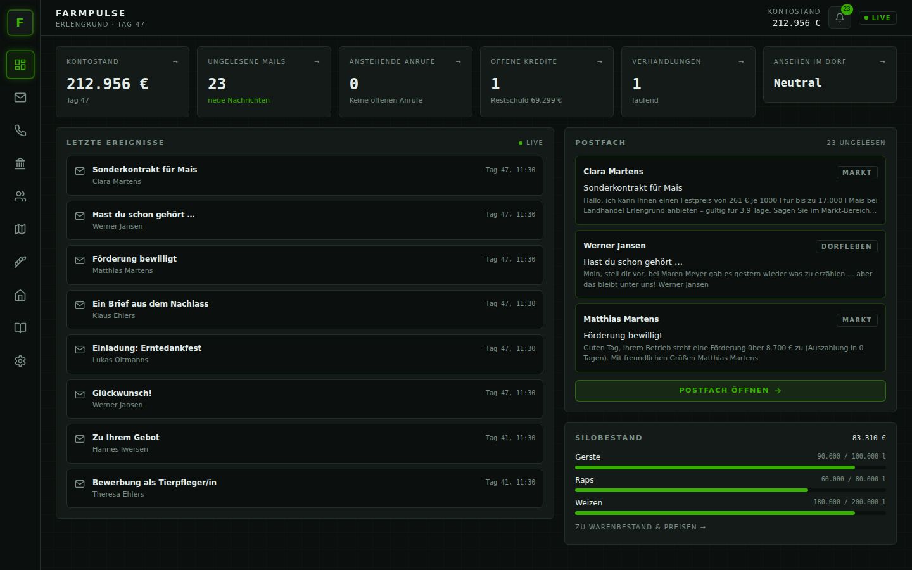
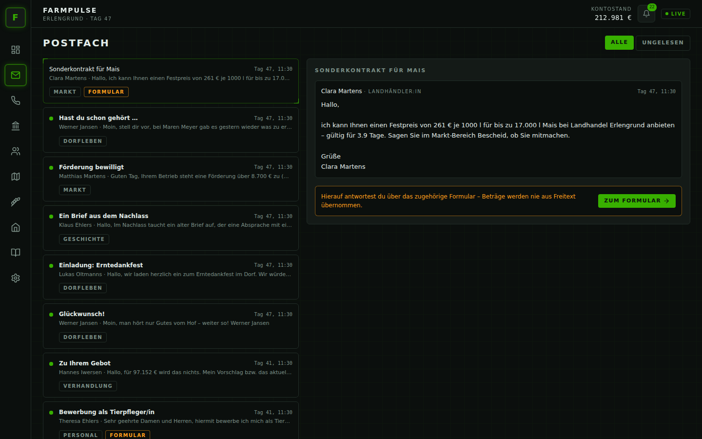
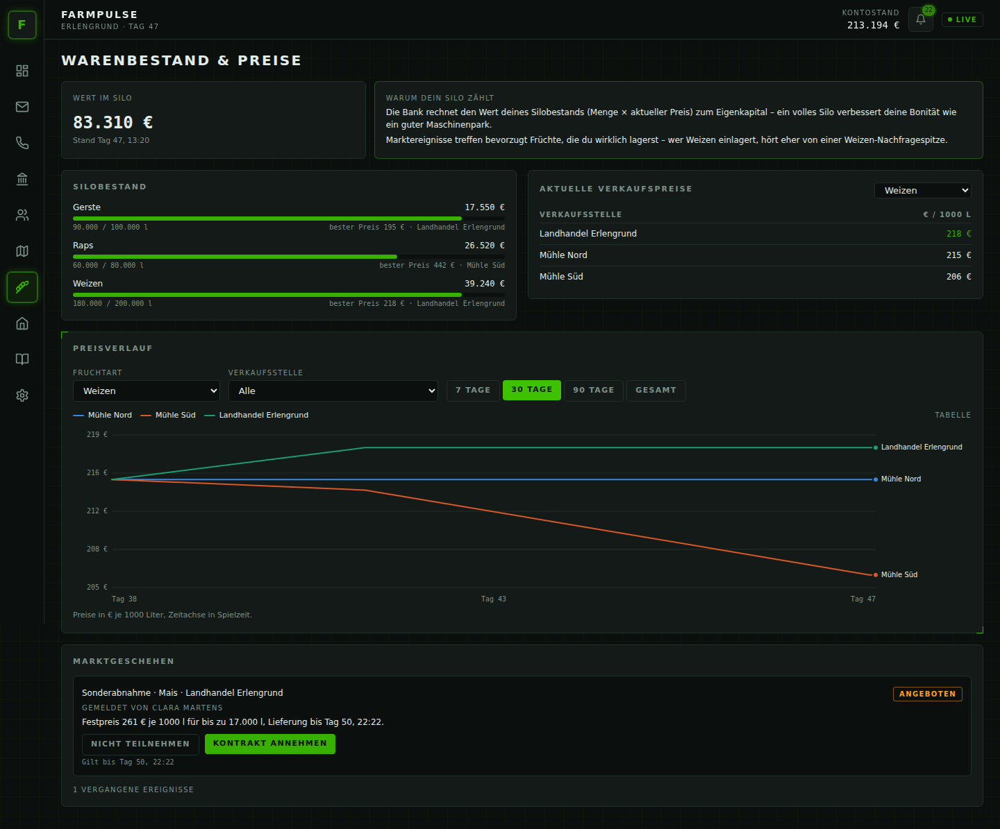
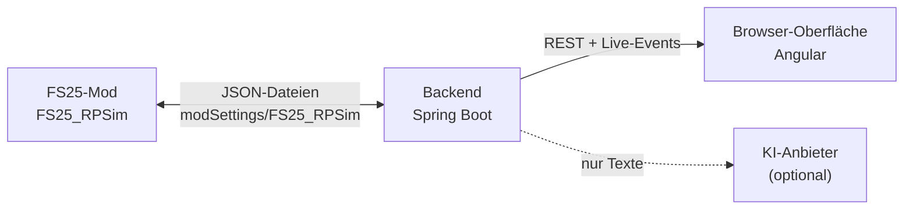

# FarmPulse – KI-Rollenspiel für Farming Simulator 25

[](https://github.com/DerGiftzwerg156/FarmPulse_v3/actions/workflows/backend.yml) [](https://github.com/DerGiftzwerg156/FarmPulse_v3/actions/workflows/frontend.yml) [](https://github.com/DerGiftzwerg156/FarmPulse_v3/actions/workflows/mod-lint.yml) [](https://github.com/DerGiftzwerg156/FarmPulse_v3/actions/workflows/e2e.yml)

**Dein Hof bekommt ein Dorf.** FarmPulse ergänzt Farming Simulator 25 um eine KI-gestützte Rollenspiel-Simulation:
Die Bankberaterin prüft deinen Kreditantrag, der Nachbar ruft wegen des Nordfelds an, der Landhändler flüstert dir
ein Gerücht über den Weizenpreis zu und dein Mechaniker beschwert sich, dass sein Gehalt zu spät kommt. Du
antwortest per Mail oder am Telefon – in einem Begleit-Tool im Browser, während du ganz normal spielst.
**Alle Zahlen – Kredite, Preise, Gehälter, Vertrauen – berechnet FarmPulse nach festen Regeln; die KI schreibt nur,
wie die Charaktere es dir sagen.** Deshalb lässt sich nichts „herbeiquatschen“, und ohne KI-Zugang funktioniert
alles mit vorformulierten Texten.

| Dashboard | Postfach | Warenbestand & Preise |
| --- | --- | --- |
|  |  |  |

## Funktionen

**Fünf Kernmodule**

- **Charaktersystem** – generierte Pflichtrollen (Bank, Genossenschaft, Amt), Dorfbewohner und Mitarbeiter mit
  Persönlichkeit, Gedächtnis und Vertrauenswert; seltene Wechsel durch Zu- und Wegzug, Urlaubsvertretungen.
- **Bank & Kredite** – ersetzt den Vanilla-Kredit: Bonitätsprüfung aus Live-Daten (Vermögen inkl. Silo,
  Liquidität, Cashflow, Schulden, Zahlungshistorie), Genehmigung / Gegenangebot / Ablehnung, Tilgung, Mahnstufen,
  Stundung.
- **Markt & Ereignisse** – regionale Nachfragespitzen, Missernten, Förderprogramme, Gerüchte und Sonderkontrakte,
  jeweils von einem Charakter überbracht.
- **Personal** – Stellenausschreibungen, Bewerbungsgespräche per Mail oder Anruf, Gehalt, Zufriedenheit in vier
  Bereichen, Warnung und Kündigung.
- **Verhandlungen** – Ackerland ersteigern, direkt mit Besitzern verhandeln oder eigene Felder verkaufen, bis zu
  drei Runden, formelbasierte Preisfindung.

**Silo & Preise** – Warenbestand mit aktuellem Wert, Verkaufspreise je Verkaufsstelle und Preisverlauf als Diagramm.

**Sechs Rollenspiel-Vertiefungen**

- **Freie Antworten** auf Mails und Anrufe; ein Ton-Klassifikator lässt Freundlichkeit (gedeckelt) ins Vertrauen
  einfließen.
- **Dorf-Ansehen** als Stufe (gut angesehen / neutral / umstritten), der Ruf eilt dir bei neuen Charakteren voraus.
- **„Nachricht verfassen“** – selbst auf Charaktere zugehen, inkl. Direktverhandlung bei Feldbesitzern.
- **Tagebuch** – automatische Chronik ab deiner Vorgeschichte plus eigene Notizen.
- **Dorfleben** – Glückwünsche, Einladungen und Klatsch zwischen den wichtigen Nachrichten.
- **Ton der Welt** – idyllisch, realistisch oder hart; im harten Modus ist auch die Bank strenger.

Dazu: Onboarding mit Vorgeschichte und Reroll der Startbesetzung, Anrufe mit Annehmen/Ablehnen, Live-Updates ohne
Neuladen, Oberfläche für Desktop und Mobilgeräte, OpenAI / Anthropic / Google Gemini / Ollama oder ganz ohne KI.

## So funktioniert es



Der Mod ist reiner Sensor und Aktuator (Hofdaten exportieren, Buchungen ausführen), das Backend trifft alle
Entscheidungen, die KI formuliert nur. Details: [Architektur-Überblick](docs/architecture/overview.md).

## Schnellstart

**Spielen** (Release): ZIP entpacken, `FS25_RPSim.zip` in den FS25-`mods`-Ordner kopieren, `start.bat` ausführen,
<http://localhost:8080> öffnen – Schritt für Schritt in der [Installationsanleitung](docs/user-guide/installation.md).

**Entwickeln** (ohne FS25, mit Bridge-Simulator; Java 21, Maven, Node ≥ 22.22.3):

```bash
cd tools/bridge-simulator && npm ci && node src/cli.js --scenario wohlhabender-hof   # Terminal 1
cd backend && mvn spring-boot:run                                                 # Terminal 2
cd frontend && npm ci && npm start                                                # Terminal 3 → http://localhost:4200
```

Mehr in [`docs/dev/setup.md`](docs/dev/setup.md).

## Dokumentation

| Für Spieler (Deutsch) | Für Entwickler (English) |
| --- | --- |
| [Installation](docs/user-guide/installation.md) | [Setup](docs/dev/setup.md) |
| [Dein erster Spielstand](docs/user-guide/erster-spielstand.md) | [Architektur](docs/architecture/overview.md) · [Bridge-Zyklus](docs/architecture/file-bridge-sequence.md) · [Domänenmodell](docs/architecture/domain-model.md) · [Zwei-Ebenen-Prinzip](docs/architecture/two-tier-principle.md) · [Anruf-Automat](docs/architecture/call-state-machine.md) |
| [Funktionen](docs/user-guide/funktionen.md) | [Bridge-Protokoll](docs/dev/bridge-protocol.md) · [Konfiguration](docs/dev/configuration-reference.md) · [KI-Anbieter](docs/dev/ai-providers.md) |
| [Fehlerbehebung](docs/user-guide/fehlerbehebung.md) | [Tests](docs/dev/testing.md) · [Manueller Testplan](docs/dev/manual-test-plan.md) · [Frontend](docs/dev/frontend.md) · [Mod-Tests](docs/dev/mod-testing.md) |
| [Mod-README](mod/README.md) | [Offene technische Punkte](docs/dev/offene-technische-punkte.md) · [Offene Fragen](QUESTIONS.md) · [Konzepte](docs/concept/) |

Weitere Werkzeuge: [Bridge-Simulator](tools/bridge-simulator/README.md) ·
[Screenshot-Generator](tools/screenshot-generator/README.md) · [Beitragen](CONTRIBUTING.md) ·
[Änderungen](CHANGELOG.md)

## Lizenz & Hinweis

MIT – siehe [LICENSE](LICENSE).

**Fan-Projekt, kein offizielles GIANTS-Software-/Farming-Simulator-Produkt.** Farming Simulator ist eine Marke der
GIANTS Software GmbH; dieses Projekt steht in keiner Verbindung zu GIANTS Software. Der Mod unterstützt in Version 1
nur Einzelspieler-Spielstände.
