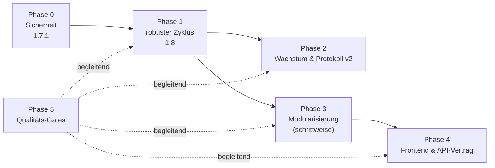

# Technisches Architektur-Review FarmPulse (Stand 06.10.2026, v1.7.0)

Untersucht wurden Backend (Spring Boot 4.1, Java 21, 407 Klassen, ca. 45.000 Zeilen), Frontend (Angular 22, 105
Quelldateien), Lua-Mod (ca. 5.900 Zeilen), Bridge-Simulator, CI und Dokumentation. Grundlage sind Code-Lektüre und
gezielte Messungen: Paketabhängigkeiten, Listener und `@Order`-Werte gezählt, `mvn verify` lokal ausgeführt und das
H2-JAR geprüft. Pfade sind relativ zu `backend/src/main/java/de/farmpulse/rpsim/`, wenn nichts anderes dasteht.

---

## 1. Gesamtbewertung

| Bereich | Note | Kurzbegründung |
| --- | --- | --- |
| Grundarchitektur (Mod ↔ Datei-Bridge ↔ Backend ↔ UI) | **gut** | Klare Zuständigkeiten, Zwei-Ebenen-Prinzip (KI schreibt nur Text) sauber umgesetzt, Idempotenz über `instructionId`, Rewind-Erkennung |
| Fachlogik / Determinismus | **gut** | Alle Formeln konfigurierbar (`rpsim.formulas.*`), Spielzeit statt Echtzeit, Aufholen Tag für Tag |
| Konsistenz & Fehlertoleranz der Laufzeit | **kritisch** | Ein einziger Riesen-Transaktions-Zyklus, In-Memory-Caches überleben ein Rollback, keine optimistische Sperre |
| Sicherheit | **kritisch** | DNS-Rebinding kann den KI-API-Key abgreifen; H2-TCP-Server im LAN offen (durch Zufallsschlüssel geschützt, korrigiert am 07.10.2026) |
| Modularität / Wartbarkeit | **mittel bis schwach** | 20 zyklische Paketabhängigkeiten, 136 synchrone Event-Listener, deren Reihenfolge an 96 verstreuten `@Order`-Zahlen hängt, God-Objekte |
| Performance / Skalierung über lange Spielstände | **mittel** | Unbegrenzt wachsende Ack-Datei und Snapshot-Tabelle, wiederholtes JSON-Parsen, ein Scheduler-Thread für alles |
| Tests & CI | **gut** | 1.153 Backend-Tests grün (11 übersprungen), 88 % Instruktions- und 68 % Branch-Abdeckung, E2E mit Playwright; es fehlen Architektur-, Abhängigkeits- und Sicherheits-Gates |
| Dokumentation | **sehr gut** | Architektur, Bridge-Protokoll, Konfigurationsreferenz und offene Punkte sind gepflegt |

**Fazit:** Das fachliche Fundament ist ungewöhnlich sauber für ein Hobby- und Mod-Projekt. Die Risiken liegen nicht in
der Fachlogik, sondern in **Laufzeit-Konsistenz, Sicherheit der lokalen Installation und Wachstum der Kopplung**. Durch
die vielen Roadmap-Features (V2, V3, V3.1) ist das Backend ein ereignisgetriebener Monolith geworden, dessen
Verhalten nur noch implizit über Listener-Reihenfolge und eine gemeinsame Transaktion definiert ist. Das ist der
wichtigste Hebel für die nächsten Ausbaustufen.

---

## 2. Stärken (beibehalten)

- **Zwei-Ebenen-Prinzip:** `AiNarrationService` ist die einzige Stelle, die einen `AiProvider` aufruft. Fallback-Texte
  halten das Spiel ohne KI spielbar.
- **Datei-Bridge mit Idempotenz:** `instructionId`, Ack-Datei, `savegameId` in jeder Datei, Prüfung der Deckung vor
  einem Batch im Mod (`checkBatchFunds`), Rewind-Behandlung (`RewindService`).
- **Spielzeit-Uhr:** `GameClockService` holt verpasste Tage einzeln nach. Dadurch verhält sich das Spiel gleich, ob
  man spielt oder Zeit überspringt.
- **Konfigurierbarkeit:** Defaults in `RpsimProperties` und `application.yml` werden per Test synchron gehalten
  (`RpsimPropertiesDefaultsTest`), dazu gibt es eine generierte Konfigurationsreferenz.
- **Datenbank:** Flyway (V1 bis V38), `ddl-auto: validate`, `open-in-view: false`.
- **Testkultur:** 112 Backend-Testklassen, Lua-Unit-Tests, Bridge-Simulator mit JSON-Schema-Validierung,
  Playwright-E2E und Screenshot-Generator.
- **LAN-Zugriff:** PBKDF2 mit 600.000 Iterationen, Sperre nach Fehlversuchen, Cookie mit `HttpOnly` und
  `SameSite=Strict`, öffentliche Adressen werden immer mit 403 abgewiesen.

---

## 3. Findings

Schweregrade: **K** = kritisch (Sicherheit oder Datenverlust), **H** = hoch (Fehlverhalten im Normalbetrieb
wahrscheinlich), **M** = mittel (Wartbarkeit oder Performance), **N** = niedrig.

### 3.1 Sicherheit

#### S-1 (M, korrigiert am 07.10.2026; ursprünglich K) H2 lauscht im Netzwerk, Benutzer `sa` ohne Passwort
- **Beleg:** `backend/src/main/resources/application-prod.yml:8` und `application-dev.yml:8` setzten
  `jdbc:h2:file:...;AUTO_SERVER=TRUE`, `username: sa`, `password:` (leer). H2 2.4.240 startet im Auto-Server-Modus
  einen TCP-Server mit `-tcpAllowOthers` (nachgeprüft in `org/h2/engine/Database.class`). Port und Schlüssel stehen
  in der `.lock.db`.
- **Nachmessung am laufenden 1.7.0-JAR (Profil `prod`):** Der Prozess lauscht zusätzlich zu 8080 auf einem zufälligen
  Port an `0.0.0.0`, also auf allen Schnittstellen. Eine Verbindung über die LAN-Adresse gelingt aber **nur**, wenn der
  Datenbankname der Zufallsschlüssel aus `rpsim.lock.db` ist (`id=…`, 43 Hex-Zeichen). Mit dem Dateipfad oder einem
  falschen Schlüssel antwortet H2 mit `28000 Wrong user name or password`, auch bei `sa` ohne Passwort.
- **Auswirkung (korrigiert):** Ein Gerät im Heimnetz kommt ohne den Schlüssel **nicht** an die Daten. Die
  ursprüngliche Aussage „Über H2 lassen sich die Daten lesen und ändern“ war überzogen. Es bleiben: ein unnötiger,
  aus dem LAN erreichbarer Netzwerkdienst als Angriffsfläche (die Fehlerbehebungs-Anleitung empfiehlt, Java in der
  Windows-Firewall für private Netze freizugeben), und wer die Lock-Datei lesen kann, braucht kein Passwort. Mit
  Zugriff gäbe es über `CREATE ALIAS` Codeausführung.
- **Empfehlung:** `AUTO_SERVER` entfernen, denn Backend und Spiel teilen sich die DB nicht. Ein zufälliges Passwort
  beim ersten Start erzeugen und lokal ablegen. Umgesetzt in Phase 0.1.

#### S-2 (K) DNS-Rebinding und Abfluss des KI-API-Keys
- **Nachweis am laufenden 1.7.0-JAR (07.10.2026):** `PUT /api/settings/ai` mit `Host: evil.example` und
  `Origin: http://evil.example` (so sendet der Browser nach DNS-Rebinding) wurde mit 200 angenommen; danach stand
  `openai.baseUrl=https://evil.example/v1` neben dem unveränderten `openai.apiKey` in `ai-provider.properties`.
- **Beleg:** Die Herkunftsprüfung in `lan/LanAccessFilter.java:49` behandelt Loopback als vertrauenswürdig. Ein
  `Host`-Header wird nirgends geprüft. Danach behält `ai/AiSettingsService.java:75-88` beim Speichern einer neuen
  `baseUrl` den bisherigen `apiKey` bei, und `PUT /api/settings/ai` ist für jeden erlaubten Absender offen.
- **Angriffsweg:** Eine Webseite, die der Spieler auf dem Spiele-PC öffnet, lässt ihre Domain per DNS-Rebinding auf
  `127.0.0.1` zeigen. Der Browser hält die Anfragen dann für Same-Origin, CORS greift nicht, und `getRemoteAddr()` ist
  Loopback. Die Seite setzt mit `PUT /api/settings/ai` die `baseUrl` auf ihren eigenen Server, und die nächste
  Narration schickt den API-Key dorthin. Bei aktivem Heimnetz-Modus ohne PIN kann das außerdem jedes Gerät im LAN.
  Auch die LAN-Einstellungen sind nur scheinbar geschützt: `LanController.requireGamePc` prüft nur auf Loopback, und
  genau das erfüllt eine Anfrage per DNS-Rebinding. Die Seite könnte also den Heimnetz-Modus einschalten und die PIN
  entfernen.
- **Empfehlung:** (a) Host-Header-Allowlist (`localhost`, `127.0.0.1`, `[::1]`, eigene LAN-IPs und Hostname); alles
  andere bekommt 421/403. (b) Einstellungen, die Geheimnisse oder Ziel-URLs ändern, nur von Loopback zulassen.
  (c) Ändert sich der Host der `baseUrl`, wird der gespeicherte Key verworfen. (d) Auch von Loopback aus für
  schreibende Anfragen einen `Origin`-Header prüfen.

#### S-3 (M) API-Key im Klartext, Swagger-UI im Release
- `./data/local-config/ai-provider.properties` speichert den Key im Klartext ohne Dateirechte-Härtung. Für ein lokales
  Werkzeug ist das vertretbar, die Datei sollte aber restriktive Rechte bekommen (POSIX `600`, unter Windows nur der
  Benutzer). Optional kommt der Key in den Windows Credential Store.
- springdoc (`/swagger-ui`, `/v3/api-docs`) ist auch im `prod`-Profil aktiv und vergrößert die Angriffsfläche. Im
  Profil `prod` mit `springdoc.api-docs.enabled=false` abschalten.

#### S-4 (N) Kein automatischer Abhängigkeits-Scan
- Es gibt kein `dependabot.yml` und keinen OWASP-, CodeQL- oder Secret-Scan. GitHub Actions sind auf Tags gepinnt
  (`@v4`), nicht auf SHAs. `npm audit --omit=dev` meldet derzeit 0 Schwachstellen.

### 3.2 Konsistenz und Laufzeit

#### R-1 (H) In-Memory-Caches überleben ein Rollback, und eine fehlerhafte Datei blockiert alles
- **Beleg:** `bridge/BridgeSyncService.java:91` macht den ganzen Zyklus zu **einer** Transaktion. Darin setzen
  `lastFactsRaw` (Z. 171) und `lastAckRaw` (Z. 189) die Caches, **bevor** `clock.advance(...)` (Z. 173) sämtliche
  Tages- und Monats-Listener synchron ausführt.
- **Auswirkung:**
  1. Wirft ein Listener eine Exception, wird alles zurückgerollt: Snapshot, Spielzeit, Acks. Die Caches halten die
     Dateien aber für verarbeitet. **Acks gehen so dauerhaft verloren**, solange der Mod eine inhaltsgleiche
     Ack-Datei schreibt. Die Anweisungen bleiben `PENDING` und werden immer wieder gesendet.
  2. Ein deterministischer Fehler in einem der 45 Tages- oder 34 Monats-Listener lässt jeden weiteren Zyklus scheitern
     (Poison Pill). Die gesamte Spiellogik steht dann still, das Log zeigt nur eine Warnung alle 2 s
     (`BridgeScheduler.java:47-50`).
  3. Ein Fehler in einem nebensächlichen Feature, etwa der Dorfzeitung, rollt auch Kreditraten und Gehälter zurück.
- **Empfehlung:** Siehe Plan, Phase 1. Kurz gesagt: Caches erst nach erfolgreichem Commit setzen
  (`TransactionSynchronization.afterCommit`) oder ganz durch persistierte Prüfsummen ersetzen. Einlesen, Acks und
  Spielzeit-Fortschritt bekommen jeweils eine eigene Transaktion. Jeder Feature-Listener läuft isoliert in eigener
  Transaktion, mit Fehlerprotokoll und Wiederholung.

#### R-2 (H) Keine optimistische Sperre: verlorene Updates zwischen Bridge-Zyklus und REST
- **Beleg:** Keine einzige Entity hat `@Version` (0 Treffer). `Savegame` hat rund 100 Felder, darunter Zustände
  vieler Features (`lastGossipGameTime`, `dynamicRotationsThisYear`, Kalender, Marktkontext …), siehe
  `domain/Savegame.java`.
- **Auswirkung:** Der Bridge-Zyklus lädt `Savegame`, `Loan`, `Character` und weitere Entities und arbeitet bei
  Aufhol-Sprüngen sekundenlang. Speichert parallel ein REST-Aufruf, etwa beim Annehmen eines Gegenangebots oder einer
  Vertrauensänderung, gewinnt der zuletzt Committende. Änderungen des Spielers oder des Zyklus verschwinden still.
- **Empfehlung:** `@Version` auf allen veränderlichen Aggregaten einführen (Flyway-Migration mit
  `version BIGINT DEFAULT 0`). REST-Konflikte werden zu HTTP 409, das Frontend lädt neu. Der Zyklus wiederholt den
  betroffenen Schritt. Langfristig wandert der Feature-Zustand aus `Savegame` in eigene Tabellen (siehe A-3).

#### R-3 (H) Ein Scheduler-Thread für Bridge, KI und SSE
- **Beleg:** `@EnableScheduling` ohne eigenen `TaskScheduler` und ohne `spring.task.scheduling.pool.size` bedeutet
  in Spring Boot genau einen Thread. Ihn teilen sich `BridgeScheduler.poll`, `NarrationWorker.run`
  (`narration/NarrationWorker.java:30`) und `SseHub.keepAlive` (`sse/SseHub.java:84`).
- **Auswirkung:** `AiNarrationService.process` ruft den KI-Anbieter **innerhalb einer DB-Transaktion** auf
  (`narration/AiNarrationService.java:64-81`), mit 30 s Timeout und 2 Versuchen pro Job. Stauen sich 10 Jobs bei einem
  langsamen Ollama oder Ratenbegrenzung, steht die Bridge bis zu 10 Minuten. Buchungen, Acks und Spielzeit hängen
  dann hinter der KI. SSE-Broadcasts laufen zudem synchron auf dem committenden Thread, ein hängender Client bremst
  also den Zyklus.
- **Empfehlung:** Eigene Executors: Bridge (1 Thread, strikt seriell), Narration (1 bis n Threads), SSE-Versand
  (asynchron mit begrenzter Queue pro Emitter). Den KI-Aufruf aus der Transaktion herausziehen: Job in Tx 1 als
  `IN_PROGRESS` beanspruchen, KI ohne Tx aufrufen, Ergebnis in Tx 2 speichern. Bei Fehler wird per Lease-Timeout neu
  zugeteilt.

#### R-4 (M) Riesen-Transaktionen beim Aufholen
- `GameClockService.advance` holt bis zu `MAX_CATCH_UP_DAYS = 400` Tage nach (`time/GameClockService.java:19,48`).
  Jeder Tag ruft rund 45 Tages-Listener auf, alles in **einer** Transaktion und mit einer immer größeren
  Hibernate-Session. Das kostet Speicher und Laufzeit, und ein einziger Fehler macht alle 400 Tage rückgängig.
- **Empfehlung:** Ein Tag pro Transaktion, Fortschritt über `lastProcessedGameDay` persistiert. Das Aufholen wird
  damit fortsetzbar, nach dem Prinzip „ein Tag = eine Arbeitseinheit".

#### R-5 (M) Unbegrenzt wachsende Bridge-Daten
- **Mod:** `state.processed` wird nie gekürzt. Der Kommentar zum „Retention-Fenster" in
  `mod/FS25_RPSim/src/import/Processor.lua:275` ist nicht umgesetzt. Jede jemals ausgeführte Buchung landet im
  Savegame-XML (`Persistence.lua:21-37`) und in **jeder** `instructions_ack.json`. Das JSON-Encoding läuft im
  Spiel-Thread und verursacht über die Zeit Ruckler.
- **Backend:** Bei jeder geänderten Ack-Datei gibt es pro Ack ein `findByInstructionId`
  (`bridge/BridgeSyncService.java:198`). Das ist ein N+1-Muster über die gesamte Historie. Dazu kommt
  `facts_snapshot.raw_json` ohne Retention: ein voller JSON-Export pro Mod-Export, für immer.
- **Empfehlung:** Ein Protokoll-Ack mit Watermark: Das Backend schreibt `ackedUpTo` bzw. die Liste bestätigter IDs in
  `instructions.json`, der Mod löscht bestätigte Einträge, die älter als N Spieltage sind. Acks im Backend per
  `findByInstructionIdIn(...)` gebündelt laden. Snapshots per Retention-Job verdichten (z. B. alle der letzten 7
  Spieltage, danach 1 pro Spieltag), Preisverläufe in eine eigene schlanke Tabelle auslagern.

#### R-6 (M) Wiederholtes Parsen des letzten Snapshots
- `FactsService.latest(sg)` parst das komplette Roh-JSON und wird an 91 Stellen aufgerufen, auch innerhalb der
  Tages-Listener. Beim Aufholen entstehen so Tausende identische Parse-Vorgänge.
- **Empfehlung:** Einen Cache pro Zyklus und Savegame (`snapshotId → FarmFacts`, invalidiert bei `FactsIngested`),
  oder das geparste Objekt im Event mitgeben.

#### R-7 (N) JVM beendet sich in Tests nicht sauber
- `mvn verify` meldet: „Surefire is going to kill self fork JVM. The exit has elapsed 30 seconds after
  System.exit(0)". Ein Nicht-Daemon-Thread blockiert also das Herunterfahren, wahrscheinlich HTTP-Client oder
  Executor der KI-Clients. Der `AnthropicClient` wird gecacht und nie geschlossen. Folge: ein langsamer Shutdown des
  Release-Backends und 30 s längere CI-Läufe.

#### R-8 (N) Keine Datensicherung
- Es gibt keinen Backup-Mechanismus für `~/.rpsim/rpsim.mv.db`. Ein defekter Spielstand oder ein Fehler in einer
  Migration bedeutet Totalverlust der Rollenspiel-Historie.
- **Empfehlung:** Beim Start und vor jeder Flyway-Migration `BACKUP TO '...zip'` ausführen, die letzten N Sicherungen
  aufbewahren.

### 3.3 Architektur und Modularität

#### A-1 (H) Implizite Pipeline: 136 synchrone Listener und 96 verstreute `@Order`-Zahlen
- **Beleg:** 45 Listener auf `GameDayPassedEvent`, 34 auf `GameMonthPassedEvent`, 17 auf `FactsIngested`, 10 auf
  `InstructionAcked`. Die Reihenfolge regeln Zahlen wie `@Order(80)`, `@Order(82)` … `@Order(200)`, verteilt über
  alle Pakete. Mehrere Listener teilen sich denselben Wert (9× `80`, 5× `82`), ihre relative Reihenfolge ist dann
  undefiniert.
- **Auswirkung:** Die fachlich wichtige Frage, ob am Monatsende erst Gehalt, dann Kreditrate und dann die
  Bonitätsprüfung laufen, lässt sich nicht an einer Stelle nachlesen. Jede neue Funktion kann die Reihenfolge
  unbemerkt ändern, und Fehler werden über die gemeinsame Transaktion verbreitet (R-1).
- **Empfehlung:** Eine explizite **Tick-Pipeline**: `GameTickPhase`-Enum (z. B. `INGEST → BOOKINGS → PAYROLL → CREDIT →
  CONTRACTS → WORLD_EVENTS → SOCIAL → NARRATION`). Jedes Feature implementiert `DailyTickHandler` bzw.
  `MonthlyTickHandler` mit `phase()`. Ein `TickOrchestrator` führt die Handler pro Phase aus, jeden in eigener
  Transaktion mit Fehlerisolierung und Metriken. Die Phasen sind dokumentiert und per Test festgeschrieben.

#### A-2 (M) 20 zyklische Paketabhängigkeiten, Schichtverletzungen
- **Beleg (gemessen):** u. a. `credit ↔ finance`, `finance ↔ tax`, `contract ↔ tax`, `contract ↔ negotiation`,
  `bridge ↔ time`, `bridge ↔ notice`, `bridge ↔ prompt`, `bridge ↔ diary`, `ai ↔ narration`,
  `character ↔ village`, `credit ↔ village`, `api ↔ bridge`, `api ↔ finance`, `api ↔ tablet`.
  Fachservices importieren REST-DTOs: `bridge/PriceQueryService.java:10-14` und `finance/FarmReportService.java:11-12`
  nutzen `api.Views`.
- **Auswirkung:** Kein Feature lässt sich isoliert testen, ersetzen oder abschalten. Die Infrastruktur (`bridge`)
  hängt an Fachlichkeit und an der API-Schicht.
- **Empfehlung:** Spring Modulith (`@ApplicationModule`, `ApplicationModules.verify()`) oder ArchUnit-Regeln
  einführen. Zielbild: `bridge` (Infrastruktur) ← `facts` (Domänen-Kern: Savegame, Uhr, Snapshot) ← Feature-Module
  ← `api`. Fachservices liefern eigene Ergebnis-Records, das Mapping auf Views passiert nur in `api`. Bestehende
  Zyklen kommen anfangs als bekannte Ausnahmen in eine Allowlist und werden schrittweise abgebaut.

#### A-3 (M) God-Objekte
| Objekt | Größe | Problem |
| --- | --- | --- |
| `domain/Savegame.java` | ~100 Felder | Kalender, Marktkontext-JSON, Rotations- und Spawner-Zustände vieler Features in einer Zeile: Kollisions-Hotspot (R-2) |
| `config/RpsimProperties.java` | 1.991 Zeilen | Alle Features in einer Klasse, Defaults doppelt (Java + YAML) |
| `api/Views.java` / `api/Requests.java` | 426 / 144 Zeilen | Alle DTOs in einer Datei |
| `mod/.../game/GameAdapter.lua` | 1.772 Zeilen | Sämtliche FS25-API-Zugriffe in einem Modul |
| `frontend/.../core/api/models.ts` | 1.539 Zeilen | Handgepflegter Spiegel der Java-Views |
- **Empfehlung:** Je Feature eigene `@ConfigurationProperties`-Klasse (`rpsim.formulas.credit` → `CreditProperties`),
  eigene Zustands-Tabelle (`feature_state` pro Savegame oder spezifische Tabellen), DTOs pro Controller, `GameAdapter`
  nach Domänen aufteilen (Finanzen, Felder, Fahrzeuge, Tiere, Lager, Helfer).

#### A-4 (M) API-Vertrag ohne einzige Quelle der Wahrheit
- springdoc erzeugt bereits OpenAPI, das Frontend pflegt `models.ts` (1.539 Zeilen) aber von Hand. Abweichungen fallen
  erst zur Laufzeit oder im E2E-Test auf.
- **Empfehlung:** Im Backend-Build `openapi.json` erzeugen (`springdoc-openapi-maven-plugin`), im Frontend Typen
  daraus generieren (`openapi-typescript`). CI bricht bei einem nicht committeten Diff ab.

#### A-5 (N) Logik in Controllern, Transaktionen auf Controller-Ebene
- 25 von 30 Controllern tragen `@Transactional`. Einige berechnen auch Fachlichkeit selbst, etwa den
  Sicherheiten-Schwellwert in `api/CreditController.java:91-101`. Das ist akzeptabel, solange `open-in-view=false`
  gilt. Die Fachlogik gehört aber in Services, damit sie unabhängig von REST testbar bleibt.

#### A-6 (N) Implizites „aktives Savegame" als globaler Zustand
- `savegame/SavegameContext.java` hält die aktuelle Bridge-ID in einer `AtomicReference`. REST-Aufrufe arbeiten immer
  auf dem gerade exportierten oder zuletzt verknüpften Spielstand. Lädt der Spieler einen anderen Spielstand,
  während ein Formular offen ist, landet die Aktion beim neuen Spielstand.
- **Empfehlung:** Die `savegameId` im Frontend-Zustand mitführen und als Header (`X-Savegame-Id`) mitschicken. Das
  Backend lehnt bei Abweichung mit 409 ab.

### 3.4 Frontend

#### F-1 (M) Grobe Invalidierung und Race Conditions beim Neuladen
- Das SSE-Event `state` kommt bei **jedem** Facts-Import und erhöht `stateVersion`. 36 `effect()`s laden daraufhin
  ganze Seiten neu (z. B. `features/bank/bank.ts:106-122`). Es gibt 128 `subscribe()`-Aufrufe, aber nur 6
  `takeUntilDestroyed` und nur 7 Dateien mit `switchMap`/`forkJoin`. Überholen sich Antworten, überschreibt eine ältere
  Antwort die neuere. Nach dem Verlassen einer Seite werden Signals trotzdem noch gesetzt.
- **Empfehlung:** Datenzugriff über `rxResource`/`httpResource` (Angular ≥ 19) oder `toSignal(... switchMap)` pro
  Seite. SSE-Events fachlich feiner zuschneiden (`loan`, `employee`, `market` …), statt bei jedem Export alles neu zu
  laden.

#### F-2 (N) Node-Version eng gepinnt
- Angular CLI 22 verlangt Node ≥ 22.22.3. Lokal (22.22.0) brechen `lint` und `test` ohne verständliche Meldung im
  npm-Script ab, die CI nutzt Node 24. `engines` in `package.json` und `.nvmrc` ergänzen.

### 3.5 Mod und Bridge-Protokoll

#### M-1 (M) Protokollversionierung nur für `farm_facts.json`
- `schemaVersion` gibt es nur im Facts-Export (`Config.lua:24`, `BridgeValidator.java:26`, fest `== 1`). Für
  `instructions.json`/`.xml`, `instructions_ack.json`, `player_responses.json` und `market_context.json` fehlt sie.
  Spieler kombinieren Mod- und Backend-Versionen frei (Mod im FS25-Ordner, Backend separat). Eine neue
  `InstructionType` führt im alten Mod zu `REJECTED`, ohne dass die Ursache sichtbar wird.
- **Empfehlung:** Jede Bridge-Datei bekommt `protocolVersion` und `producerVersion`. Das Backend zeigt beim
  Verknüpfen eine Kompatibilitätsmatrix bzw. Warnung („Mod 1.6 zu alt für Backend 1.8"). Die JSON-Schemas aus
  `tools/bridge-simulator/schema` werden Teil des Vertrags und vom Backend-Test gegen `BridgeDtos` geprüft.

#### M-2 (N) Nicht-atomare Schreibvorgänge des Mods
- Bekannte, dokumentierte Einschränkung (kein `os.rename` in der FS25-Sandbox). Das Backend verwirft unvollständiges
  JSON. Mit wachsender Ack-Datei (R-5) steigt jedoch die Wahrscheinlichkeit, eine halb geschriebene Datei zu lesen.
  Entschärfung: R-5 umsetzen, dazu eine Prüfsumme bzw. Länge am Dateiende (`"_end": "<sha1>"`).

### 3.6 Qualitätssicherung und CI

#### Q-1 (M) Fehlende Qualitäts-Gates
- Es gibt keinen Coverage-Schwellwert. JaCoCo erzeugt nur einen Bericht, obwohl das Niveau bei 88 % / 68 % gut ist.
- Es gibt keine Architekturtests (ArchUnit oder Modulith), siehe A-2.
- Es gibt keine statische Analyse im Backend (Error Prone, SpotBugs oder Checkstyle). Im Frontend laufen ESLint und
  Prettier, im Mod luacheck.
- 85 von 112 Testklassen sind `@SpringBootTest`. Formeln wie Bonität, Verhandlung oder Steuern werden fast nur über
  den vollen Kontext getestet. Das verlängert die Laufzeit und erschwert gezielte Grenzwerttests.
- Es fehlt ein Test für den Fehlerfall aus R-1 (Listener wirft → Zyklus wiederholbar, keine Acks verloren).

---

## 4. Maßnahmenplan

Die Phasen sind nach Risiko geordnet. Phase 0 und Phase 1 sollten **vor** weiteren Roadmap-Features erledigt sein.
Aufwand in Personentagen (PT) für eine Person, die den Code kennt.

### Phase 0: Sofortmaßnahmen Sicherheit (Patch-Release 1.7.1, ca. 2–3 PT)

> **Status (07.10.2026): umgesetzt.** Abweichungen und Entscheidungen des Projektinhabers:
> - 0.2: Erlaubt sind `localhost`, **jede** IP-Adresse (eine IP im `Host`-Header kann nicht aus DNS-Rebinding stammen),
>   der Rechnername und die Liste `rpsim.web.allowed-hosts`, statt nur der beim Start erkannten eigenen LAN-IPs.
> - 0.1: Ein in `spring.datasource.password` gesetztes Passwort hat Vorrang. Die Passwortdatei wird *vor* der Änderung
>   der Datenbank geschrieben, ein Absturz dazwischen wird beim nächsten Start repariert.
> - 0.5: Der Windows-ACL-Pfad ist gegen ein In-Memory-Dateisystem (Jimfs) getestet. Die Prüfung auf echtem Windows
>   steht im [manuellen Testplan, Abschnitt 27](../dev/manual-test-plan.md#27-security-hardening-on-windows-technical-review-102026-phase-0).
> - 0.6: CodeQL übersetzt Java mit Maven (`build-mode: manual`, wegen Lombok), JavaScript/TypeScript ohne Build.
>   Dependabot läuft wöchentlich, Minor- und Patch-Updates je Ökosystem gruppiert.
> - Versionsnummer: Einträge unter `[Unreleased]`, das Release 1.7.1 taggt der Projektinhaber.

| # | Maßnahme | Finding | Akzeptanzkriterium |
| --- | --- | --- | --- |
| 0.1 | `AUTO_SERVER=TRUE` aus `application-prod.yml`/`application-dev.yml` entfernen; beim ersten Start ein zufälliges DB-Passwort erzeugen und in `~/.rpsim/db.properties` ablegen (Dateirechte nur Benutzer); bestehende DBs per `ALTER USER sa SET PASSWORD` migrieren | S-1 | `netstat` zeigt keinen H2-Port; Integrationstest: Start mit vorhandener DB ohne Passwort läuft und setzt das Passwort |
| 0.2 | `HostHeaderFilter` (Order vor `LanAccessFilter`): erlaubt nur `localhost`, `127.0.0.1`, `[::1]`, Rechnername und die eigenen LAN-IPs (`NetworkAddresses.privateIpv4Addresses()`), sonst 403 | S-2 | MockMvc-Test: `Host: evil.example` von Loopback → 403 |
| 0.3 | Schreibende Anfragen (`POST/PUT/DELETE`) mit `Origin`-Header nur annehmen, wenn dieser zu den erlaubten Hosts passt | S-2 | Test: `Origin: https://evil.example` → 403 |
| 0.4 | `PUT /api/settings/ai` wie schon `/api/lan/*` per `requireGamePc` nur von Loopback zulassen (wirkt erst zusammen mit 0.2, weil DNS-Rebinding von Loopback kommt); gespeicherten Key löschen, wenn sich der Host der `baseUrl` ändert und kein neuer Key mitkommt | S-2 | Test: `baseUrl`-Wechsel ohne Key → `apiKeySet=false` |
| 0.5 | springdoc im Profil `prod` deaktivieren; Dateirechte der `ai-provider.properties` setzen | S-3 | `GET /swagger-ui` im prod-Profil → 404 |
| 0.6 | `.github/dependabot.yml` (maven, npm ×3, github-actions) und CodeQL-Workflow (java, javascript) | S-4 | Dependabot-PRs erscheinen; CodeQL läuft bei PRs |

### Phase 1: Robuster Bridge-Zyklus (Release 1.8, ca. 8–12 PT)

> **Status (07.10.2026): 1.1–1.3 umgesetzt (PR A), 1.4 und 1.5–1.8 folgen in eigenen PRs.** Entscheidungen des
> Projektinhabers:
> - 1.3: **strikte Reihenfolge** statt Kern-Transaktion + isolierte Feature-Handler: Jeder Listener läuft in eigener
>   Transaktion mit Journal; ein fehlschlagender Listener hält die Warteschlange an und wird im nächsten Zyklus
>   wiederholt, nach **3** Fehlversuchen übersprungen. Abgesichert sind **alle** Ereignisse des Bridge-Zyklus (auch
>   Hofdaten, Buchungsbestätigungen, Rewind, Kalender, Vertragsmeldungen), nicht nur die Tick-Ereignisse.
> - Meldung als Hinweis-Karte auf der Startseite (`CYCLE_STEP_SKIPPED`), nicht in den Einstellungen.
> - Umsetzung: dauerhafte Warteschlange `cycle_event` statt Prüfsummen pro Datei (1.2) – die Einlese-Transaktion
>   speichert Daten und Ereignisse atomar, der Datei-Cache wird erst nach dem Commit gesetzt.

Ziel: Kein Fehler eines Features kann Buchungen, Acks oder die Spielzeit blockieren, und nichts geht still verloren.

| # | Maßnahme | Finding | Akzeptanzkriterium |
| --- | --- | --- | --- |
| 1.1 | **Regressionstest zuerst:** Ein Test-Listener auf `GameDayPassedEvent` wirft eine Exception. Erwartet: Acks werden trotzdem angewendet; nach Entfernen des Fehlers holt der nächste Zyklus nach | R-1 | Test ist zuerst rot und nach 1.2/1.3 grün |
| 1.2 | `runCycle()` aufteilen: `ingestMarketContext`, `ingestFacts`, `applyAcks`, `ingestResponses`, `writeInstructions` jeweils mit eigener Transaktion (`TransactionTemplate`). Caches (`last*Raw`) erst im `afterCommit` setzen oder durch eine persistierte Prüfsumme pro Datei (`bridge_file_state`) ersetzen | R-1 | Rollback in einem Schritt lässt die anderen unberührt; Cache wird bei Rollback nicht gesetzt |
| 1.3 | **Tick-Orchestrator** einführen (`time/TickOrchestrator`): Pro Spieltag eine Transaktion für Kernbuchungen (Gehalt, Kreditraten, Verträge); Feature-Handler einzeln in `REQUIRES_NEW` mit `try/catch`, Fehler in Tabelle `tick_failure` (Handler, Tag, Stacktrace, Versuche) und als Hinweis in den Einstellungen; Wiederholung beim nächsten Zyklus, nach N Fehlversuchen überspringen und melden | R-1, R-4, A-1 | Fehlerhafter Handler blockiert andere nicht; Fortschritt `lastProcessedGameDay` wird pro Tag committet |
| 1.4 | `@Version` auf allen veränderlichen Entities (Flyway V39), `ObjectOptimisticLockingFailureException` → HTTP 409 im `ApiExceptionHandler`; Frontend zeigt „Daten wurden aktualisiert" und lädt neu; im Tick: Retry des Handlers | R-2 | Nebenläufigkeitstest (REST + Zyklus parallel) ohne verlorene Änderung |
| 1.5 | Eigene Executors: `bridgeScheduler` (1 Thread), `narrationExecutor` (konfigurierbar, Default 1), SSE-Versand asynchron (`SseHub` mit eigenem Executor, Timeout pro Send) | R-3 | Test mit KI-Fake, der 30 s blockiert: Bridge-Zyklen laufen weiter |
| 1.6 | `AiNarrationService.process` in drei Schritte aufteilen: claim (Tx, `IN_PROGRESS` + `leaseUntil`) → Aufruf ohne Tx → speichern (Tx); hängende Leases neu vergeben (Flyway: Spalten `lease_until`, `attempts`) | R-3 | Keine DB-Transaktion offen während des HTTP-Aufrufs |
| 1.7 | Shutdown sauber machen: KI-Clients als `DisposableBean` schließen, Executor-Threads als Daemon bzw. mit `awaitTermination` | R-7 | Surefire-Warnung „kill self fork JVM" verschwindet |
| 1.8 | Automatische Sicherung: `BACKUP TO` beim Start und vor Migrationen, 5 Generationen in `~/.rpsim/backups/`; in der Fehlerbehebung dokumentieren | R-8 | Backup-Datei nach Start vorhanden; Wiederherstellung dokumentiert |

### Phase 2: Wachstum begrenzen und Bridge-Protokoll v2 (ca. 6–8 PT)

| # | Maßnahme | Finding | Akzeptanzkriterium |
| --- | --- | --- | --- |
| 2.1 | Protokoll: `instructions.json` erhält `ackedInstructionIds` (vom Backend endgültig verarbeitet). Der Mod entfernt diese Einträge nach `ackRetentionDays` Spieltagen aus `state.processed` und aus der Ack-Datei. Rückwärtskompatibel: ohne das Feld verhält sich der Mod wie heute | R-5 | Lua-Test: 10.000 Buchungen → Ack-Datei bleibt unter einer festen Größe |
| 2.2 | Backend: Acks gebündelt laden (`findByInstructionIdIn`), nur noch `PENDING`-relevante IDs betrachten | R-5 | Ein SQL-Statement pro Ack-Datei |
| 2.3 | Snapshot-Retention: täglicher Job verdichtet `facts_snapshot` (letzte 7 Spieltage vollständig, danach 1/Tag); Preisverlauf in Tabelle `price_point(savegame, game_time, fill_type, sell_point, price)` | R-5 | DB-Größe nach simuliertem Spieljahr unter einem festgelegten Grenzwert (Bridge-Simulator-Szenario) |
| 2.4 | `FactsService.latest` mit Cache pro Snapshot-ID (Caffeine, max. 1 Eintrag pro Savegame) | R-6 | Parse-Zähler im Test: 1× pro Snapshot |
| 2.5 | `protocolVersion` und `producerVersion` in allen Bridge-Dateien; Kompatibilitätsprüfung und Hinweis im Onboarding/Header; Schemas in `tools/bridge-simulator/schema` als verbindlicher Vertrag, Backend-Test validiert `BridgeDtos`-Serialisierung dagegen | M-1, M-2 | Altes Mod-Format erzeugt einen sichtbaren Hinweis statt stiller `REJECTED` |

### Phase 3: Modularisierung (über mehrere Releases, ca. 15–25 PT, schrittweise)

Vorgehen: Erst messen und einfrieren, dann abbauen. Jeder Schritt ist ein eigener PR ohne fachliche Änderung.

| # | Maßnahme | Finding | Akzeptanzkriterium |
| --- | --- | --- | --- |
| 3.1 | ArchUnit oder Spring Modulith einführen; heutige 20 Zyklen als Allowlist („frozen") festschreiben; neue Zyklen brechen den Build | A-2, Q-1 | CI rot bei neuem Zyklus |
| 3.2 | DTO-Leck schließen: `PriceQueryService`, `FarmReportService` u. a. liefern eigene Records; Mapping nur in `api` | A-2 | Regel „nur `api` importiert `api.*`" grün |
| 3.3 | Kern-Modul `facts` (Savegame, GameClock, Snapshot, Kalender) von `bridge` (Datei-I/O, DTOs) trennen; Abhängigkeitsrichtung `feature → facts ← bridge` | A-2 | Zyklen `bridge ↔ time/notice/prompt/diary` aufgelöst |
| 3.4 | Zyklen paarweise auflösen (`credit ↔ finance`, `finance ↔ tax`, `contract ↔ tax`, `contract ↔ negotiation`, `character ↔ village`, `ai ↔ narration`) per Ports-Interface im abhängigen Modul oder Domain-Event | A-2 | Allowlist schrumpft pro Release |
| 3.5 | Listener auf `TickHandler` mit `GameTickPhase` umstellen (siehe 1.3), alle `@Order`-Zahlen entfernen; Phasenreihenfolge in `docs/architecture/tick-pipeline.md` dokumentieren und per Test festschreiben | A-1 | 0× `@Order` auf Tick-Listenern; Pipeline-Test listet Handler pro Phase |
| 3.6 | `Savegame` verschlanken: Feature-Zustände in eigene Tabellen (`village_life_state`, `rotation_state`, `calendar_state`, `market_context`) | A-3, R-2 | `Savegame` unter 25 Feldern |
| 3.7 | `RpsimProperties` aufteilen in je eine `@ConfigurationProperties`-Klasse pro Feature; Java-Defaults als einzige Quelle, `application.yml` nur noch mit Abweichungen, Konfigurationsreferenz aus Metadaten generieren (`spring-configuration-metadata.json`) | A-3 | Keine doppelten Defaults; `ConfigurationReferenceDocTest` grün |
| 3.8 | `Views.java`/`Requests.java` pro Controller aufteilen; Fachlogik aus Controllern in Services verschieben, `@Transactional` an Services | A-3, A-5 | Controller ohne Berechnungen |
| 3.9 | `savegameId` explizit an der API (`X-Savegame-Id`), 409 bei Abweichung | A-6 | E2E: Spielstandwechsel bei offenem Formular → 409 statt falscher Buchung |
| 3.10 | `GameAdapter.lua` nach Domänen aufteilen (`adapter/Finance.lua`, `Fields.lua`, `Vehicles.lua`, `Animals.lua`, `Storage.lua`, `Helpers.lua`) bei gleicher öffentlicher Schnittstelle | A-3 | luacheck + Lua-Tests grün; keine Datei über 500 Zeilen |

### Phase 4: Frontend und API-Vertrag (ca. 5–8 PT)

| # | Maßnahme | Finding | Akzeptanzkriterium |
| --- | --- | --- | --- |
| 4.1 | OpenAPI-Spezifikation im Backend-Build erzeugen und committen; `openapi-typescript` generiert `models.generated.ts`; `models.ts` schrittweise ersetzen; CI prüft, dass die generierten Dateien aktuell sind | A-4 | CI rot bei abweichendem Vertrag |
| 4.2 | Seiten auf `rxResource`/`httpResource` bzw. `switchMap` umstellen (Abbruch veralteter Requests, automatisches Aufräumen) | F-1 | Keine `subscribe()` in Komponenten für Ladevorgänge |
| 4.3 | Feinere SSE-Events (`loan`, `employee`, `market`, `field` …) und `state` nur noch für Header-Daten | F-1 | Ein Facts-Import lädt nur betroffene Seiten neu |
| 4.4 | `engines.node` + `.nvmrc` | F-2 | `npm ci` warnt bei falscher Node-Version |

### Phase 5: Qualitäts-Gates dauerhaft (begleitend, ca. 3–4 PT)

| # | Maßnahme | Finding |
| --- | --- | --- |
| 5.1 | JaCoCo-`check` mit Mindestwerten auf heutigem Niveau (z. B. 85 % Instruktionen / 65 % Branches), Frontend-Coverage-Schwelle in Vitest | Q-1 |
| 5.2 | Error Prone oder SpotBugs im Maven-Build (zunächst als Warnung, dann als Fehler) | Q-1 |
| 5.3 | Reine Unit-Tests für Formel-Services (ohne Spring-Kontext) einführen; neue Formeln nur mit Grenzwerttests; Ziel: Verhältnis `@SpringBootTest` zu Unit-Tests umkehren | Q-1 |
| 5.4 | Last- und Langlauf-Szenario im Bridge-Simulator („3 Spieljahre im Zeitraffer"); misst DB-Größe, Zyklusdauer, Ack-Dateigröße und läuft nightly | R-4, R-5 |
| 5.5 | GitHub Actions auf Commit-SHAs pinnen (Dependabot hält sie aktuell) | S-4 |
| 5.6 | PR-Template um „Neue Tick-Handler: Phase angegeben, isoliert transaktional, idempotent bei Rewind" ergänzen | A-1 |

### Reihenfolge und Abhängigkeiten

- 1.3 (Tick-Orchestrator) ist die Grundlage für 3.5. Beide zusammen zu planen vermeidet doppelte Umbauten.
- 2.1 ändert das Mod-Protokoll. Deshalb vorher 2.5 (Versionierung) bzw. beide im selben Release ausliefern.
- 3.1 (Architektur-Gate) möglichst früh einführen, damit neue Roadmap-Features keine weiteren Zyklen erzeugen.

### Gesamtaufwand

| Phase | Aufwand | Nutzen |
| --- | --- | --- |
| 0 | 2–3 PT | Schließt eine kritische (S-2) und eine mittlere (S-1) Sicherheitslücke |
| 1 | 8–12 PT | Beseitigt die wahrscheinlichsten Ursachen für „nichts passiert mehr" und stille Datenverluste |
| 2 | 6–8 PT | Stabil über lange Spielstände, Mod/Backend-Versionen sicher kombinierbar |
| 3 | 15–25 PT | Hält die Roadmap umsetzbar, ohne dass jede Funktion alle anderen gefährdet |
| 4 | 5–8 PT | Weniger Laufzeitfehler durch Vertragsabweichung, ruhigere UI |
| 5 | 3–4 PT | Verhindert Rückfälle |
| **Summe** | **ca. 39–60 PT** | |

---

## 5. Methodik und Grenzen

- `mvn -B verify` lokal ausgeführt: 1.153 Tests, 0 Fehler, 11 übersprungen, JaCoCo 88 % Instruktionen / 68 %
  Branches.
- Frontend `lint`/`test` ließen sich in der Analyseumgebung nicht ausführen (Node 22.22.0 < geforderte 22.22.3).
  `npm audit --omit=dev`: 0 Schwachstellen. Lua-Tests wurden nicht ausgeführt (kein Lua 5.1 in der Umgebung). Beides
  läuft laut Workflows in der CI.
- Paketzyklen, Listener- und `@Order`-Zahlen sind per Skript über die Import- und Annotationszeilen gemessen. Das ist
  eine Näherung auf Paketebene, nicht auf Klassenebene.
- Das H2-Verhalten (S-1) ist am ausgelieferten JAR 2.4.240 verifiziert. Ob die Windows-Firewall den Port im
  Einzelfall blockt, hängt von der Freigabe für Java ab, die die Fehlerbehebungs-Anleitung empfiehlt.
- Nicht bewertet: fachliches Balancing der Formeln, UX und Texte, Verhalten im echten FS25 (dafür gibt es den
  manuellen Testplan).
