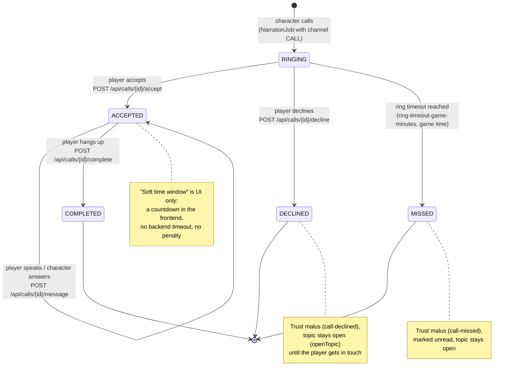

# Call state machine

Incoming calls (`Communication` with channel `CALL`, initiated by a character) follow this state machine
(`CallService`). The ring timeout runs in **game time** – if the game is paused, the phone keeps ringing.

Every transition is published as `CallStatusChanged` and pushed to the browser as SSE event `call`; the frontend
shows the incoming-call overlay for `RINGING` and the conversation view for `ACCEPTED`.
