# Domain model

All 21 JPA entities of `de.farmpulse.rpsim.domain` (AP-3.2, Flyway `V1`–`V5`). Every entity except `Savegame`
belongs to exactly one savegame (`SavegameScoped` → column `savegame_id`); the diagram shows that relation once per
entity. Only the most important columns are listed. Relations drawn dashed are logical references by id
(no foreign key), e.g. from generic `relatedEntityType/relatedEntityId` pairs.

```mermaid
erDiagram
    SAVEGAME ||--o{ GAME_CHARACTER : "has"
    SAVEGAME ||--o{ COMMUNICATION : "has"
    SAVEGAME ||--o{ NARRATION_JOB : "has"
    SAVEGAME ||--o{ OUTBOX_INSTRUCTION : "has"
    SAVEGAME ||--o{ FACTS_SNAPSHOT : "has"
    SAVEGAME ||--o{ CREDIT_APPLICATION : "has"
    SAVEGAME ||--o{ LOAN : "has"
    SAVEGAME ||--o{ MARKET_EVENT : "has"
    SAVEGAME ||--o{ NEGOTIATION : "has"
    SAVEGAME ||--o{ FARMLAND_OWNERSHIP : "has"
    SAVEGAME ||--o{ JOB_POSTING : "has"
    SAVEGAME ||--o{ EMPLOYEE : "has"
    SAVEGAME ||--o{ DIARY_ENTRY : "has"
    SAVEGAME ||--o{ PUBLIC_ACTION_EVENT : "has"
    SAVEGAME ||--o{ STORY_HOOK : "has"

    GAME_CHARACTER ||--o{ TRUST_EVENT : "trust log"
    GAME_CHARACTER |o--o{ COMMUNICATION : "writes / calls"
    GAME_CHARACTER |o--o{ NARRATION_JOB : "narrates"
    GAME_CHARACTER |o--o{ MARKET_EVENT : "announces"
    GAME_CHARACTER |o--o{ FARMLAND_OWNERSHIP : "owns"
    GAME_CHARACTER |o--o{ STORY_HOOK : "carries"
    GAME_CHARACTER ||--o| EMPLOYEE : "is employed as"
    GAME_CHARACTER ||--o{ JOB_APPLICATION : "applies"
    GAME_CHARACTER |o--o{ NEGOTIATION : "counterpart / announcer / winner"
    GAME_CHARACTER |o--o{ NEGOTIATION_OFFER : "bids"

    JOB_POSTING ||--o{ JOB_APPLICATION : "receives"
    EMPLOYEE ||--o{ SATISFACTION_EVENT : "needs log"
    NEGOTIATION ||--o{ NEGOTIATION_OFFER : "rounds"
    LOAN ||--o{ LOAN_PAYMENT : "history"
    CREDIT_APPLICATION |o..o| LOAN : "loanId"
    NARRATION_JOB |o..o| COMMUNICATION : "communicationId"
    COMMUNICATION |o..o{ COMMUNICATION : "threadRootId"
    OUTBOX_INSTRUCTION }o..o| LOAN_PAYMENT : "instructionId"
    JOB_POSTING |o..o| EMPLOYEE : "filledEmployeeId"

    SAVEGAME {
        long id PK
        string bridgeSavegameId UK "id exported by the mod"
        string status "DRAFT ACTIVE ARCHIVED"
        string mapName
        long currentGameTime "ms since savegame start"
        string tonePreset "IDYLLIC REALISTIC HARSH"
        string farmOrigin
        string villageRelation
        long startingCapitalTarget
        long legacyLoanAmount
    }
    GAME_CHARACTER {
        long id PK
        string role "BANK_ADVISOR COOPERATIVE ..."
        string category "MANDATORY DYNAMIC EMPLOYEE APPLICANT SUBSTITUTE"
        string status "ACTIVE ON_LEAVE TERMINATED"
        double trustScore "cached, replayable from TRUST_EVENT"
        string name
        string traits
        string speechStyle
        string backstory
        string negotiationTrait
        double virtualWealth "hidden, never exported"
    }
    TRUST_EVENT {
        long id PK
        long characterId FK
        long gameTime
        double delta
        string reason
    }
    COMMUNICATION {
        long id PK
        long characterId FK
        string channel "MAIL CALL"
        string initiatedBy "PLAYER CHARACTER"
        string subject
        string body
        long gameTime
        boolean readFlag
        string category
        long threadRootId
        string callStatus "RINGING ACCEPTED DECLINED MISSED COMPLETED"
        string formLink
        boolean usedFallback
    }
    NARRATION_JOB {
        long id PK
        long characterId FK
        string eventType
        string factsJson "whitelisted facts only"
        string playerMessage
        string status "PENDING DONE FALLBACK"
        long notBeforeGameTime
        long communicationId
    }
    OUTBOX_INSTRUCTION {
        long id PK
        string instructionId UK "UUID, idempotency key"
        string batchId
        string type "MONEY_TRANSACTION PRICE_EVENT FARMLAND_TRANSFER"
        string payloadJson
        string status "PENDING APPLIED REJECTED FAILED"
    }
    FACTS_SNAPSHOT {
        long id PK
        long gameTime
        long balance
        string rawJson "farm_facts.json as received"
    }
    CREDIT_APPLICATION {
        long id PK
        long amount
        int termMonths
        double finalScore "internal, never exposed by the API"
        string decision "APPROVED COUNTER_OFFER REJECTED"
        string reasonCategory
        long decisionVisibleAtGameTime
        string status
        long loanId
    }
    LOAN {
        long id PK
        long principal
        long remainingAmount
        double interestRate
        long monthlyInstallment
        boolean legacy
        int escalationLevel
        boolean blocksNewCredit
        string status "ACTIVE PAID_OFF CALLED"
    }
    LOAN_PAYMENT {
        long id PK
        long loanId FK
        long gameTime
        long amount
        string type "DISBURSEMENT INSTALLMENT MISSED PENALTY CALLBACK DEFERRAL"
        string instructionId
    }
    MARKET_EVENT {
        long id PK
        string eventType
        string status
        string fillType
        string sellPoint
        double peakMultiplier
        long fixedPrice
        boolean isAccurate "rumours"
        long characterId FK
    }
    NEGOTIATION {
        long id PK
        string assetId "farmlandId"
        string kind "AUCTION DIRECT SALE_OFFER"
        string direction "PLAYER_BUYS PLAYER_SELLS"
        string status
        long basePrice
        long askingPrice
        int roundsUsed
        int maxRounds
        long finalPrice
    }
    NEGOTIATION_OFFER {
        long id PK
        long negotiationId FK
        long characterId FK
        int roundNumber
        string offeredBy "PLAYER CHARACTER"
        long amount
        string result
        long hiddenMaxBid "NPC limit, never exposed"
    }
    FARMLAND_OWNERSHIP {
        long id PK
        int farmlandId
        string ownerType "PLAYER CHARACTER UNCLAIMED"
        long ownerCharacterId FK
        long referencePrice
        double hectares
    }
    JOB_POSTING {
        long id PK
        string jobRole
        string status "OPEN FILLED CLOSED"
        long filledEmployeeId
    }
    JOB_APPLICATION {
        long id PK
        long postingId FK
        long characterId FK
        int skill "fixed, not changed by interviews"
        long expectedSalary
        string status
    }
    EMPLOYEE {
        long id PK
        long characterId FK
        string jobRole
        int skill
        long monthlySalary
        double payFairness
        double workload
        double appreciation
        boolean warningSent
        string status "ACTIVE TERMINATED"
    }
    SATISFACTION_EVENT {
        long id PK
        long employeeId FK
        long gameTime
        string category
        double delta
    }
    DIARY_ENTRY {
        long id PK
        long gameTime
        string entryType "AUTO PLAYER_NOTE"
        string category
        string title
        string text
    }
    PUBLIC_ACTION_EVENT {
        long id PK
        long gameTime
        string type "PUBLIC_DEFAULT VILLAGE_EVENT DONATION OTHER"
        double delta
    }
    STORY_HOOK {
        long id PK
        string hookKey
        long characterId FK
        long scheduledGameTime
        boolean fired
    }
```

Notes:

- The JPA entity `Character` is stored in table `game_character` (`CHARACTER` is reserved in SQL).
- Hidden fact values (`finalScore`, `hiddenMaxBid`, `virtualWealth`, the exact `trustScore`) stay in the backend;
  the REST API only exposes categories and tiers (see [`two-tier-principle.md`](two-tier-principle.md)).
