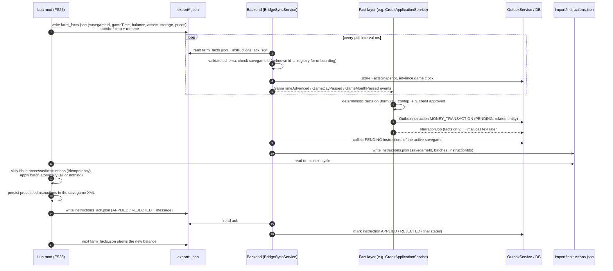

# File bridge – one complete cycle

The mod exports facts, the backend decides in the fact layer, stores an `OutboxInstruction`, writes it to
`instructions.json`, the mod applies it and acknowledges it in `instructions_ack.json`. Details and the JSON
schemas: [`docs/dev/bridge-protocol.md`](../dev/bridge-protocol.md).

Guarantees:

- **savegameId everywhere** – files of another savegame are never applied or ingested into the wrong savegame.
- **Idempotency** – every instruction has a UUID; the mod remembers processed ids in the savegame, a re-sent file
  is harmless.
- **Batches** – e.g. `FARMLAND_TRANSFER` + `MONEY_TRANSACTION` of a land deal share a `batchId` and are applied
  together or not at all.
- **Atomic writes** – both sides write `*.tmp` and rename; readers never see half-written files.
