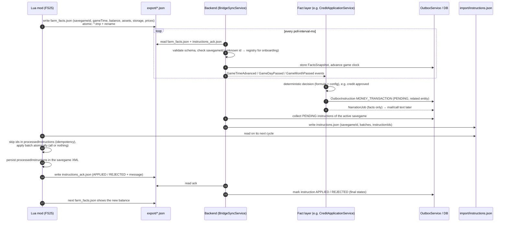
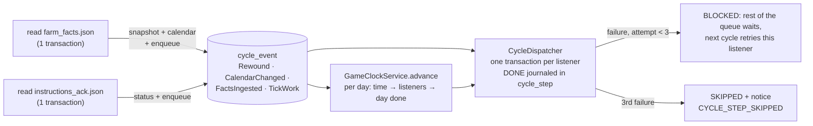

# File bridge – one complete cycle

The mod exports facts, the backend decides in the fact layer, stores an `OutboxInstruction`, writes it to
`instructions.json`, the mod applies it and acknowledges it in `instructions_ack.json`. Details and the JSON
schemas: [`docs/dev/bridge-protocol.md`](../dev/bridge-protocol.md).

```mermaid
sequenceDiagram
    autonumber
    participant M as Lua mod (FS25)
    participant X as export/*.json
    participant B as Backend (BridgeSyncService)
    participant F as Fact layer (e.g. CreditApplicationService)
    participant O as OutboxService / DB
    participant I as import/instructions.json

    M->>X: write farm_facts.json (savegameId, gameTime, balance, assets, storage, prices)<br/>atomic: *.tmp + rename
    loop every poll-interval-ms
        B->>X: read farm_facts.json + instructions_ack.json
        B->>B: validate schema, check savegameId (unknown id → registry for onboarding)
        B->>O: store FactsSnapshot, advance game clock
        B-->>F: GameTimeAdvanced / GameDayPassed / GameMonthPassed events
    end
    F->>F: deterministic decision (formula + config), e.g. credit approved
    F->>O: OutboxInstruction MONEY_TRANSACTION (PENDING, related entity)
    F-->>O: NarrationJob (facts only) → mail/call text later
    B->>O: collect PENDING instructions of the active savegame
    B->>I: write instructions.json (savegameId, batches, instructionIds)
    M->>I: read on its next cycle
    M->>M: skip ids in processedInstructions (idempotency),<br/>apply batch atomically (all or nothing)
    M->>M: persist processedInstructions in the savegame XML
    M->>X: write instructions_ack.json (APPLIED / REJECTED + message)
    B->>X: read ack
    B->>O: mark instruction APPLIED / REJECTED (final states)
    M->>X: next farm_facts.json shows the new balance
```

Guarantees:

- **savegameId everywhere** – files of another savegame are never applied or ingested into the wrong savegame.
- **Idempotency** – every instruction has a UUID; the mod remembers processed ids in the savegame, a re-sent file
  is harmless.
- **Batches** – e.g. `FARMLAND_TRANSFER` + `MONEY_TRANSACTION` of a land deal share a `batchId` and are applied
  together or not at all.
- **Writes** – the backend writes `*.tmp` and renames; the mod writes directly (the FS25 sandbox has no `os.rename`,
  see [open technical points #1](../dev/offene-technische-punkte.md)) and the backend discards incomplete JSON and
  re-reads it next cycle.
- **Nothing read gets lost** – see the next section.

## Inside the backend: queue and steps (technical review 10/2026, Phase 1.2/1.3)

`BridgeSyncService.runCycle()` has no transaction of its own. Each read is one transaction that stores its data
(snapshot, calendar, ack status, market context) **and** enqueues the resulting events in the table `cycle_event`;
only after that commit the file counts as read. The queue is then delivered in id order per savegame:

```mermaid
flowchart LR
    R["read farm_facts.json<br/>(1 transaction)"] -->|"snapshot + calendar<br/>+ enqueue"| Q[("cycle_event<br/>Rewound · CalendarChanged ·<br/>FactsIngested · TickWork")]
    A["read instructions_ack.json<br/>(1 transaction)"] -->|"status + enqueue"| Q
    Q --> D["CycleDispatcher<br/>one transaction per listener<br/>DONE journaled in cycle_step"]
    Q --> C["GameClockService.advance<br/>per day: time → listeners → day done"]
    C --> D
    D -->|"failure, attempt &lt; 3"| W["BLOCKED: rest of the queue waits,<br/>next cycle retries this listener"]
    D -->|"3rd failure"| N["SKIPPED + notice<br/>CYCLE_STEP_SKIPPED"]
```

- **One transaction per listener**, in Spring's listener order (`@Order`). The `DONE` row in `cycle_step` is written
  in the same transaction as the listener's own changes - a retried event never runs a listener twice.
- **Strict order:** a failing listener stops the delivery; the next cycle (`poll-interval-ms`) retries it, and while a
  savegame has queued work no new file of it is read. After `rpsim.bridge.step-max-attempts` (3) failures the listener
  is skipped for this event and the player gets the notice *Verarbeitungsschritt übersprungen*.
- **Game time:** the work of a snapshot (`TickWork`) commits the game time of a day before its listeners run and the
  finished day (`lastProcessedGameDay`) after them, so a long catch-up resumes where it stopped (also after a
  restart) instead of starting over.
- `writeInstructions()` writes the outbox in every cycle; the synchronisation of the open questions
  (`InstructionsWriting`) is queued like every other event.
