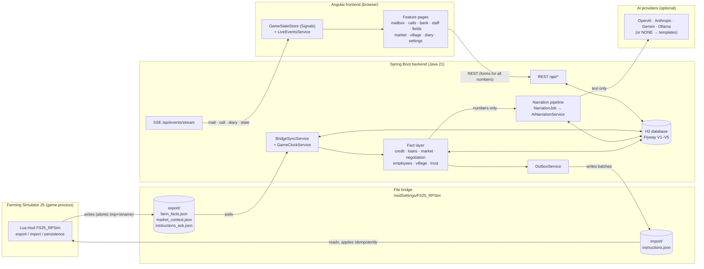

# Architecture overview

FarmPulse (technical name `rpsim`) adds an AI role-play layer to Farming Simulator 25. Three components talk to
each other; the Lua mod and the backend never talk directly over a network but exchange JSON files.

| Layer | Responsibility | Details |
| --- | --- | --- |
| Lua mod (`mod/`) | Export farm facts and market context, apply instructions (money, prices, farmland), persist processed ids in the savegame | [`mod/README.md`](../../mod/README.md), [`bridge-protocol.md`](../dev/bridge-protocol.md) |
| File bridge | Decouples game and tool; every file carries the `savegameId`; ack + idempotency | [`file-bridge-sequence.md`](file-bridge-sequence.md) |
| Backend (`backend/`) | All game-relevant decisions (deterministic formulas), persistence, narration jobs, REST + SSE | [`domain-model.md`](domain-model.md), [`two-tier-principle.md`](two-tier-principle.md) |
| AI provider | Only writes texts (tone, personality) around numbers that are already decided | [`ai-providers.md`](../dev/ai-providers.md) |
| Frontend (`frontend/`) | Role-play UI; live updates via SSE; every number is entered in a form, never extracted from free text | [`frontend.md`](../dev/frontend.md) |

Development and tests run without FS25: the bridge simulator (`tools/bridge-simulator/`) plays the mod's part on
the same files.
