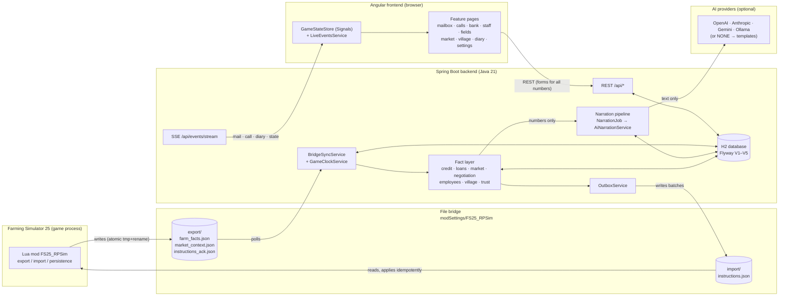

# Architecture overview

FarmPulse (technical name `rpsim`) adds an AI role-play layer to Farming Simulator 25. Three components talk to
each other; the Lua mod and the backend never talk directly over a network but exchange JSON files.

```mermaid
flowchart LR
    subgraph FS25["Farming Simulator 25 (game process)"]
        MOD["Lua mod FS25_RPSim<br/>export / import / persistence"]
    end

    subgraph BRIDGE["File bridge<br/>modSettings/FS25_RPSim"]
        EXP[("export/<br/>farm_facts.json<br/>market_context.json<br/>instructions_ack.json")]
        IMP[("import/<br/>instructions.json")]
    end

    subgraph BACKEND["Spring Boot backend (Java 21)"]
        SYNC["BridgeSyncService<br/>+ GameClockService"]
        FACTS["Fact layer<br/>credit · loans · market · negotiation<br/>employees · village · trust"]
        OUTBOX["OutboxService"]
        NARR["Narration pipeline<br/>NarrationJob → AiNarrationService"]
        DB[("H2 database<br/>Flyway V1–V5")]
        API["REST /api/*"]
        SSE["SSE /api/events/stream"]
    end

    subgraph AI["AI providers (optional)"]
        LLM["OpenAI · Anthropic · Gemini · Ollama<br/>(or NONE → templates)"]
    end

    subgraph WEB["Angular frontend (browser)"]
        UI["Feature pages<br/>mailbox · calls · bank · staff · fields<br/>market · village · diary · settings"]
        STORE["GameStateStore (Signals)<br/>+ LiveEventsService"]
    end

    MOD -- "writes (atomic tmp+rename)" --> EXP
    IMP -- "reads, applies idempotently" --> MOD
    EXP -- "polls" --> SYNC
    SYNC --> FACTS
    FACTS --> OUTBOX
    OUTBOX -- "writes batches" --> IMP
    FACTS -- "numbers only" --> NARR
    NARR -- "text only" --> LLM
    FACTS & NARR & SYNC <--> DB
    API <--> DB
    UI -- "REST (forms for all numbers)" --> API
    SSE -- "mail · call · diary · state" --> STORE
    STORE --> UI
```

| Layer | Responsibility | Details |
| --- | --- | --- |
| Lua mod (`mod/`) | Export farm facts and market context, apply instructions (money, prices, farmland), persist processed ids in the savegame | [`mod/README.md`](../../mod/README.md), [`bridge-protocol.md`](../dev/bridge-protocol.md) |
| File bridge | Decouples game and tool; every file carries the `savegameId`; ack + idempotency | [`file-bridge-sequence.md`](file-bridge-sequence.md) |
| Backend (`backend/`) | All game-relevant decisions (deterministic formulas), persistence, narration jobs, REST + SSE | [`domain-model.md`](domain-model.md), [`two-tier-principle.md`](two-tier-principle.md) |
| AI provider | Only writes texts (tone, personality) around numbers that are already decided | [`ai-providers.md`](../dev/ai-providers.md) |
| Frontend (`frontend/`) | Role-play UI; live updates via SSE; every number is entered in a form, never extracted from free text | [`frontend.md`](../dev/frontend.md) |

Development and tests run without FS25: the bridge simulator (`tools/bridge-simulator/`) plays the mod's part on
the same files.

## Threads and shutdown (technical review 10/2026, Phase 1.5–1.8)

Each kind of background work has a thread of its own, so a slow part cannot hold the others:

| Work | Thread | Notes |
| --- | --- | --- |
| Bridge cycle (`BridgeScheduler`) | `bridge` (1, strictly one cycle after the other) | `rpsim.bridge.poll-interval-ms`; on shutdown a running cycle gets 10 s, an interrupted one continues from its queue |
| Narration (`NarrationWorker`) | `narration-poll` + `narration-1..n` (`rpsim.ai.worker-threads`, default 1) | Claim the job (transaction, `IN_PROGRESS` + lease) → AI call **without** transaction → store (transaction). A lease that runs out is claimed again |
| Live updates (`SseHub`) | `sse-<n>`, one per connected app | `broadcast` only queues (100 events per client); a client that lags behind is disconnected and reconnects by itself |
| SSE keep-alive | Spring's scheduler (`@Scheduled`) | only queues a `ping` |

All these threads are daemons. When the backend stops, `SseHub` completes every stream first (an open stream would
make Tomcat's graceful shutdown wait 30 s), then bridge and narration finish their current work, then the AI HTTP
clients are closed. At every start, before Flyway migrates, the H2 database is backed up (`rpsim.db.backup-dir`,
newest 5 kept).
