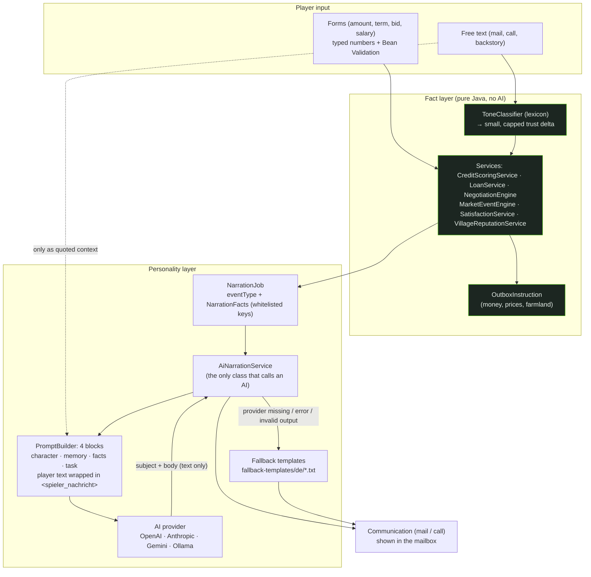

# Two-tier principle (fact layer vs. personality layer)

The central security concept: **the AI never produces numbers.** Everything that moves game money, prices,
skills or trust is decided by deterministic services with configurable formulas (`rpsim.formulas.*`). The AI only
receives the finished result and phrases it in the voice of a character.

Guard rails (each is covered by tests):

| Rule | Where |
| --- | --- |
| Forbidden fact keys (score, minAccept, maxBid, trust, weight, threshold, hiddenMax, virtualWealth) can never reach a prompt | `NarrationFacts` |
| Player text is data, not instructions (`<spieler_nachricht>` wrapper, system prompt says so) | `PromptBuilder` |
| AI output is parsed as text only; numbers in it never flow back into the fact layer | `AiOutputParser`, `AiNarrationService` |
| Numbers come exclusively from forms (typed request DTOs), never parsed from free text | `api/Requests` |
| Trust from tone is small and capped per message (`rpsim.formulas.tone.cap`); proactive messages have a pacing cool-down | `ToneTrustService`, `ConversationService` |
| Trust influence on credit (±8) is smaller than the gap between decision thresholds (30) | `CreditFormulaTest.trustCapIsSmallerThanThresholdGap` |
| Trust influence on land prices is capped at ±5 % | `NegotiationFormulaTest` |
| Without an AI provider (`NONE`) the game still works with templates | `FallbackTemplates` |
