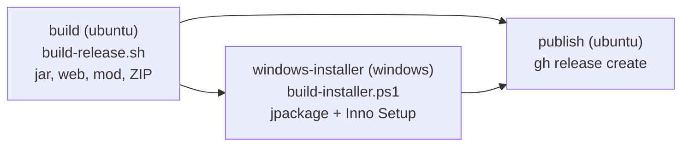

# Windows installer and desktop mode

Status: owner decisions of 2026-10-08 (see `QUESTIONS.md`), implemented in the same change.

## Goal

Players get a normal Windows setup (`FarmPulse-<v>-Setup.exe`) instead of a ZIP with `start.bat`:

- the setup asks for the important settings (AI provider, exchange folder, port, ...),
- the installed application starts **in the background** (no console window that can be closed by accident), shows a
  **tray icon** and **opens the browser** on the right port as soon as the server is ready.

The existing ZIP bundle (`FarmPulse-<v>.zip`, `start.bat` / `start.sh`, `application-local.yml`) stays **unchanged** for
experts and Linux/macOS.

## Release assets

| File | Audience | Built by |
| --- | --- | --- |
| `FarmPulse-<v>-Setup.exe` | players (Windows) | job `windows-installer` (new) |
| `FarmPulse-<v>.zip` | experts, Linux/macOS | job `build` (unchanged script) |
| `FS25_RPSim.zip` | everybody | job `build` |

The snapshot pre-release on every push to `main` gets the setup as well (`FarmPulse-<v>-snapshot-Setup.exe`).

## Build pipeline (`.github/workflows/release.yml`)

1. **build** – unchanged `tools/release/build-release.sh` (incl. backend tests); uploads the jar, the web ZIP, the mod
   ZIP, the player ZIP and the release notes as workflow artifact.
2. **windows-installer** – `tools/release/build-installer.ps1`:
   - `jpackage --type app-image` turns `rpsim-backend.jar` + `web/` into `FarmPulse\FarmPulse.exe` with its **own Java
     runtime** (players need no Java installation). The launcher is a GUI launcher (no `--win-console`), so no console
     window appears. Its only JVM option is `-Drpsim.desktop.enabled=true`.
   - **Inno Setup 6** (`tools/release/installer/FarmPulse.iss`, German only) packs the app image into the setup with the
     settings pages. The setup is **not code-signed** for now: Windows SmartScreen shows "unknown publisher"; the
     installation guide explains "Weitere Informationen → Trotzdem ausführen".
3. **publish** – creates the GitHub Release (tag) or replaces the snapshot pre-release with all assets.

Pull requests that touch the release tooling or the desktop code run `build` and `windows-installer` (without
publishing), so a broken installer script is seen before it reaches `main`.

## Installer

**Install mode:** the player chooses at the start (Inno Setup `PrivilegesRequiredOverridesAllowed=dialog`):
"only for me" (default, no admin rights, `%LOCALAPPDATA%\Programs\FarmPulse`) or "for all users" (admin,
`C:\Program Files\FarmPulse`). Settings always belong to the user who runs the setup (see *Files* below).

**Pages (in this order):**

| Page | Content | Default (new installation) |
| --- | --- | --- |
| Update (only when a previous installation exists) | "Bisherige Einstellungen beibehalten" or "Einstellungen neu festlegen"; keeping skips the settings pages and leaves the files untouched | keep |
| KI-Anbieter | later in FarmPulse / without AI (template texts) / OpenAI / Anthropic / Google Gemini / Ollama; API key (masked); model (optional); Ollama address | later in FarmPulse |
| Ordner | exchange folder (`modSettings\FS25_RPSim`) and FS25 `mods` folder, both with "Durchsuchen" | the real Windows *Documents* folder (`{userdocs}`, works with a OneDrive redirect) + `My Games\FarmingSimulator2025\...` |
| Start | preferred port; "Browser beim Start öffnen" | 8080; on |
| Tasks | copy the mod into the `mods` folder; start with Windows (autostart, background); desktop shortcut | all on |
| Finish | "FarmPulse jetzt starten" | on |

When the player re-enters the settings during an update, every page is pre-filled with the previous answers (Inno
Setup `RegisterPreviousData`), except the API key: an empty key field keeps the stored key.

**Uninstall:** stops a running FarmPulse (Restart Manager), removes the program and asks
"Spielstände und Einstellungen ebenfalls löschen?" (default *No*) for `%USERPROFILE%\.rpsim`. The mod in the `mods`
folder is never removed (savegames depend on it).

## Files of the desktop installation

All per-user files live in `%USERPROFILE%\.rpsim\`, where the prod profile already keeps the database:

| File | Written by | Content |
| --- | --- | --- |
| `rpsim.mv.db`, `db.properties` | backend | database and its password (unchanged) |
| `farmpulse-setup.yml` | setup | `server.port`, `rpsim.bridge.path`, `rpsim.desktop.open-browser` |
| `application-local.yml` | the player (optional) | expert overrides, win over `farmpulse-setup.yml` |
| `local-config/ai-provider.properties` | setup **and** settings page | AI provider, model, key, base URL – the same file the settings page writes, so a provider chosen in the setup shows up there and can be changed later in the tablet |
| `logs/farmpulse.log` | backend | log file (there is no console) |
| `desktop.lock`, `desktop.url` | backend | single-instance lock and the URL of the running instance |

The setup writes `farmpulse-setup.yml` and the AI file only on a new installation or when the player chose
"Einstellungen neu festlegen". It merges into an existing AI file (other providers' keys survive).

Known limit: with "for all users", Windows may run the setup elevated under a *different* administrator account
(standard user + admin password). The settings then land in that administrator's profile; the player sets them once
in the tablet instead. The common case (the player is administrator of the gaming PC) is not affected.

## Desktop mode of the backend (`de.farmpulse.rpsim.desktop`)

Active only when the JVM is started with `-Drpsim.desktop.enabled=true` (the `jpackage` launcher). `start.bat`,
`start.sh`, development and tests behave exactly as before.

1. **Before Spring starts** (`DesktopLauncher`):
   - **single instance:** an exclusive lock on `~/.rpsim/desktop.lock`. A second start does not start a second server:
     it waits up to 120 s for `~/.rpsim/desktop.url` and opens the browser there, then exits.
   - sets the profiles `prod,desktop`, the static web folder `<install>\app\web` and the data folder, unless they are
     given explicitly.
   - turns AWT headless mode off (tray icon, browser, dialogs).
2. **Profile `desktop`** (`application-desktop.yml`): imports `~/.rpsim/farmpulse-setup.yml`, then
   `~/.rpsim/application-local.yml`; AI file, log file as in the table above.
3. **Port** (`DesktopPortCustomizer`): the configured port is the preferred one. When it is taken, the next free port
   up to `rpsim.desktop.port-search-range` above it is used (owner decision: automatically a free port; the tablet
   address can then change - the tray notification says so).
4. **Ready** (`DesktopIntegration`, `ApplicationReadyEvent`): writes `desktop.url`, shows the tray icon
   ("FarmPulse öffnen", "Protokoll öffnen", "Beenden"; double click opens the browser) and opens the browser when
   `rpsim.desktop.open-browser` is on.
5. **Start failure:** a dialog with an understandable message and the path of the log file (e.g. the database is in
   use because FarmPulse is already running via `start.bat`), then exit code 1.
6. **Shutdown** ("Beenden", Windows logoff, uninstall): Spring closes normally, `desktop.url` is deleted, the lock is
   released.

## Decisions (owner, 2026-10-08)

| Question | Decision |
| --- | --- |
| Java | bundled with the setup |
| Install location | the player chooses (only for me / for all users) |
| Background operation | tray icon with open / log / quit |
| Extra settings | copy the mod, autostart with Windows, port + open browser, desktop shortcut – all preselected |
| Uninstall | ask whether to delete savegames and settings (default no) |
| Update | the player chooses: keep the settings or set them again |
| Code signing | unsigned for now |
| Snapshot | gets the setup, too |
| Language | German only |
| Port in use | automatically the next free port |
| Expert ZIP | stays unchanged |
