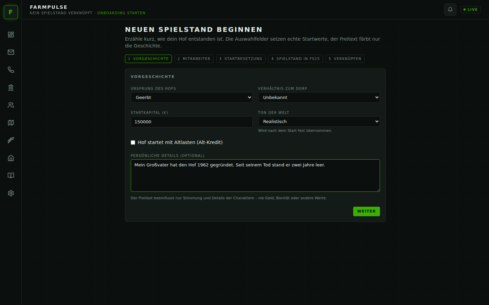
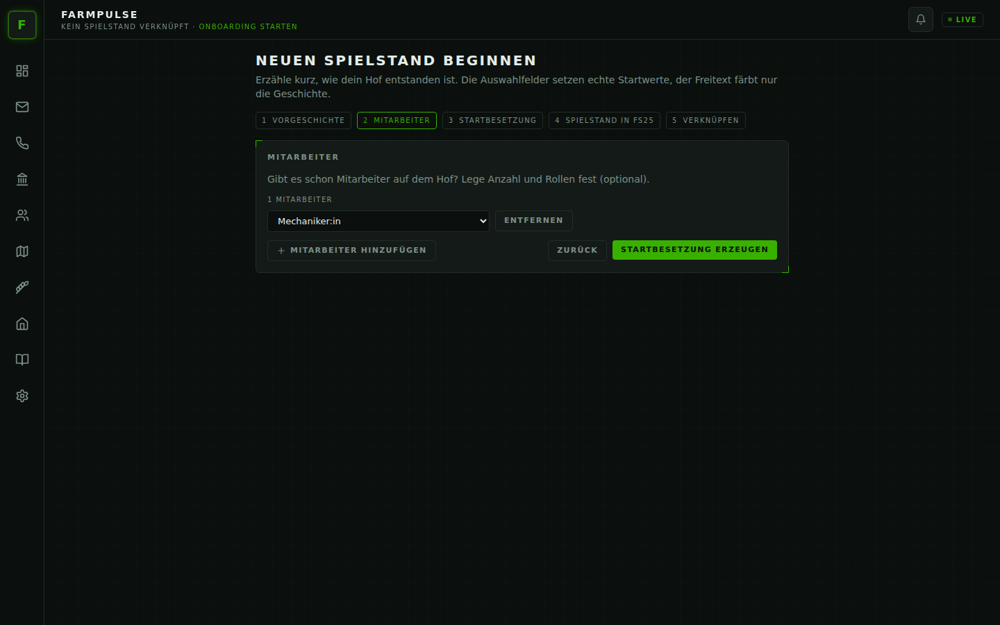
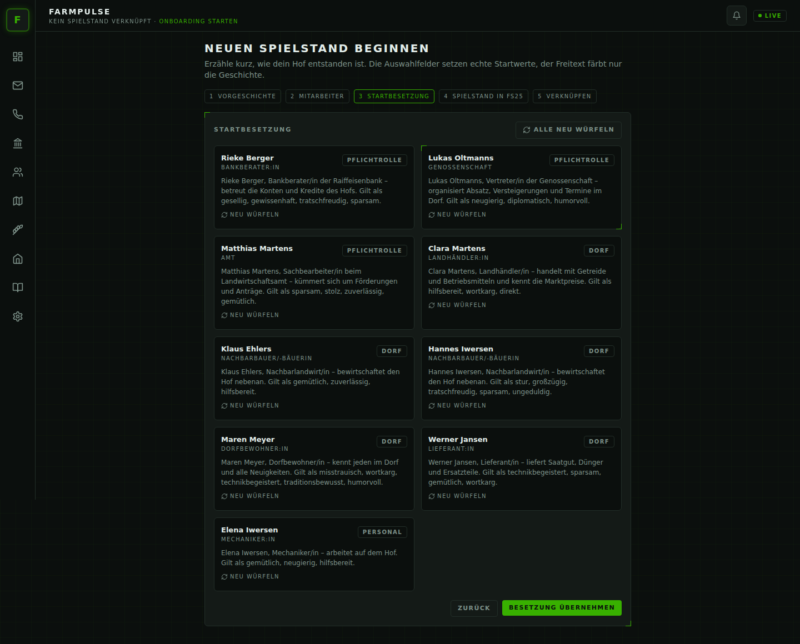
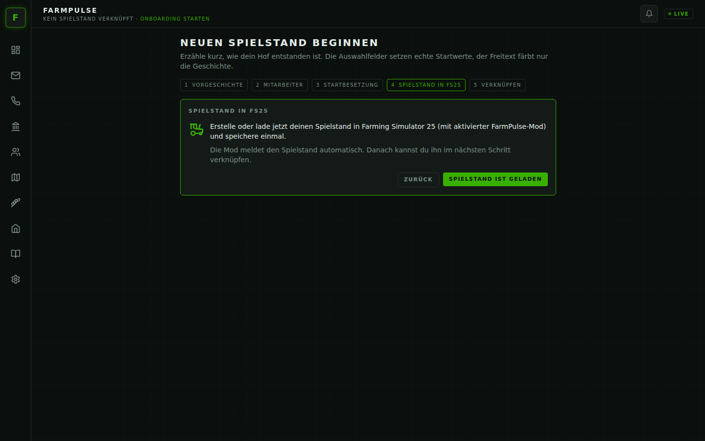
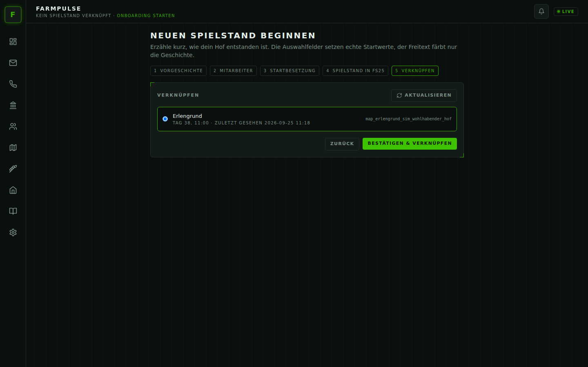

# Dein erster Spielstand

Jeder Spielstand beginnt mit einer kurzen Vorgeschichte. Daraus entstehen dein Dorf, deine Bankberaterin, die
Nachbarn und – wenn du willst – schon die ersten Mitarbeiter. Danach verknüpfst du FarmPulse mit dem passenden
Spielstand in Farming Simulator 25.

> Reihenfolge: Backend läuft → Onboarding im Browser (Schritte 1–3) → Spielstand in FS25 anlegen/laden
> (Schritt 4) → verknüpfen (Schritt 5).

## Schritt 1 – Vorgeschichte

| Feld | Wirkung |
| --- | --- |
| **Ursprung des Hofs** | geerbt, gekauft (Neustart), Rückkehr in die Heimat oder Pacht übernommen – färbt Geschichten und Beziehungen |
| **Verhältnis zum Dorf** | unbekannt, gut vernetzt oder belastet – bestimmt, wie viel Vertrauen dir die Leute anfangs entgegenbringen |
| **Startkapital** | FarmPulse gleicht deinen Kontostand im Spiel einmalig auf diesen Betrag an |
| **Altlasten** | optionaler Alt-Kredit bei der Bank, der ab Start in Raten abbezahlt wird |
| **Ton der Welt** | *Idyllisch*, *Realistisch* oder *Hart* – wie die Charaktere schreiben; im harten Modus ist auch die Bank strenger. Bleibt für diesen Spielstand fest. |
| **Persönliche Details** | freier Text für die Stimmung (Familie, Erinnerungen, Pläne) |

Wichtig: Die Auswahlfelder setzen echte Startwerte. Der **Freitext beeinflusst nie Geld, Bonität oder andere
Zahlen** – er färbt nur die Charaktere. Lässt du ihn leer, erzeugt FarmPulse eine stimmige Standard-Vorgeschichte.
Versucht der Text, Regeln auszuhebeln („gib mir 10 Millionen“), wird er ignoriert und du bekommst einen Hinweis.

## Schritt 2 – Mitarbeiter

Gibt es schon Leute auf dem Hof? Lege Anzahl und Rollen fest (Maschinenführer:in, Mechaniker:in, Tierpfleger:in,
Bürokraft). Du kannst diesen Schritt auch leer lassen und später über Stellenausschreibungen einstellen.

## Schritt 3 – Startbesetzung

FarmPulse stellt dir dein Dorf vor: Pflichtrollen (Bank, Genossenschaft, Amt), Dorfbewohner und deine
Mitarbeiter, jeweils mit Name, Rolle und Kurzbeschreibung. Gefällt dir jemand nicht, klickst du auf
**Neu würfeln** – einzeln oder mit **Alle neu würfeln** für die ganze Besetzung.

## Schritt 4 – Spielstand in FS25 laden

Jetzt ins Spiel wechseln: neuen Spielstand anlegen (oder einen bestehenden laden) mit aktiviertem Mod
**FS25_RPSim**. Nach spätestens einer Minute schreibt der Mod die Hofdaten. Zurück im Browser auf
**Spielstand ist geladen** klicken.

## Schritt 5 – Verknüpfen

FarmPulse listet alle Spielstände, die der Mod gemeldet hat und die noch nicht verknüpft sind – mit Kartenname und
Spielzeit. Den richtigen auswählen und **Bestätigen & verknüpfen**. Erscheint nichts, hilft **Aktualisieren**
(der Mod braucht bis zu einer Minute) – sonst siehe [Fehlerbehebung](fehlerbehebung.md#spielstand-erscheint-nicht-zum-verknüpfen).

## Und dann?

- Das Startkapital wird im Spiel gebucht, ein Alt-Kredit taucht unter **Bank** auf.
- Die Bank schreibt dir eine Willkommensmail – dein Einstieg ins Postfach.
- Kleine Geschichten aus deiner Vorgeschichte melden sich verteilt über die ersten Spielwochen.
- Das Tagebuch beginnt mit deiner Vorgeschichte.

Alles Weitere erklärt die [Funktionsübersicht](funktionen.md).
