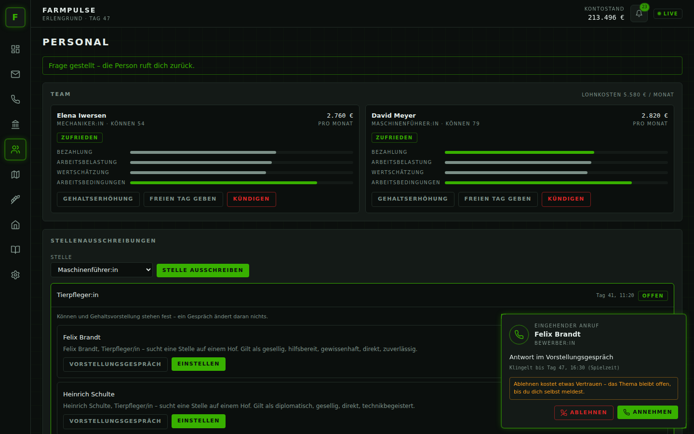
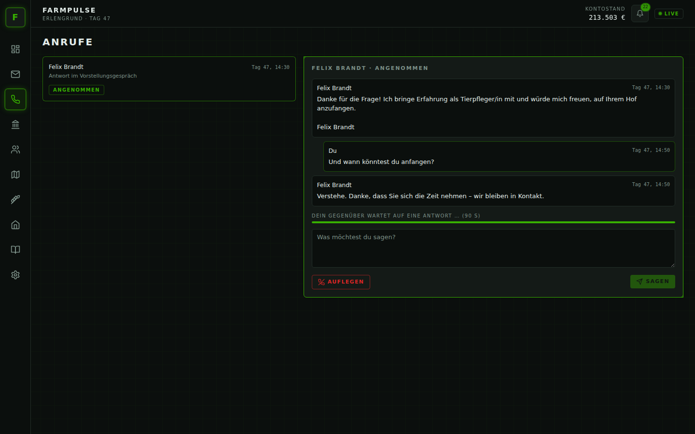
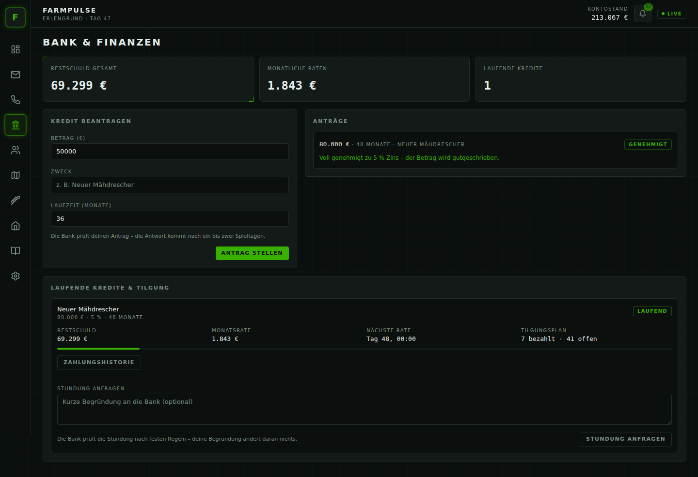
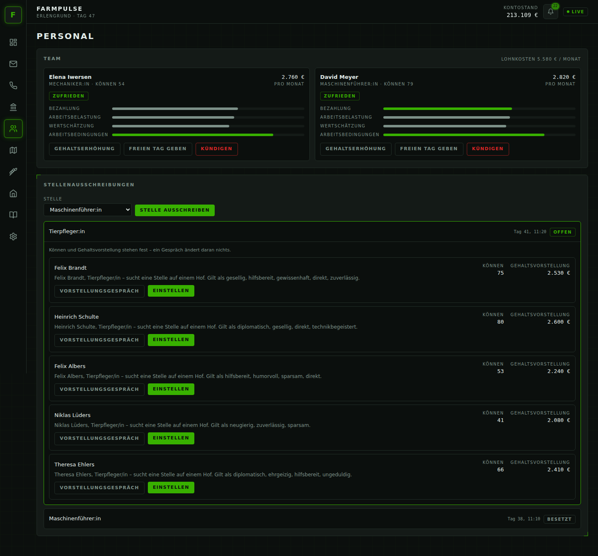
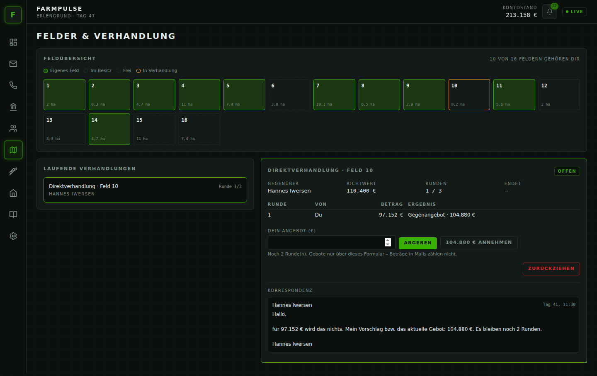
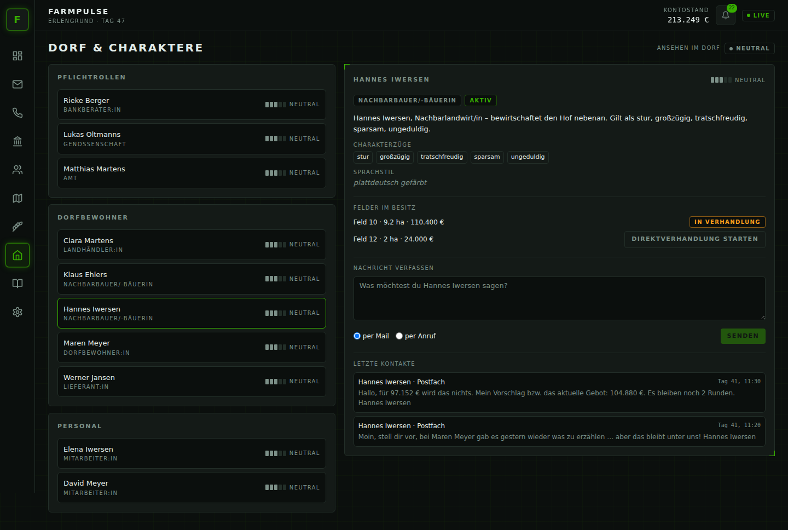
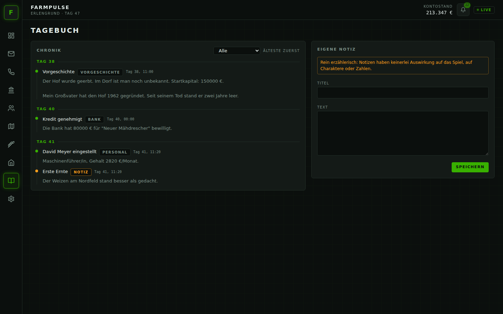
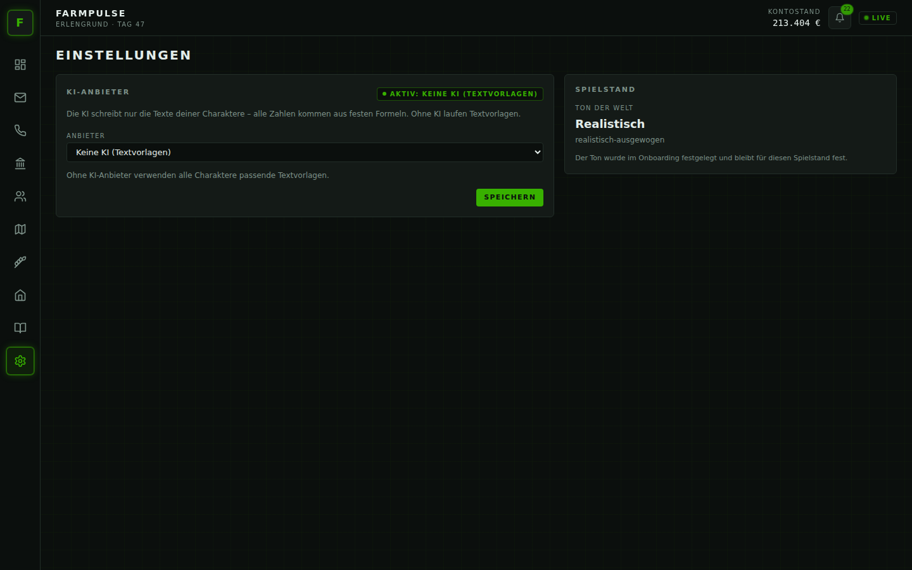
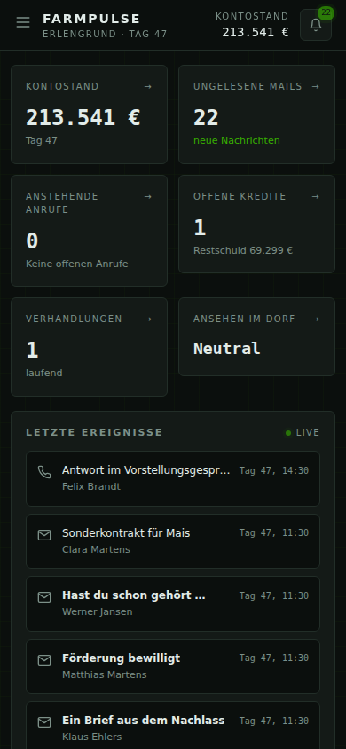

# Funktionen im Überblick

FarmPulse läuft neben dem Spiel: Du spielst Farming Simulator wie gewohnt, und im Browser melden sich die Menschen
aus deinem Dorf. **Alle Zahlen – Kredite, Preise, Gehälter, Vertrauen – berechnet FarmPulse nach festen Regeln.**
Die KI formuliert nur, *wie* die Charaktere es dir sagen. Deshalb gibst du Beträge immer in Formularen ein, nie im
Freitext.

Neues erscheint **live** (grüne Anzeige *Live* oben rechts), ohne dass du die Seite neu laden musst. Die Glocke
zählt ungelesene Mails und anstehende Anrufe.

## Dashboard

Kontostand, ungelesene Mails, anstehende Anrufe, offene Kredite, laufende Verhandlungen und dein Ansehen im Dorf auf
einen Blick – dazu die letzten Ereignisse, eine Vorschau aufs Postfach und dein Silobestand.

## Postfach

Mails sind ohne Zeitdruck: Antworte frei, wann du willst – die Antwort kommt in Spielzeit zurück. Mails, bei denen
es um Geld geht (Gegenangebot der Bank, Bewerbungen, Gebote, Sonderkontrakte), tragen das Badge **Formular** und
führen dich mit **Zum Formular** an die richtige Stelle. Glückwünsche, Einladungen und Klatsch erkennst du am Badge
**Dorfleben**. Wie freundlich du schreibst, merkt sich dein Gegenüber – ein wenig.

Während du spielst, blendet FS25 neue Mails und eingehende Anrufe kurz ein („FarmPulse: Neue Mail von …“), damit du
nicht ständig in den Browser schauen musst. Abschalten lässt sich das mit `rpsim.bridge.ingame-notifications: false`.

## Anrufe

Anrufe klingeln – in Spielzeit. **Annehmen** öffnet das Gespräch. **Ablehnen** kostet etwas Vertrauen, und das
Thema bleibt offen, bis du dich selbst meldest. Ignorierst du den Anruf, gilt er nach einer Weile als verpasst.

Im Gespräch zeigt ein Balken, dass dein Gegenüber auf eine Antwort wartet. Das ist nur Stimmung: Nimmst du dir
länger Zeit, passiert nichts Schlimmes. **Auflegen** beendet das Gespräch.

## Bank & Finanzen

- **Kredit beantragen:** Betrag, Zweck, Laufzeit. Die Bank prüft ein bis zwei Spieltage.
- **Ergebnis:** *Genehmigt*, *Gegenangebot* (geringerer Betrag, kürzere Laufzeit oder höherer Zins – annehmen oder
  ablehnen) oder *Abgelehnt* mit einer groben Begründung. Die genaue Rechnung verrät die Bank nicht – wie im echten
  Leben.
- In die Prüfung fließen dein Vermögen (auch das Getreide im Silo), Liquidität, Einnahmen, Schulden (auch der
  Kredit aus dem Grundspiel), Zahlungshistorie und – nur als kleiner Zuschlag – dein Vertrauen bei der Bank.
- **Laufende Kredite:** Rate, Restschuld, Tilgungsplan und Zahlungshistorie. Raten werden automatisch abgebucht –
  jeweils zu Beginn eines Spielmonats. Ein Spielmonat ist der Monat im FS25-Kalender; stellst du im Spiel die
  „Tage pro Monat“ um, verschieben sich alle Termine passend mit.
- Geleaste Fahrzeuge zählen nicht zum Vermögen.
- **Zahlungsausfall:** Mahnung → Verzugsgebühr → Vertrauensverlust → bei wiederholtem Ausfall Fälligstellung der
  Restschuld (das spricht sich im Dorf herum) oder Kreditsperre.
- **Stundung:** Einmal pro Kredit kannst du um eine Ratenpause bitten; die Bank entscheidet nach festen Regeln.

## Personal

- **Stelle ausschreiben:** Nach kurzer Zeit bewerben sich 3–5 Leute, mit Können und Gehaltsvorstellung.
- **Vorstellungsgespräch:** Frag per Mail oder Anruf – Können und Gehalt ändern sich dadurch nicht, du lernst die
  Person nur kennen.
- **Team:** Zufriedenheit gesamt und je Bereich (Bezahlung, Arbeitsbelastung, Wertschätzung,
  Arbeitsbedingungen = Zustand deiner Maschinen). Zufriedene Leute arbeiten besser, das zeigt sich monatlich im
  Geld.
- **Gehalt:** wird zu Beginn jedes Spielmonats (FS25-Kalender) überwiesen.
- **Gehaltserhöhung, freier Tag, Kündigen.** Bleibt jemand lange unzufrieden, kommt erst eine Warnung, dann die
  Kündigung.

## Felder & Verhandlung

Die Feldübersicht zeigt alle Felder der Karte: deine eigenen, die der Dorfbewohner und freie. Felder, die
jemandem gehören, gehören den Figuren, die das Spiel selbst dem Feld zuordnet – du triffst also dieselben Namen wie
im Feld-Menü von FS25. Diese Figuren gehören zur Karte und ziehen nie weg.

- **Versteigerungen** werden per Mail angekündigt; andere bieten mit, du hast bis zu drei Runden.
- **Direktverhandlung:** Bei Feldern, die jemandem aus dem Dorf gehören, eröffnest du selbst eine Verhandlung.
  Auf ein zu niedriges Angebot folgt ein Gegenangebot, das du mit einem Klick annehmen kannst.
- **Eigene Felder verkaufen:** Wunschpreis nennen, Interessenten melden sich mit einem ersten Angebot.

Einigt ihr euch, wechselt das Feld im Spiel den Besitzer und das Geld wird gebucht. Reicht dein Kontostand für
einen Kauf nicht, platzt das Geschäft – das Feld bleibt beim bisherigen Besitzer. Flächen, die das Spiel selbst
nicht zum Kauf anbietet (Ortschaft, Straßen), sind als „nicht handelbar“ markiert.

## Warenbestand & Preise

Was liegt im Silo, was ist es wert, wo zahlt man gerade am meisten? Der **Preisverlauf** zeigt die Preise je
Verkaufsstelle über 7, 30, 90 Tage oder den ganzen Spielstand (mit *Tabelle* auch als Zahlen). Im
**Marktgeschehen** stehen Preisereignisse, Gerüchte (die nicht immer stimmen) und Sonderkontrakte zum Festpreis, an
denen du teilnehmen kannst. Ein volles Silo zählt übrigens bei der Bank als Vermögen, und Marktereignisse treffen
bevorzugt die Früchte, die du wirklich lagerst.

## Verträge & Vorgänge

Neue Ansprechpartner stellen sich vor, sobald es für sie etwas zu tun gibt. Ihre Verträge und offenen Vorgänge
findest du unter **Verträge & Vorgänge**.

- **Versicherungsmakler:in – Sturm- und Hagelversicherung.** Unwetter werden simuliert: Hagel trifft im Frühjahr
  und Sommer eines deiner Felder, Stürme im Herbst und Winter deine Gebäude. Ein Schaden kostet immer Geld. Mit
  Versicherung (Tarif *Basis* oder *Komfort*, Prämie zu jedem Monatsbeginn) meldest du den Schaden per Mail oder
  Anruf innerhalb der Frist und bekommst einen Teil erstattet (abzüglich Selbstbehalt). Ist eine Prämie offen, ruht
  der Schutz; nach zwei offenen Prämien endet der Vertrag.
- **Jagdpächter:in – Wildschäden.** Im Sommer und Herbst wühlen Wildschweine auf deinen Feldern (simuliert, der
  Schaden kostet Geld). Der Jagdpächter bietet Ersatz an. Du kannst annehmen, mehr fordern (bis zu zwei Runden),
  eine **gemeinsame Maßnahme** vereinbaren (eigener Beitrag, danach für einige Monate seltener Schäden, besseres
  Ansehen im Dorf) oder ablehnen – ein Streit spricht sich herum. Antwortest du nicht, zahlt er sein letztes Angebot.
- **Tierarzt, Viehhändler:in und Zuchtberatung – nur wenn du Tiere hältst.** Der Tierarzt kommt alle paar Monate zur
  Routineuntersuchung je Tierart und schickt eine Rechnung (Grundgebühr plus Betrag je Tier). Die Zuchtberatung
  kommentiert, wie sich dein Bestand entwickelt hat. Der Viehhändler bietet ab und zu an, eine Anzahl Tiere zu kaufen
  oder zu verkaufen, und zahlt dafür eine **Prämie je Tier**. Den Handel selbst erledigst du im Spiel wie gewohnt:
  Nimmst du das Angebot an, zählt bis zur Frist, um wie viele Tiere sich dein Bestand in die vereinbarte Richtung
  verändert hat – für jedes davon gibt es die Prämie (höchstens für die vereinbarte Anzahl).
- **Energieversorger – nur wenn deine Karte eine passende Verkaufsstelle hat.** Nimmt eine Verkaufsstelle z. B.
  Silage, Gärreste oder Methan an (Biogas-Anlage), bietet der Energieversorger Festpreis-Kontrakte an (du entscheidest
  unter **Warenbestand & Preise**, ob du mitmachst) oder kündigt Preisschwankungen an dieser Stelle an. Gibt es keine
  solche Verkaufsstelle, meldet er sich nicht.
- **Pacht.** Felder, die jemandem aus dem Dorf gehören, kannst du auf der Feldseite mit **Pacht anfragen** pachten
  statt kaufen. Sagt der Besitzer zu, nimmst du das Angebot unter **Verträge** an: Im Spiel gehört dir das Feld dann
  für die Laufzeit (du kannst es ganz normal bewirtschaften), die Pacht wird zu jedem Monatsbeginn abgebucht. Einen
  Monat vor dem Ende meldet sich der Besitzer mit einer Verlängerung zum neuen Pachtpreis und – wenn er verkaufen
  würde – einem Kaufangebot. Antwortest du nicht, geht das Feld zum Ende automatisch zurück. Bleibt die Pacht zweimal
  offen, nimmt er das Feld vorzeitig zurück.
- **Werkstatt – Wartungsvertrag.** Für eine feste Monatsgebühr (abhängig vom Wert deiner Maschinen) setzt die
  Werkstatt zu jedem Monatsbeginn die am stärksten abgenutzten Fahrzeuge instand – direkt im Spiel, ohne weitere
  Kosten. Ohne Vertrag meldet sie sich ab und zu mit einem Hinweis, wenn eine Maschine stark abgenutzt ist. Das
  Angebot forderst du unter **Verträge** an; kündigen kannst du jederzeit.
- **Lieferverträge mit Produktionen.** Gibt es auf der Karte Produktionen, die Waren ankaufen (z. B. Bäckerei oder
  Molkerei), bietet die Genossenschaft gelegentlich einen Liefervertrag zum Festpreis an. Er erscheint wie ein
  Sonderkontrakt unter **Warenbestand & Preise**; du entscheidest, ob du mitmachst.

## Dorf & Charaktere

Alle Menschen im Dorf mit Rolle und Vertrauen (fünf Balken und ein Wort statt einer Zahl). In der Detailansicht
stehen Charakterzüge, Sprachstil und Hintergrund. Mit **Nachricht verfassen** meldest du dich selbst – per Mail oder
Anruf. Schreibst du jemandem mehrmals kurz hintereinander, antwortet er trotzdem; aufs Vertrauen wirkt nur der
erste Kontakt des Tages. Dein **Ansehen im Dorf** siehst du oben rechts als Stufe (gut angesehen, neutral,
umstritten). Gelegentlich ziehen Leute weg oder neu zu.

## Tagebuch

Die Chronik deines Hofs – beginnend mit der Vorgeschichte. Wichtige Ereignisse trägt FarmPulse selbst ein. Eigene
Notizen sind reine Erinnerung und haben keinerlei Auswirkung aufs Spiel.

## Einstellungen

KI-Anbieter, Modell und API-Schlüssel (siehe [Installation](installation.md#5-ki-anbieter-einrichten-optional)) und
der Ton deines Spielstands (nur Anzeige).

## Auf dem Handy

Die Oberfläche passt sich an kleine Bildschirme an – z. B. auf einem Tablet neben dem Spiel. Standardmäßig ist
FarmPulse nur auf dem eigenen PC erreichbar (`localhost`), weil es keine Anmeldung gibt. Für ein Tablet im
Heimnetz `server.address: 0.0.0.0` in `application-local.yml` eintragen und am Tablet `http://<IP-des-PCs>:8080`
öffnen – dann kann allerdings jeder in deinem Netz mitspielen.
