# Funktionen im Überblick

FarmPulse läuft neben dem Spiel: Du spielst Farming Simulator wie gewohnt, und auf deinem **Hof-Tablet** im Browser
melden sich die Menschen aus deinem Dorf. **Alle Zahlen – Kredite, Preise, Gehälter, Vertrauen – berechnet FarmPulse
nach festen Regeln.** Die KI formuliert nur, *wie* die Charaktere es dir sagen. Deshalb gibst du Beträge immer in
Formularen ein, nie im Freitext.

## Das Hof-Tablet

FarmPulse sieht aus wie ein Tablet auf dem Hof: Jede Funktion ist eine **App**, der Startbildschirm ist der
Homescreen.

- **Statusleiste (oben, immer sichtbar):** Karte, Spieltag und Uhrzeit, FS25-Monat, das **Wetter** aus dem Spiel
  (Temperatur, Regen oder trocken; mit der Maus darüber steht, wie nass der Boden ist), dein Kontostand und die
  Anzeige *Live*. Neues erscheint live, ohne dass du die Seite neu laden musst. Ein Klick auf den Kartennamen führt
  zurück zum Start. Die Temperatur braucht die aktuelle Mod-Version.
- **Startbildschirm:** Uhrzeit und Datum im Spiel, darunter drei Kennzahlen – das **Monatsergebnis** (führt zur Bank),
  die **nächste Abbuchung** zum Monatsbeginn (führt zum Kalender) und dein **Ansehen im Dorf** (führt zu den
  Kontakten). Daneben die Widgets **Zu erledigen** (die dringendsten Aufgaben), **Felder** (wie viele erntereif sind)
  und **Stall** (Gesundheit und Futter des Stalls, der am schlechtesten dasteht).
- **Apps:** Eine Zahl am App-Symbol zählt, was dort auf dich wartet – ungelesene Mails, klingelnde Anrufe, offene
  Entscheidungen.
- **Dock:** Post, Telefon, Aufgaben und Kalender liegen immer griffbereit – auf dem Start unten schwebend, in jeder
  App als Leiste am unteren Rand.
- **In einer App** steht oben ihr Name mit einer kurzen Beschreibung; **Start** führt zurück zum Homescreen.

| App | Was du dort findest |
| --- | --- |
| **Post** | Mails aus dem Dorf, Entscheidungen direkt in der Mail |
| **Telefon** | Anrufe annehmen, zurückrufen und nachlesen |
| **Kontakte** | Dorf, Familie und Vereine, Vertrauen und Ansehen, Sponsoring |
| **Aufgaben** | Alles, was auf deine Entscheidung wartet – aus allen Apps, nach Frist sortiert |
| **Kalender** | Die nächsten Tage, Abbuchungen zum Monatsbeginn, Dorffeste, Steuertermine, Familie, Einladungen |
| **Bank** | Kredite, Anträge und Hofbuchhaltung |
| **Ämter** | Finanzamt (Steuern, Bescheide, Steuerberatung) und Landwirtschaftsamt (Kontrollen) |
| **Agrarbörse** | Silo, Preise, Marktgeschehen, Kontrakte, Preisalarm und Vorkontrakte |
| **Versicherung** | Sturm- und Hagelversicherung, Schäden melden, Wildschaden |
| **Personal** | Team, Helferstunden, Helfer im Spiel und Stellenausschreibungen |
| **Flurkarte** | Felder, Kulturen, Fruchtfolge, Verhandlungen, Pacht und Forderungen |
| **Stall** | Tiere, Tierpfleger, Tierarzt, Viehhandel und Tierwohl |
| **Werkstatt** | Wartung, Wartungsvertrag und Mechaniker |
| **Handel** | Ware aus deinen Silos mit den Nachbarn handeln, Aufträge der Nachbarn, Hofladen |
| **Tagebuch** | Die Chronik deines Hofs |
| **Einstellungen** | KI, Fragen im Spiel, Hinweise und Reaktionen |

Alte Lesezeichen (z. B. `/mailbox`, `/bank`, `/contracts`) funktionieren weiter und führen in die passende App.

## Aufgaben

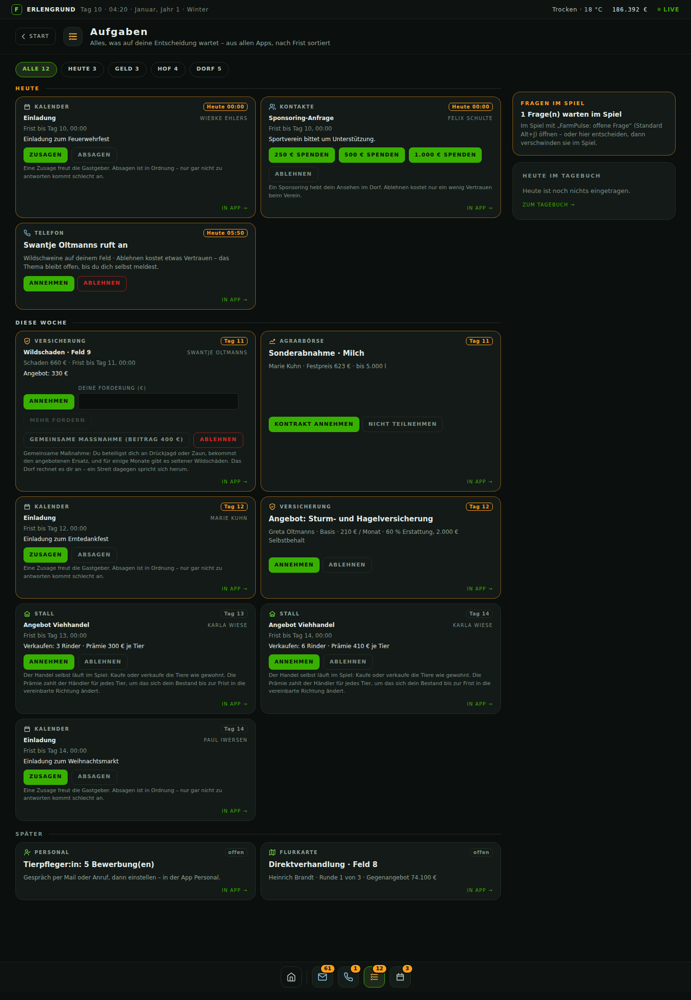

Alles, was auf deine Entscheidung wartet, an einem Ort: Schadensmeldungen, Vertragsangebote, eine auslaufende Pacht,
das Gegenangebot der Bank, klingelnde Anrufe, offene Verhandlungen, Sonderkontrakte, Stellen mit Bewerbungen,
Einladungen, Steuerbescheide und angekündigte Kontrollen. Die Liste ist nach Frist sortiert und in **Heute**,
**Diese Woche** und **Später** gegliedert; oben filterst du nach *Heute*, *Geld*, *Hof* und *Dorf*.

Ganz oben stehen die **Hinweise aus dem Spiel** – z. B. eine Buchung, die der Mod mangels Geld nicht ausführen
konnte, oder die Frage nach dem Nachbuchen, wenn du einen älteren Spielstand geladen hast (siehe
[Fehlerbehebung](fehlerbehebung.md#spielstand-ohne-speichern-neu-geladen)).

Jede Karte zeigt, aus welcher App sie kommt. Einfache Entscheidungen triffst du direkt auf der Karte; **In App**
öffnet die App mit dem Eintrag markiert. Warten Fragen im Spiel (siehe **Einstellungen**), steht ihre Zahl oben –
entscheidest du hier, verschwinden sie im Spiel. Daneben siehst du, was heute im Tagebuch steht.

## Kalender

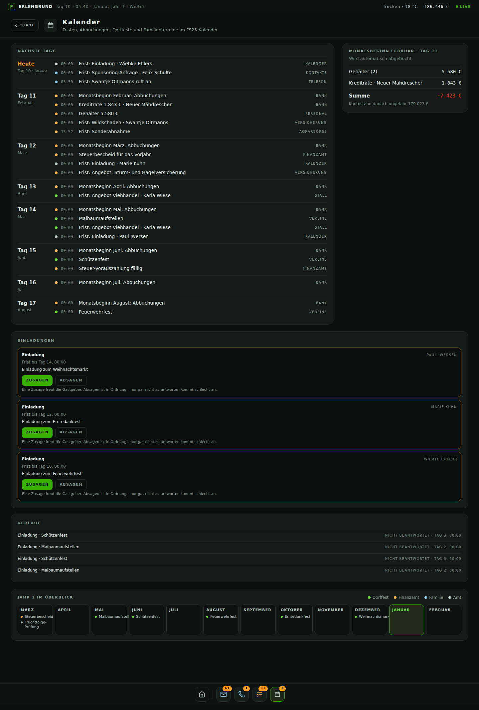

- **Nächste Tage:** alles, was in den kommenden Spieltagen ansteht – Monatsbeginn, Kreditraten, Gehälter,
  Vertragszahlungen, das Ende einer Pacht, Dorffeste, Steuertermine und die Fristen offener Entscheidungen.
- **Monatsbeginn:** was zum nächsten Monatsbeginn automatisch abgebucht wird (Gehälter, Kreditraten, Prämien,
  Pacht, Wartung, Altenteil), die Summe und ungefähr dein Kontostand danach. Was du **selbst zahlen** musst
  (Steuerbescheide), steht extra.
- **Das Jahr im Überblick:** die festen Termine des FS25-Jahres – Dorffeste der Vereine, Steuerbescheid und
  Vorauszahlungen, die Fruchtfolge-Prüfung des Amts und Familientermine (Geburtstage, Hochzeitstag, Einschulung).
- **Einladungen** zu den Dorffesten beantwortest du hier: **Zusagen** freut die Gastgeber, **Absagen** ist in
  Ordnung, gar nicht zu antworten kostet ein wenig Vertrauen.

Ein Spielmonat ist der Monat im FS25-Kalender; stellst du im Spiel die „Tage pro Monat“ um, verschieben sich alle
Termine passend mit.

## Post

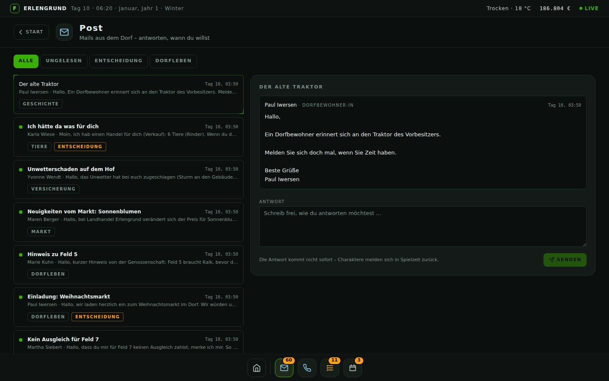

Mails sind ohne Zeitdruck: Antworte frei, wann du willst – die Antwort kommt in Spielzeit zurück. Wie freundlich du
schreibst, merkt sich dein Gegenüber – ein wenig.

Mails, bei denen es um eine Entscheidung geht (Gegenangebot der Bank, Vertragsangebote, Gebote, Sonderkontrakte,
Ausgleichsforderungen …), tragen das Badge **Entscheidung**. Statt einer freien Antwort zeigen sie die Karte **Deine
Entscheidung** mit den Bedingungen und den Knöpfen – du entscheidest also direkt in der Mail. **In der App öffnen**
führt zum Eintrag in seiner App (z. B. für eine Bewerbung ins Personal). Ist die Entscheidung schon gefallen oder
abgelaufen, steht das dort. Glückwünsche, Einladungen und Klatsch erkennst du am Badge **Dorfleben**. Oben filterst
du nach *Ungelesen*, *Entscheidung* und *Dorfleben*.

Während du spielst, blendet FS25 neue Mails und eingehende Anrufe kurz ein („FarmPulse: Neue Mail von …“), damit du
nicht ständig in den Browser schauen musst. Abschalten lässt sich das mit `rpsim.bridge.ingame-notifications: false`.

## Telefon

Anrufe klingeln – in Spielzeit, egal in welcher App du gerade bist. **Annehmen** öffnet das Gespräch. **Ablehnen**
kostet etwas Vertrauen, und das Thema bleibt offen, bis du dich selbst meldest. Ignorierst du den Anruf, gilt er
nach einer Weile als verpasst. In der App **Telefon** stehen alle Anrufe zum Nachlesen und Zurückrufen.

Im Gespräch zeigt ein Balken, dass dein Gegenüber auf eine Antwort wartet. Das ist nur Stimmung: Nimmst du dir
länger Zeit, passiert nichts Schlimmes. **Auflegen** beendet das Gespräch.

**Direkt im Spiel antworten:** Mit der aktuellen Mod-Version fragt das Spiel bei einem Anruf in einem Ja/Nein-Fenster,
ob du annimmst – ohne in den Browser zu wechseln. *Ja* nimmt an (das Gespräch ist danach im Browser bereit), *Nein*
lehnt ab wie der Knopf im Browser. Welche weiteren Entscheidungen im Spiel gefragt werden, stellst du unter
**Einstellungen** ein.

## Bank

- **Kredit beantragen:** Betrag, Zweck, Laufzeit. Die Bank prüft ein bis zwei Spieltage.
- **Ergebnis:** *Genehmigt*, *Gegenangebot* (geringerer Betrag, kürzere Laufzeit oder höherer Zins – annehmen oder
  ablehnen) oder *Abgelehnt* mit einer groben Begründung. Die genaue Rechnung verrät die Bank nicht – wie im echten
  Leben.
- In die Prüfung fließen dein Vermögen (auch das Getreide im Silo), Liquidität, Einnahmen, Schulden (auch der
  Kredit aus dem Grundspiel), Zahlungshistorie und – nur als kleiner Zuschlag – dein Vertrauen bei der Bank.
- **Laufende Kredite:** Rate, Restschuld, Tilgungsplan und Zahlungshistorie. Raten werden automatisch abgebucht –
  jeweils zu Beginn eines Spielmonats (was genau, zeigt der **Kalender**).
- Geleaste Fahrzeuge zählen nicht zum Vermögen.
- **Hofbuchhaltung:** Der Mod schreibt jede Buchung des Spiels mit (Ernteverkauf, Kraftstoff, Saatgut, Helferlohn,
  Leasing …) und summiert sie je Spielmonat. In der Bank siehst du Einnahmen und Ausgaben des laufenden Betriebs je
  Monat als Balken, das **Monatsergebnis** und in der *Tabelle* zusätzlich Investitionen, Anlagenverkäufe und
  Kredite. Die Bank rechnet damit: Dein Cashflow ist der Durchschnitt der abgeschlossenen Monate, Investitionen
  zählen nicht als Verlust, und die echten Leasingkosten gelten als laufende Verpflichtung. Mit einem älteren Mod
  rechnet die Bank weiter mit dem Kontostand.
- **Käufe und Verkäufe von Anlagen:** Fahrzeug-, Gebäude- und Feldkäufe zählen als Investition, ihre Verkäufe als
  Anlagenverkauf – beides senkt oder hebt dein Monatsergebnis nicht. Buchungen unter *Sonstiges* zählen je nach
  Vorzeichen als Einnahme oder Ausgabe des laufenden Betriebs.
- **Die Bank warnt:** Macht dein Betrieb zwei Monate in Folge Verlust, während ein Kredit läuft, meldet sich die
  Bank, bevor eine Rate platzt (einmal je Verlustphase).
- **Rekordmonat:** Hast du den höchsten Ernteerlös eines Monats seit Beginn, gratuliert die Genossenschaft – das
  stärkt ihr Vertrauen ein wenig.
- **Zahlungsausfall:** Mahnung → Verzugsgebühr → Vertrauensverlust → bei wiederholtem Ausfall Fälligstellung der
  Restschuld (das spricht sich im Dorf herum) oder Kreditsperre.
- **Stundung:** Einmal pro Kredit kannst du um eine Ratenpause bitten; die Bank entscheidet nach festen Regeln.
- **Sondertilgung:** Bei jedem laufenden Kredit (auch der Altlast) kannst du zusätzlich einen beliebigen Betrag bis
  zur Restschuld zurückzahlen. Die Monatsrate bleibt gleich, die Laufzeit wird kürzer – der Tilgungsplan zeigt die
  verbleibenden Raten. Je Spieljahr (FS25-Kalender) sind 10 % des ursprünglichen Kreditbetrags gebührenfrei; auf den
  Teil darüber berechnet die Bank 1 % Vorfälligkeitsentschädigung, die zusätzlich abgebucht wird. Zahlst du die
  komplette Restschuld, kommen die anteiligen Zinsen des laufenden Monats dazu. Vor dem Abschicken siehst du, was
  genau abgebucht wird; reicht dein Guthaben nicht, lehnt die Bank ab. Während eine Rate überfällig ist oder eine
  Stundung läuft, geht keine Sondertilgung. Die Bankberaterin bestätigt per Mail, und ab 5 % der Restschuld steigt
  ihr Vertrauen etwas.
- **Kredit aus dem Spielmenü:** Den Kredit im Finanzmenü von FS25 kannst du weiter nutzen – gesperrt wird nichts.
  Die Bank merkt es aber: Nimmst du dort Geld auf, meldet sich deine Bankberaterin („Sie haben sich woanders Geld
  geliehen?“) und ihr Vertrauen sinkt, je mehr du aufnimmst. Tust du es erneut, während der alte Kredit noch offen
  ist, kosten neue Kredite der Bank einen Zinsaufschlag, bis der Kredit aus dem Spielmenü ganz getilgt ist – gilt
  gerade ein Aufschlag, steht er direkt über dem Antragsformular. Jede Rückzahlung nimmt sie wohlwollend zur
  Kenntnis.
- **Grundschuld:** Im Antragsformular kannst du eigene Felder als Sicherheit anbieten. Der Beleihungswert ist 60 % des
  Feldpreises. Je mehr er vom Kreditbetrag deckt, desto günstiger wird der Zins (bei voller Deckung um 1
  Prozentpunkt), und die Bank sieht den Kredit nicht mehr als zu groß für deinen Betrieb an. Für einen sehr großen
  Kredit (über die Hälfte deines Vermögens) verlangt die Bank eine Grundschuld für den Teil darüber. Reichen deine
  Felder dafür, macht sie ein Gegenangebot „mit Grundschuld“ und nennt die Felder. Gepachtete Felder zählen nicht.
  Ein belastetes Feld ist in der **Flurkarte** markiert. Verkaufen kannst du es dort erst, wenn die Bank zustimmt
  (Knopf *Verkauf erlauben lassen* am Kredit). Der Erlös tilgt dann den Beleihungswert, ohne Gebühr. Verkaufst du es
  stattdessen im Spielmenü, ist die Bankberaterin verärgert und fordert die gleiche Sondertilgung binnen 10 Tagen.
  Zahlst du nicht, zählt das wie eine verpasste Rate, und es gibt keine neuen Kredite, bis die Forderung bezahlt ist.
  Ist der Kredit getilgt, ist die Grundschuld gelöscht. Im Ton *Hart* nimmt die Bank bei einer Fälligstellung die
  belasteten Felder und rechnet sie gegen die Restschuld; einen Überschuss bekommst du.
- **Liquiditätsplanung:** Die nächsten 12 Monate mit allem, was schon feststeht: Gehälter, Kreditraten, Verträge,
  Pacht, Altenteil und Steuervorauszahlungen, dazu die erwartete Einnahme deiner Vorkontrakte im Liefermonat. Dazu
  kommen die Einnahmen als **Schätzung** aus dem gleichen Monat des
  Vorjahres. Fällt dein Kontostand in einem Monat unter null oder unter einen Monat Fixkosten, steht das oben. Ein Klick
  auf einen Monat zeigt die einzelnen Posten. Droht in den nächsten drei Monaten ein Minus, meldet sich die
  Bankberaterin vorab (einmal je Engpass).
- **Hofbericht und Jahresgespräch:** Zum Jahreswechsel (Februar → März) schreibt die Bank den Hofbericht des Jahres:
  Einnahmen und Ausgaben je Kategorie, Steuer, Kultur und Ertrag je Feld, Regen, Tiere, Personal, Vertrauen und
  Ansehen im Dorf im Vergleich zum Vorjahr. Die Bankberaterin lädt zum **Jahresgespräch** ein. Lief das Jahr gut,
  bietet sie eine Zinssenkung auf deine laufenden Kredite an (0,25 Prozentpunkte, die Rate sinkt). Lief es schlecht,
  wird es ein ernstes Gespräch, an deinen Verträgen ändert sich aber nichts. Absagen hat keine Folgen.

## Ämter

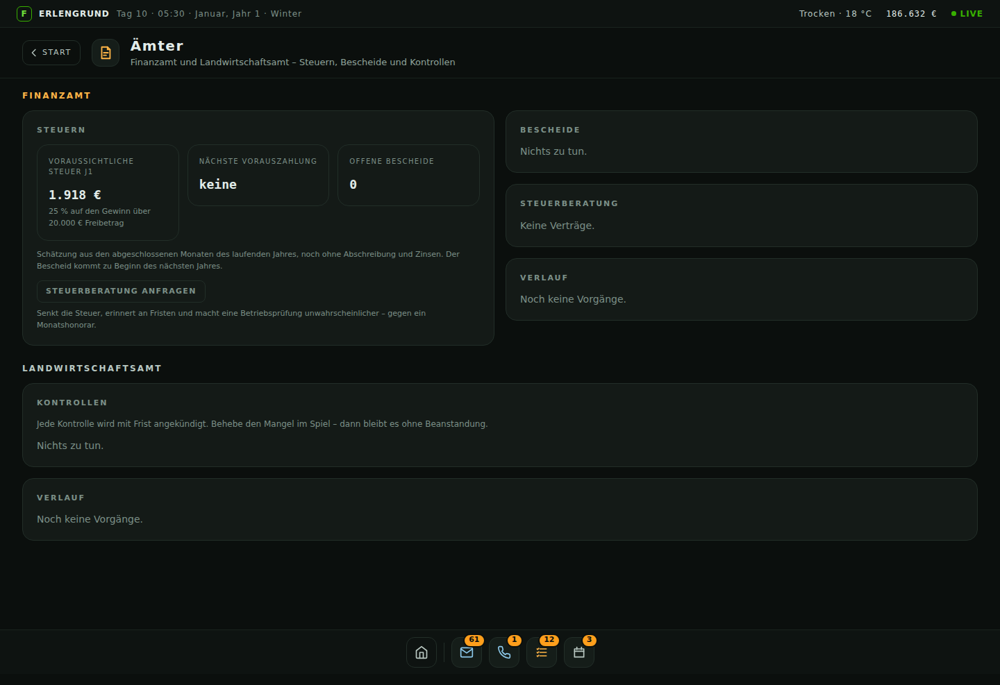

**Finanzamt**

- **Steuern:** Das Finanzamt meldet sich mit dem ersten Steuerbescheid. Das Steuerjahr ist das FS25-Jahr (ab März).
  Gerechnet wird mit der Hofbuchhaltung: Gewinn = Einnahmen − Ausgaben des laufenden Betriebs (ohne Steuern und
  Bußgelder) − Abschreibung (ein Anteil vom Wert deiner Fahrzeuge und Gebäude) − Zinsen deiner Bankkredite. Vom
  Gewinn über dem Freibetrag geht ein fester Satz ab (im harten Modus höher, der Freibetrag kleiner). Zu Beginn des
  neuen Jahres kommt der **Bescheid** mit der ganzen Rechnung: Nachzahlung oder Erstattung (die wird dir
  gutgeschrieben). Ab dem zweiten Jahr zahlst du vierteljährlich **Vorauszahlungen** (März, Juni, September,
  Dezember) auf Basis des letzten Bescheids. Die Karte **Steuern** zeigt die voraussichtliche Steuer des laufenden
  Jahres, die nächste Vorauszahlung und den letzten Bescheid Zeile für Zeile.
- **Bescheide bezahlst du selbst** unter **Bescheide** mit *Zahlen* – abgebucht wird nichts automatisch. Nach der
  Frist kommt je angefangenem Monat ein Säumniszuschlag dazu, das Finanzamt mahnt und droht später mit Pfändung (nur
  als Brief und Vertrauensverlust, gesperrt wird nichts). Vorauszahlungen, Nachzahlungen und Nachforderungen einer
  Betriebsprüfung stehen dort mit Frist.
- **Steuerberatung:** Mit *Steuerberatung anfragen* bekommst du ein Angebot mit Monatshonorar. Die Beratung senkt
  die Steuer um einen Anteil, erinnert dich kurz vor einer Frist und macht eine **Betriebsprüfung** unwahrscheinlicher.
  Eine Prüfung kann nach jedem Bescheid zufällig kommen; sie fordert Steuer nach auf Ausgaben unter unbekannten
  Buchungsarten und auf Monate, in denen die Ausgaben sprunghaft über dem Durchschnitt lagen.
- Ohne Hofbuchhaltung (älterer Mod) gibt es keinen Bescheid.

**Landwirtschaftsamt** – das Amt prüft nur, was das Spiel wirklich meldet:

- **Fruchtfolge:** Am Ende jedes FS25-Jahres vergleicht das Amt die Hauptkultur jedes Feldes mit dem Vorjahr. Für
  jeden Hektar mit Fruchtwechsel gibt es eine **Fruchtfolgeprämie**. Steht auf einem Feld zweimal dieselbe Kultur,
  kommt ein Hinweis; passiert es auf einem Feld ein weiteres Mal, wird die gesamte Prämie des Jahres gekürzt. Die
  Vorschau aufs laufende Jahr steht in der **Flurkarte**.
- **Bewirtschaftungspflicht:** Liegt ein eigenes Feld mehrere Monate ohne Kultur und voller Unkraut oder Steine,
  kündigt das Amt eine Kontrolle an. Ist das Feld zur Frist immer noch so, folgt ein Bußgeld.
- **Tierwohl:** Ist die Gesundheit in einem Stall mehrere Tage sehr niedrig oder sind Futter oder Wasser leer, kündigt
  das Amt eine Kontrolle an. Beim ersten Verstoß gibt es eine **Auflage** mit neuer Frist, danach ein Bußgeld – und
  das Dorf redet darüber. Die Ankündigung steht auch im **Stall**.

Jede Kontrolle wird vorher angekündigt (unter **Kontrollen** mit Frist), du hast also immer Zeit zu reagieren. Das
Ergebnis (ohne Beanstandung, Auflage oder Bußgeld) landet im Verlauf. Mehr als zwei Kontrollen im Monat gibt es nicht.

- **Dürrehilfe:** Wird eine Dürre ausgerufen (siehe **Versicherung**), bietet das Amt eine Hilfe von 150 € je Hektar
  deiner eigenen Felder an, auf denen in den trockenen Monaten eine Kultur wuchs. Den Antrag stellst du unter
  **Dürrehilfe** mit *Antrag stellen* innerhalb von 15 Tagen; das Geld kommt sofort als Förderung. Mit einer
  Dürreversicherung ist die Hilfe um die Hälfte gekürzt. Ohne wachsende Felder gibt es keine Hilfe.

## Personal

- **Stelle ausschreiben:** Nach kurzer Zeit bewerben sich 3–5 Leute, mit Können und Gehaltsvorstellung.
- **Vorstellungsgespräch:** Frag per Mail oder Anruf – Können und Gehalt ändern sich dadurch nicht, du lernst die
  Person nur kennen.
- **Team:** Zufriedenheit gesamt und je Bereich (Bezahlung, Arbeitsbelastung, Wertschätzung,
  Arbeitsbedingungen = Zustand deiner Maschinen). Zufriedene Leute arbeiten besser, das zeigt sich monatlich im
  Geld.
- **Gehalt:** wird zu Beginn jedes Spielmonats (FS25-Kalender) überwiesen.
- **Gehaltserhöhung, freier Tag, Kündigen.** Bleibt jemand lange unzufrieden, kommt erst eine Warnung, dann ein
  **Streik** (Abzeichen *Streikt*, das Gehalt läuft weiter, die Person arbeitet nicht) und zuletzt die Kündigung.
  Steigt die Zufriedenheit wieder, endet der Streik von selbst.
- **Maschinenführer fahren deine Helfer.** Startest du im Spiel einen Helfer, übernimmt ihn der erste freie
  Maschinenführer – die Liste ist nach Können sortiert. Die Meldungen im Spiel nennen seinen Namen, und du zahlst im
  Spiel keinen Helferlohn (das Gehalt läuft ja schon). Gibt es keinen freien Maschinenführer, fährt ein normaler
  Helfer zum normalen Spiellohn. Auf der Personal-Karte siehst du, wie viele Stunden jemand in diesem und im letzten
  Monat gefahren ist: Mehr als 8 Stunden je Spieltag drücken auf die Arbeitsbelastung, weniger erholt. Wer wenig
  fährt, bringt auch weniger zusätzlichen Nutzen. Ein Streikender stellt seinen Helfer sofort ab. Fahren ständig
  Helfer ohne eigenen Mitarbeiter, fragt die Genossenschaft einmal nach, ob du nicht jemanden fest einstellen willst.
- **Schulungen für Maschinenführer.** Ohne Schulung fährt ein Maschinenführer als Helfer nur kleine und mittlere
  Traktoren (und Fahrzeuge ohne Schulungspflicht wie PKW oder Stapler). Für **große Traktoren, Mähdrescher,
  Feldhäcksler, Spezialernter** (Rüben, Kartoffeln, Gemüse, Baumwolle, Zuckerrohr, Trauben, Oliven), **LKW** sowie
  **Selbstfahrer & Lader** (Selbstfahrspritzen, Selbstfahrmäher, Radlader, Teleskoplader, Hoflader) braucht er die
  passende Schulung. Es zählt das Fahrzeug, das der Helfer fährt – ein Traktor mit gezogenem Roder braucht also nur
  die Traktor-Stufe. Auf der Personal-Karte buchst du mit *Schulung* eine Weiterbildung: Sie kostet Geld (von 4.500 €
  für große Traktoren bis 12.000 € für den LKW-Führerschein), dauert **einen Spieltag** – so lange fährt die Person
  keinen Helfer – und steigert die Wertschätzung. Danach steht die Schulung auf der Karte. Bewerber für die Stelle
  Maschinenführer bringen manchmal schon eine Schulung mit (sichtbar in der Bewerbung) und möchten dafür etwas mehr
  Gehalt. Wer schon vor diesem Update angestellt war, hat noch keine Schulung. Findet sich kein geschulter
  Maschinenführer, fährt wie bisher ein normaler Helfer zum Spiellohn – im *strengen Modus* startet der Helfer dann
  gar nicht, und das Spiel meldet, welche Schulung fehlt.
- **Helfer im Spiel:** *Helferlohn über das Gehalt* (Standard an) – fährt ein Maschinenführer, bucht das Spiel keinen
  Helferlohn. Ausgeschaltet zahlst du zusätzlich den normalen Spiellohn. *Strenger Modus* (Standard aus) – höchstens
  so viele Helfer wie aktive Maschinenführer; ohne Maschinenführer gibt es dann keine Helfer, streikende oder
  freigestellte zählen nicht. Das gilt auch für Helfer von Mods wie Courseplay oder AutoDrive: Ist das Limit erreicht,
  startet der Helfer nicht oder hält direkt nach dem Start wieder an („kein freier Maschinenführer“). Maschinen mit Schulungspflicht starten im strengen Modus nur mit einem freien,
  geschulten Maschinenführer.
- **Mechaniker:in.** Setzt zu jedem Monatsbeginn deine am stärksten abgenutzten Maschinen instand – so weit ihre
  Zeit reicht (je besser das Können, desto mehr). Bleiben Maschinen liegen, steigt die Arbeitsbelastung. Über die
  Arbeit kommt jeden Monat ein kurzer Werkstattbericht (siehe **Werkstatt**).
- **Tierpfleger:in.** Kümmert sich um deine Ställe. Zu viele Tiere je Pfleger (ab etwa 80) belasten, kranke Tiere
  drücken auf die Arbeitsbedingungen. Fehlt es in einem Stall an Futter oder Wasser, meldet sich der Pfleger (siehe
  **Stall**).
- **Bürokraft.** Bearbeitet Kreditanträge schneller und erinnert dich drei Tage vor Fristen per Mail: offene
  Steuerbescheide (außer du hast einen Steuerberater, der erinnert schon), angekündigte Kontrollen des Amts, die
  Antragsfrist der Dürrehilfe, das Ende des Liefermonats eines Vorkontrakts und das Pachtende. Betriebsprüfungen werden
  seltener – je besser und zufriedener sie ist, desto mehr (mit Steuerberater zählt der stärkere Effekt). Am Fristtag
  bezahlt sie einen offenen Steuerbescheid selbst, wenn das Geld reicht – so fallen keine Säumniszuschläge an. Ist sie
  überlastet (Arbeitsbelastung sehr niedrig), bleibt das liegen.
- **Azubi.** Schreibst du eine Stelle *Azubi* aus, bewerben sich junge Leute mit wenig Können für ein festes, niedriges
  Gehalt (höchstens zwei Azubis gleichzeitig). Ein Azubi lernt jeden Monat dazu und fährt deine Helfer wie ein
  Maschinenführer ohne Schulung – also nur kleine und mittlere Traktoren, und erst, wenn kein Maschinenführer frei ist.
  Nach zwei Spieljahren ist die Ausbildung zu Ende: Einen Monat vorher fragt er, ob er als Maschinenführer bleiben
  darf, und nennt sein Gehalt. Du kannst ihn übernehmen, ein Gegenangebot machen (ab 90 % seiner Forderung sagt er zu)
  oder ablehnen – dann macht er die Ausbildung fertig und geht.
- Die Stundenzählung braucht die aktuelle Mod-Version; mit einer älteren gilt die bisherige Arbeitsbelastung.

## Flurkarte

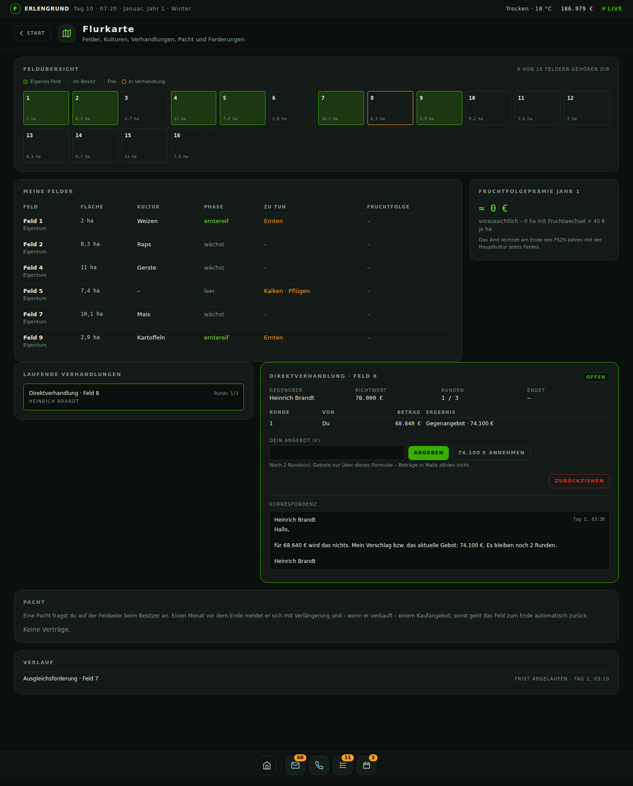

Die Flurkarte zeigt alle Felder der Karte: deine eigenen, die der Dorfbewohner und freie. Felder, die
jemandem gehören, gehören den Figuren, die das Spiel selbst dem Feld zuordnet – du triffst also dieselben Namen wie
im Feld-Menü von FS25. Diese Figuren gehören zur Karte und ziehen nie weg.

**Meine Felder:** Mit der aktuellen Mod-Version steht über der Karte eine Tabelle deiner eigenen und gepachteten
Felder: Fläche, Kultur, Phase (leer, wächst, erntereif, abgeerntet, verdorrt), was zu tun ist (ernten, kalken,
pflügen, Unkraut, Steine) und die **Fruchtfolge** gegenüber dem Vorjahr. Darunter die voraussichtliche
**Fruchtfolgeprämie** des laufenden Jahres und eine Warnung, auf welchen Feldern dieselbe Kultur wie im Vorjahr steht
(Hinweis des Amts) oder zum zweiten Mal steht (Kürzung der Prämie). Abgerechnet wird am Ende des FS25-Jahres mit der
Hauptkultur jedes Feldes.

- **Versteigerungen** werden per Mail angekündigt; andere bieten mit, du hast bis zu drei Runden.
- **Direktverhandlung:** Bei Feldern, die jemandem aus dem Dorf gehören, eröffnest du selbst eine Verhandlung.
  Auf ein zu niedriges Angebot folgt ein Gegenangebot, das du mit einem Klick annehmen kannst.
- **Eigene Felder verkaufen:** Wunschpreis nennen, Interessenten melden sich mit einem ersten Angebot.

Einigt ihr euch, wechselt das Feld im Spiel den Besitzer und das Geld wird gebucht. Reicht dein Kontostand für einen
Kauf nicht, platzt das Geschäft – das Feld bleibt beim bisherigen Besitzer. Flächen, die das Spiel selbst nicht zum
Kauf anbietet (Ortschaft, Straßen), sind als „nicht handelbar“ markiert.

**Pacht.** Felder, die jemandem aus dem Dorf gehören, kannst du mit **Pacht anfragen** pachten statt kaufen. Sagt der
Besitzer zu, nimmst du das Angebot in der Flurkarte (oder in **Aufgaben**) an: Im Spiel gehört dir das Feld dann für
die Laufzeit (du kannst es ganz normal bewirtschaften), die Pacht wird zu jedem Monatsbeginn abgebucht. Einen Monat
vor dem Ende meldet sich der Besitzer mit einer Verlängerung zum neuen Pachtpreis und – wenn er verkaufen würde –
einem Kaufangebot. Antwortest du nicht, geht das Feld zum Ende automatisch zurück. Bleibt die Pacht zweimal offen,
nimmt er das Feld vorzeitig zurück.

**Feldmenü des Spiels:** Du kannst Felder weiter direkt im Feldmenü von FS25 kaufen und verkaufen – gesperrt wird
nichts, aber das Dorf merkt es. Kaufst du das Feld einer Figur über ihren Kopf hinweg, ist sie verärgert (weniger
Vertrauen, dein Ansehen im Dorf sinkt etwas) und verlangt einen Ausgleich (10 % des Spielpreises). Die Forderung
steht in der Flurkarte: *Ausgleich zahlen* oder *Ablehnen* – ablehnen oder die Frist verstreichen lassen kostet
weiteres Vertrauen. Ein freies Feld im Spielmenü zu kaufen, landet nur im Tagebuch; verkaufst du ein eigenes Feld
dort, redet das Dorf darüber.

**Lohnunternehmer – Aufträge aus dem Spiel.** Der Lohnunternehmer macht dich ab und zu per Mail auf einen Auftrag
aufmerksam, der gerade im Auftragsmenü des Spiels verfügbar ist (Titel, Feld, Auftraggeber, Lohn). Annehmen und
erledigen tust du ihn wie gewohnt im Spiel. Schaffst du ihn, steigt dein Ansehen beim Lohnunternehmer und beim
Auftraggeber; das Tool selbst startet nie einen Auftrag.

**Was auf deinen Feldern wächst**, bekommt das Dorf mit (aktuelle Mod-Version):

- **Hagel und Wildschweine** treffen nur Felder, auf denen etwas steht. Der Hagelschaden richtet sich nach Fläche,
  Ertrag und aktuellem Preis deiner Kultur, der Wildschaden nach Fläche und Wachstum; betroffen sind nur Mais,
  Weizen, Gerste, Hafer und Kartoffeln. Nach einem verregneten Monat hagelt es häufiger.
- **Nachbarn:** Bleibt ein Feld längere Zeit voller Unkraut oder Steine, spricht dich ein Nachbar freundlich an. Tut
  sich danach nichts, wird er ungehalten und sein Vertrauen sinkt etwas. Unkraut und Steine zählen nur, wenn sie in
  deinem Spielstand eingeschaltet sind.
- **Dorfklatsch:** Liegt ein Feld lange brach oder verdorrt eine Ernte, redet das Dorf darüber.
- **Genossenschaft:** Hast du in einem Jahr alle erntereifen Felder rechtzeitig geerntet und ist nichts verdorrt,
  gratuliert sie. Außerdem gibt sie höchstens einmal pro Woche einen Hinweis zur Feldarbeit: ein Feld ist erntereif,
  braucht Kalk oder sollte gepflügt werden (Kalk und Pflügen nur, wenn dein Spielstand sie verlangt). Die Hinweise
  kannst du unter **Einstellungen** abschalten.
- **Bank:** Stehende Kulturen zählen in der Bonitätsprüfung als Vermögen (mit Abschlag, je nach Wachstum); die
  Bankberaterin erwähnt das in ihrer Antwort.

Mit einer älteren Mod-Version bleibt alles wie bisher: Hagel und Wildschaden treffen ein beliebiges eigenes Feld.

**Familienfeld:** Hast du im Onboarding eine Familie gewählt, kannst du in der Detailansicht eines eigenen Feldes
**Als Familienfeld markieren** („Das Feld am Bach war schon beim Großvater in der Familie“). Verkaufst du es später –
im Tool oder im Feldmenü des Spiels –, sinkt das Vertrauen der ganzen Familie deutlich.

## Agrarbörse

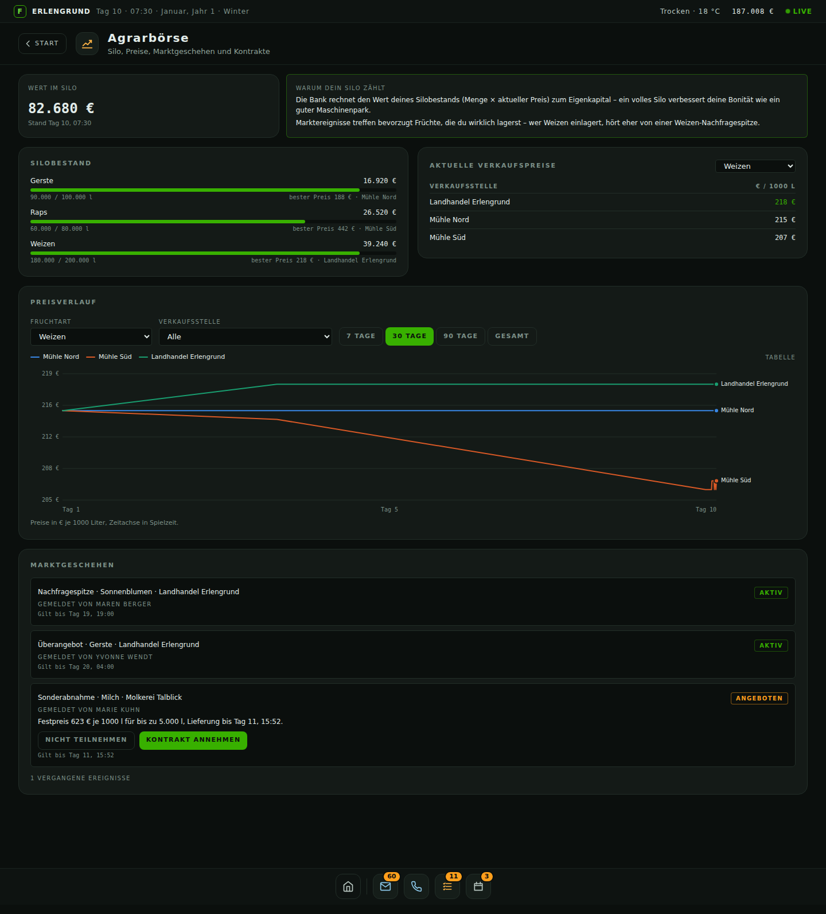

Was liegt im Silo, was ist es wert, wo zahlt man gerade am meisten? Der **Preisverlauf** zeigt die Preise je
Verkaufsstelle über 7, 30, 90 Tage oder den ganzen Spielstand (mit *Tabelle* auch als Zahlen). Im
**Marktgeschehen** stehen Preisereignisse, Gerüchte (die nicht immer stimmen) und Sonderkontrakte zum Festpreis, an
denen du teilnehmen kannst. Ein volles Silo zählt übrigens bei der Bank als Vermögen, und Marktereignisse treffen
bevorzugt die Früchte, die du wirklich lagerst.

- **Energieversorger – nur wenn deine Karte eine passende Verkaufsstelle hat.** Nimmt eine Verkaufsstelle z. B.
  Silage, Gärreste oder Methan an (Biogas-Anlage), bietet der Energieversorger Festpreis-Kontrakte an oder kündigt
  Preisschwankungen an dieser Stelle an. Gibt es keine solche Verkaufsstelle, meldet er sich nicht.
- **Lieferverträge mit Produktionen.** Gibt es auf der Karte Produktionen, die Waren ankaufen (z. B. Bäckerei oder
  Molkerei), bietet die Genossenschaft gelegentlich einen Liefervertrag zum Festpreis an. Er erscheint wie ein
  Sonderkontrakt; du entscheidest, ob du mitmachst.
- **Preisalarm:** Wähle Sorte, Verkaufsstelle (oder *beliebig*, dann zählt der beste Preis), Richtung und Preis je
  1.000 Liter. Erreicht der Preis die Schwelle, blendet das Spiel einen Hinweis ein, und die Landhändlerin schreibt
  dir, wie viel davon im Silo liegt und was es gerade wert ist. Ein Alarm meldet sich einmal; danach kannst du ihn
  wieder aktivieren. Höchstens 10 Alarme sind gleichzeitig aktiv.
- **Vorkontrakt:** Verkaufe deine Ernte im Voraus. Du wählst Sorte, Verkaufsstelle, Menge (1.000 bis 200.000 Liter)
  und den Liefermonat (1 bis 12 Monate voraus). Die Landhändlerin nennt den Festpreis: der heutige Preis mit 2 %
  Abschlag je Monat Vorlauf. Mit *Abschließen* gilt er, ein Rücktritt ist nicht möglich. Im Liefermonat zahlt die
  Verkaufsstelle im Spiel den Festpreis bis zur vereinbarten Menge. Fehlt am Monatsende Ware, kostet die Fehlmenge
  25 % ihres Werts als Vertragsstrafe, und die Landhändlerin ist enttäuscht. Volle Lieferung freut sie. Die
  erwartete Einnahme steht in der Liquiditätsplanung der Bank. Je Verkaufsstelle und Sorte gibt es nur einen
  Festpreis zur selben Zeit.

## Versicherung

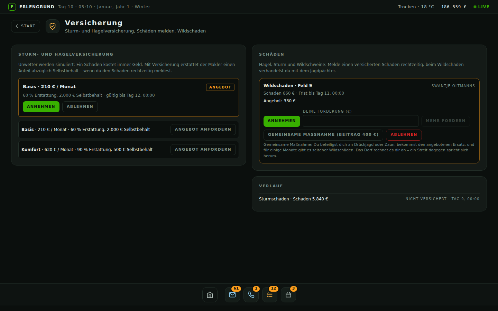

Neue Ansprechpartner stellen sich vor, sobald es für sie etwas zu tun gibt – ihre Verträge und offenen Vorgänge
stehen in der App, zu der sie gehören.

- **Versicherungsmakler:in – Sturm- und Hagelversicherung.** Unwetter werden simuliert: Hagel trifft im Frühjahr
  und Sommer eines deiner Felder, Stürme im Herbst und Winter deine Gebäude. Ein Schaden kostet immer Geld. Mit
  Versicherung (Tarif *Basis* oder *Komfort*, Prämie zu jedem Monatsbeginn) meldest du den Schaden per Mail oder
  Anruf innerhalb der Frist und bekommst einen Teil erstattet (abzüglich Selbstbehalt). Ist eine Prämie offen, ruht
  der Schutz; nach zwei offenen Prämien endet der Vertrag.
- **Jagdpächter:in – Wildschäden.** Im Sommer und Herbst wühlen Wildschweine auf deinen Feldern (simuliert, der
  Schaden kostet Geld). Der Jagdpächter bietet Ersatz an. Du kannst annehmen, mehr fordern (bis zu zwei Runden),
  eine **gemeinsame Maßnahme** vereinbaren (eigener Beitrag, danach für einige Monate seltener Schäden, besseres
  Ansehen im Dorf) oder ablehnen – ein Streit spricht sich herum. Antwortest du nicht, zahlt er sein letztes Angebot.
- **Dürre und Dürreversicherung.** FarmPulse zählt, wie lange es in jedem Monat regnet. Ein Wachstumsmonat (Mai bis
  Oktober) ist trocken, wenn es in weniger als 3 % der Zeit geregnet hat – dafür muss FarmPulse mindestens die Hälfte
  des Monats mitgelaufen sein. Beim ersten trockenen Monat warnt die Genossenschaft, nach zwei trockenen Monaten in
  Folge ist es eine **Dürre**: Die Preise der Kulturen, die im Dorf stehen, steigen in der Region, im Dorf wird geredet,
  und das Amt bietet die **Dürrehilfe** an (App **Ämter**). Dein Ertrag im Spiel ändert sich nicht. Die
  **Dürreversicherung** (Wetterindex) läuft neben der Sturm- und Hagelversicherung: 4 € je Hektar deiner eigenen
  Felder (ohne Pachtflächen) und Monat, bei einer Dürre zahlt sie 200 € je Hektar ohne Schadensmeldung – aber nur, wenn
  du sie vor dem ersten trockenen Monat abgeschlossen hast und die Prämie bezahlt ist. Die Karte zeigt den Regen der
  letzten Monate, die laufende Trockenreihe und die bisherigen Dürren.

## Stall

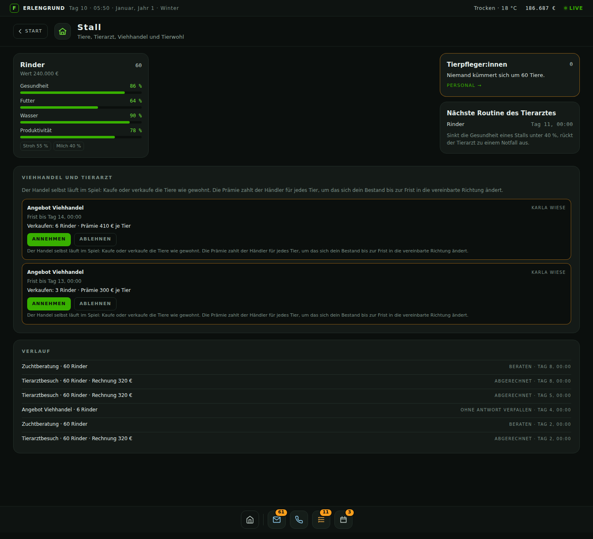

Der Stall zeigt deine Ställe so, wie das Spiel sie meldet: Tierart, Anzahl, **Gesundheit**, **Futter**, **Wasser**,
**Produktivität** und den Wert der Tiere. Wird es in einem Stall knapp, ist er markiert; eine angekündigte
**Tierwohl-Kontrolle** des Amts steht mit Frist darüber. Gesundheit, Futter und Wasser brauchen die aktuelle
Mod-Version.

- **Tierpfleger:innen:** wer sich kümmert und wie viele Tiere auf eine Person kommen (ab etwa 80 wird es eng).
- **Tierarzt, Viehhändler:in und Zuchtberatung – nur wenn du Tiere hältst.** Der Tierarzt kommt alle paar Monate zur
  Routineuntersuchung je Tierart und schickt eine Rechnung (Grundgebühr plus Betrag je Tier); wann er das nächste Mal
  kommt, steht im Stall. Sinkt die Gesundheit in einem Stall stark (unter 40 %), rückt er zu einem **Notfall** aus –
  teurer als die Routine und höchstens alle paar Tage je Stall. Die Zuchtberatung kommentiert, wie sich dein Bestand
  entwickelt hat, und nennt die Produktivität deiner Ställe. Der Viehhändler bietet ab und zu an, eine Anzahl Tiere
  zu kaufen oder zu verkaufen, und zahlt dafür eine **Prämie je Tier**. Den Handel selbst erledigst du im Spiel wie
  gewohnt: Nimmst du das Angebot an, zählt bis zur Frist, um wie viele Tiere sich dein Bestand in die vereinbarte
  Richtung verändert hat – für jedes davon gibt es die Prämie (höchstens für die vereinbarte Anzahl).

## Werkstatt

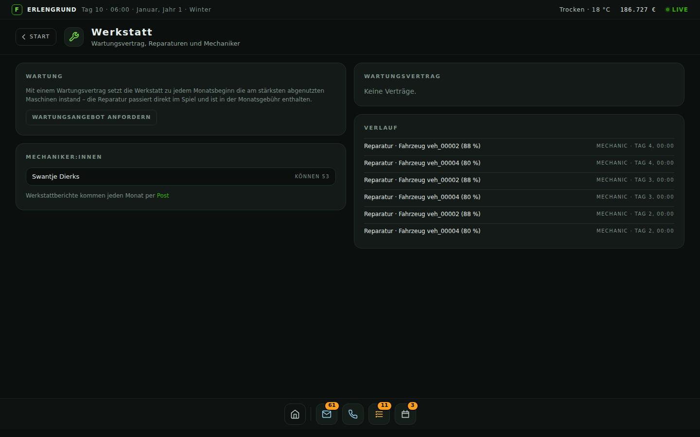

- **Mechaniker:innen:** wer bei dir schraubt und mit welchem Können (einstellen im **Personal**). Die monatlichen
  Werkstattberichte kommen per Post.
- **Wartungsvertrag.** Für eine feste Monatsgebühr (abhängig vom Wert deiner Maschinen) setzt die Werkstatt zu
  jedem Monatsbeginn die am stärksten abgenutzten Fahrzeuge instand – direkt im Spiel, ohne weitere Kosten. Ohne
  Vertrag meldet sie sich ab und zu mit einem Hinweis, wenn eine Maschine stark abgenutzt ist. Das Angebot forderst
  du in der Werkstatt an; kündigen kannst du jederzeit.
- **Gebrauchtmaschinen kaufen.** Ab und zu bietet die Werkstatt (etwas teurer) oder ein Nachbar (etwas günstiger)
  eine gebrauchte Maschine aus dem Shop des Spiels an – mit Alter, Betriebsstunden und Schaden. Der Preis folgt der
  Gebrauchtpreis-Formel des Spiels. Du machst in bis zu drei Runden ein Angebot; nach der Einigung steht die Maschine
  auf einem Shop-Platz und gehört dir, der Preis wird erst bei der Lieferung gebucht. Ist kein Platz frei, kommt ein
  Hinweis im Spiel und eine Mail – räume den Platz frei, am nächsten Tag wird es noch einmal versucht (höchstens fünfmal).
- **Eigene Maschinen verkaufen.** Unter **Eigene Maschinen** bietest du eine Maschine mit Wunschpreis an. Ein bis drei
  Nachbarn melden sich mit einem Angebot über dem Händlerpreis des Spiels (höchstens 110 % davon); du nimmst an oder
  forderst mehr. Nach der Einigung verschwindet die Maschine im Spiel und der Erlös wird gebucht. Sitzt jemand darin,
  fährt ein Helfer oder hängt etwas an der Maschine, klappt es nicht – im Spiel erscheint dann „Bitte erst abkoppeln“.
  Geleaste Maschinen kannst du nicht verkaufen.

## Handel

Die Nachbarn im Dorf sind Handelspartner. Gehandelt wird nur Ware, für die du ein **eigenes Silo** hast (Silo oder
Silo-Erweiterung, die dir gehört); die Menge wird im Spiel wirklich in dein Silo gebucht oder aus ihm entnommen, das
Geld im selben Moment. Die App zeigt:

- **Deine Silos:** jede Sorte, die ein eigenes Silo annimmt, mit Füllstand und freiem Platz.
- **Nachbarn:** Betrieb (Milchviehbetrieb, Ackerbau oder Gemischtbetrieb), Vertrauen, **Vorrat** mit Preis je
  1.000 Liter, was er **braucht** und welche Felder er bewirtschaftet. Der Vorrat entsteht aus der Ernte seiner
  Felder (bei Weizen, Gerste und Hafer auch Stroh) und wird jeden Monat kleiner. Seine Preise richten sich nach der
  besten Verkaufsstelle – er verkauft etwas teurer und kauft etwas billiger, gutes Vertrauen macht es für dich
  günstiger. Für Ware ohne Verkaufsstelle gilt ein Richtpreis.
- **Ware anfragen:** Sorte aus seinem Vorrat und Menge wählen – höchstens so viel, wie er hat und in deine Silos
  passt. Der Nachbar antwortet sofort mit seinem Angebot; es steht unten bei den Angeboten.
- **Nach Arbeit fragen:** Hat der Nachbar ein abgeerntetes, noch nicht gepflügtes oder ein steiniges Feld, bittet er
  dich ums **Pflügen** oder **Steine sammeln**.
- **Angebote, Anfragen und Aufträge:** Von sich aus bietet ein Nachbar ab und zu Ware an oder fragt nach Ware aus
  deinen Silos (höchstens zwei Nachrichten im Monat, fünf Tage Zeit zum Antworten). **Kaufen** bzw. **Verkaufen**
  bucht Ware und Geld; ein Handel stärkt das Vertrauen, und wer Nachbarn mit seiner Ware aushilft, steigt im Ansehen
  des Dorfs. Ablehnen kostet etwas Vertrauen, Ignorieren mehr. Liegt beim Buchen zu wenig im Silo, ist der Nachbar
  enttäuscht.
- **Aufträge der Nachbarn:** Nach deiner Zusage steht der Auftrag im **Auftragsmenü des Spiels**, mit dem Nachbarn als
  Auftraggeber; die Vergütung zahlt das Spiel. Erledigst du ihn, bedankt sich der Nachbar mit einem kleinen Bonus
  (250 €), sonst ist er enttäuscht. Hast du im Spiel schon die Höchstzahl an Aufträgen angenommen, fragt niemand.

**Hofladen:** Leute aus dem Dorf bestellen ab und zu kleine Mengen aus deinen Silos (Kartoffeln, Weizen, Hafer,
Zuckerrüben oder Raps, je nachdem, was bei dir liegt), zum Hofladenpreis von 130 % des besten Marktpreises. Mit
*Liefern* wird die Ware aus dem Silo gebucht und das Geld gutgeschrieben. Das hebt dein Ansehen im Dorf (höchstens
viermal im Jahr). Lehnst du ab oder antwortest nicht binnen 3 Tagen, kommen seltener Bestellungen; jede Lieferung
macht das wieder besser.

Die Nachbarfelder, deine Silos und die Aufträge brauchen die aktuelle Mod-Version; fehlen sie, sagt die App es oben.

## Kontakte

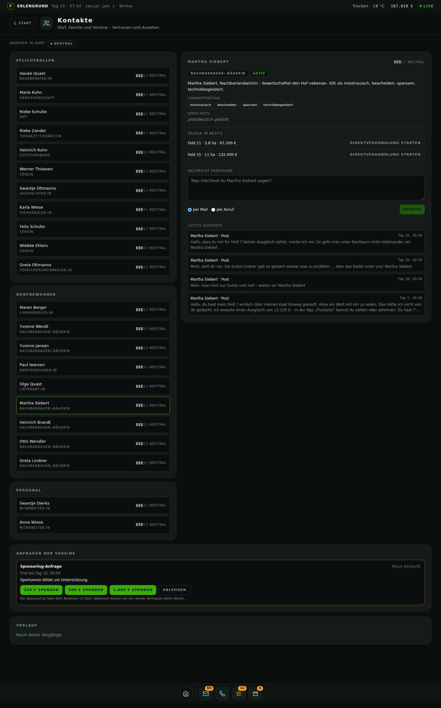

Alle Menschen im Dorf mit Rolle und Vertrauen (fünf Balken und ein Wort statt einer Zahl). In der Detailansicht
stehen Charakterzüge, Sprachstil und Hintergrund. Mit **Nachricht verfassen** meldest du dich selbst – per Mail oder
Anruf. Schreibst du jemandem mehrmals kurz hintereinander, antwortet er trotzdem; aufs Vertrauen wirkt nur der
erste Kontakt des Tages. Dein **Ansehen im Dorf** (gut angesehen, neutral, umstritten) steht auch auf dem
Startbildschirm. Gelegentlich ziehen Leute weg oder neu zu. Bei einem Nachbarn führt **Handel & Arbeit mit diesem
Nachbarn** in die App **Handel**.

**Vereine:** Schützenverein, Freiwillige Feuerwehr und Sportverein haben je eine:n Vorsitzende:n. Zu den Dorffesten
im FS25-Kalender (Maibaumaufstellen im Mai, Schützenfest im Juni, Feuerwehrfest im August, Erntedankfest im Oktober,
Weihnachtsmarkt im Dezember) kommt eine Einladung – die beantwortest du im **Kalender**. Ab und zu bittet ein Verein
um **Sponsoring** in festen Stufen (z. B. 250, 500 oder 1.000 €) – das hebt dein Ansehen im Dorf; ablehnen kostet
nur wenig. Die Anfrage steht in den Kontakten.

**Familie:** Deine Familie (aus dem Onboarding) steht mit im Dorf, zählt aber nicht zum Ansehen und zieht nie weg.
Die Eltern auf dem Altenteil bekommen jeden Monat ihre Zahlung. Zu Geburtstagen, zum Hochzeitstag und zur Einschulung
kommt eine Nachricht (die Termine stehen im **Kalender**), zur Erntezeit bietet manchmal jemand Hilfe an, und zu
Jahresbeginn schreibt das Tagebuch die Geschichte der Hofnachfolge fort.

## Tagebuch

Die Chronik deines Hofs – beginnend mit der Vorgeschichte. Wichtige Ereignisse trägt FarmPulse selbst ein. Eigene
Notizen sind reine Erinnerung und haben keinerlei Auswirkung aufs Spiel.

## Einstellungen

KI-Anbieter, Modell und API-Schlüssel (siehe [Installation](installation.md#5-ki-anbieter-einrichten-optional)) und
der Ton deines Spielstands (nur Anzeige). Die Einstellungen für die Helfer im Spiel stehen im **Personal**.

**Tablet & Netzwerk:** FarmPulse im Heimnetz erreichbar machen (Standard aus), optionale PIN für Tablets und Handys,
Adresse und QR-Code (siehe [Auf dem Handy oder Tablet](#auf-dem-handy-oder-tablet)). Gilt für die ganze Installation,
nicht nur für einen Spielstand, und lässt sich nur am Spiele-PC ändern.

**Felder:** Hinweise der Genossenschaft zur Feldarbeit ein- oder ausschalten (Standard an).

**Kredit und Felder im Spielmenü:** Die Reaktionen der Charaktere auf den Kredit oder Feldkauf im Spielmenü ein- oder
ausschalten (Standard an). Ausgeschaltet bleibt nur der Tagebucheintrag.

**Fragen im Spiel:** Einfache Ja/Nein-Entscheidungen erscheinen als Fenster direkt im Spiel, immer zu den
Bedingungen, die auch im Browser stehen. Einzeln einschaltbar (Standard: nur Anrufe):

- eingehende Anrufe annehmen oder ablehnen,
- Angebote für Pacht, Wartung und Versicherung annehmen oder ablehnen und eine Pacht verlängern,
- das Entschädigungsangebot des Jagdpächters annehmen (*Nein* = im Browser weiter verhandeln),
- das Gegenangebot der Bank annehmen oder ablehnen,
- Einladungen zu Festen zu- oder absagen,
- eine Ausgleichsforderung für einen Feldkauf zahlen oder ablehnen,
- einen Steuerbescheid bezahlen (*Nein* = später im Browser),
- das Angebot der Steuerberatung annehmen oder ablehnen,
- ein Angebot oder eine Anfrage eines Nachbarn im **Handel** annehmen oder ablehnen,
- eine Bestellung für den **Hofladen** liefern oder ablehnen,
- einem Nachbarn einen Auftrag zusagen oder absagen.

Die Knöpfe des Fensters heißen *Ja* und *Nein*; was sie bewirken, steht im Text („Ja = Annehmen · Nein = Ablehnen“).
Ist gerade ein Menü offen, wartet die Frage, bis es geschlossen ist. Die Taste **FarmPulse: offene Frage** (Standard
Alt+J, in der Steuerung des Spiels änderbar) öffnet die nächste wartende Frage – sie steht in der Tastenhilfe, solange
eine Frage wartet. Entscheidest du vorher im Browser, verschwindet die Frage im Spiel. Klappt etwas nicht (z. B. reicht
der Kontostand nicht), meldet das Spiel es mit einem Hinweis. Lädst du einen Spielstand ohne zu speichern, kommen
noch offene Fragen erneut.

## Auf dem Handy oder Tablet

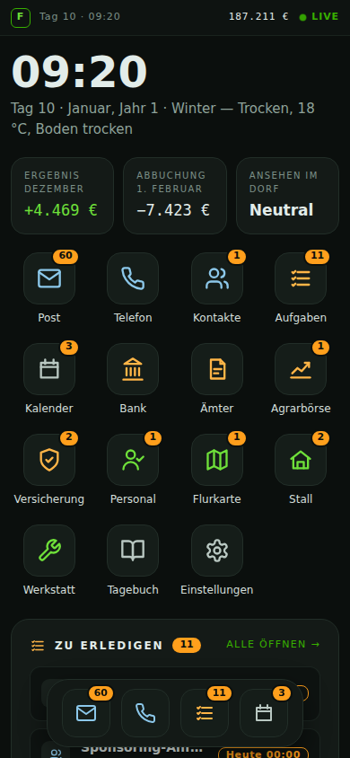

Das Hof-Tablet füllt immer das ganze Browserfenster und passt sich an kleine Bildschirme an – z. B. ein echtes Tablet
neben dem Spiel. Standardmäßig ist FarmPulse nur auf dem eigenen PC erreichbar. Unter **Einstellungen → Tablet &
Netzwerk** schaltest du am Spiele-PC den Zugriff aus dem Heimnetz frei, setzt auf Wunsch eine PIN und findest Adresse
und QR-Code für das Tablet (Anleitung: [Auf dem Tablet oder Handy öffnen](installation.md#auf-dem-tablet-oder-handy-öffnen)).
Live-Updates, Anrufe und alle Apps funktionieren auf dem Tablet wie am PC. Über **Zum Startbildschirm hinzufügen**
bekommt das Tablet ein FarmPulse-Symbol. Aus dem Internet ist das Tool nie erreichbar. Benachrichtigungen im
Hintergrund und ein Offline-Modus gibt es auf dem Tablet nicht: Beides verlangt eine verschlüsselte Verbindung
(HTTPS), im Heimnetz läuft FarmPulse über `http://`.
