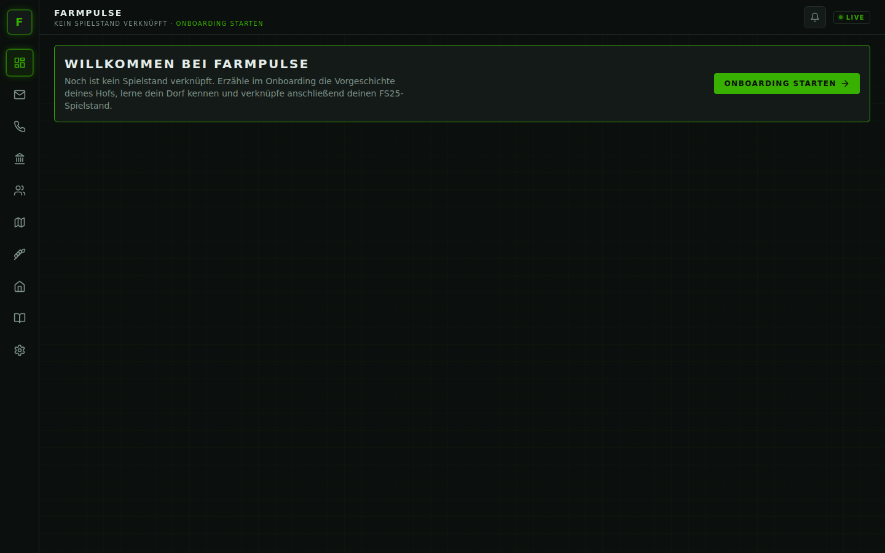

# Installation

FarmPulse besteht aus drei Teilen, die du einmal einrichtest:

| Teil | Was er macht | Wo er läuft |
| --- | --- | --- |
| **Mod `FS25_RPSim`** | liest Kontostand, Maschinen, Felder, Silo und Preise aus dem Spiel und führt Buchungen/Preisänderungen aus | in Farming Simulator 25 |
| **Backend** (`rpsim-backend.jar`) | das „Gehirn“: Bank, Markt, Dorf, Personal, KI-Texte | als kleines Programm auf deinem PC |
| **Oberfläche** | Postfach, Anrufe, Bank … im Browser | wird vom Backend mitgeliefert: <http://localhost:8080> |

Mod und Backend unterhalten sich nur über Dateien im Ordner `modSettings/FS25_RPSim` – es gibt keine
Netzwerkverbindung ins Spiel und dein API-Schlüssel landet nie im Mod-Ordner.

## Voraussetzungen

- Farming Simulator 25 (PC), Einzelspieler-Spielstand
- **Java 21** (z. B. [Eclipse Temurin 21 JRE](https://adoptium.net/)) – prüfen mit `java -version`
- ein aktueller Browser (Chrome, Edge, Firefox)
- optional ein KI-Zugang (OpenAI, Anthropic, Google Gemini) oder ein lokales [Ollama](https://ollama.com/) –
  ohne KI funktioniert alles mit vorformulierten Texten

## 1. Release entpacken

Lade `FarmPulse-<version>.zip` von der [Releases-Seite](https://github.com/DerGiftzwerg156/FarmPulse_v3/releases) und entpacke es z. B. nach `C:\FarmPulse`. Inhalt:

```
FarmPulse-<version>/
  rpsim-backend.jar               Backend
  web/                            Oberfläche (wird vom Backend ausgeliefert)
  FS25_RPSim.zip                  der Mod
  start.bat / start.sh            Startskripte
  application-local.yml.example   Vorlage für eigene Einstellungen
```

## 2. Mod installieren

1. `FS25_RPSim.zip` **ungeöffnet** nach `Dokumente\My Games\FarmingSimulator2025\mods\` kopieren.
2. Farming Simulator 25 starten, beim Anlegen bzw. Laden des Spielstands **FS25_RPSim** in der Mod-Auswahl
   aktivieren.

Der Mod legt beim ersten Laden `Dokumente\My Games\FarmingSimulator2025\modSettings\FS25_RPSim\` an und schreibt
dort etwa jede Minute die Hofdaten.

## 3. Backend starten

Doppelklick auf **`start.bat`** (Windows) bzw. `./start.sh` (Linux/macOS). Ein Konsolenfenster zeigt nach einigen
Sekunden `Started RpsimApplication`. Das Fenster offen lassen, solange du spielst – Schließen beendet das Backend.

Das Backend sucht die Mod-Dateien unter `<Benutzerordner>\Documents\My Games\FarmingSimulator2025\modSettings\FS25_RPSim`.
Liegt dein Dokumente-Ordner woanders (z. B. in OneDrive), trage den Pfad ein – siehe
[Eigene Einstellungen](#eigene-einstellungen-optional).

Deine Spieldaten (Charaktere, Mails, Kredite …) speichert das Backend in `<Benutzerordner>\.rpsim\`.

## 4. Oberfläche öffnen

Im Browser <http://localhost:8080> öffnen. Ohne verknüpften Spielstand begrüßt dich FarmPulse mit dem Einstieg
ins Onboarding:



Weiter geht es mit [Dein erster Spielstand](erster-spielstand.md).

## 5. KI-Anbieter einrichten (optional)

Unter **Einstellungen** wählst du den Anbieter, optional ein Modell und trägst deinen API-Schlüssel ein.


| Anbieter | Was du brauchst |
| --- | --- |
| Keine KI (Textvorlagen) | nichts – Charaktere antworten mit passenden, vorformulierten Texten |
| OpenAI | API-Schlüssel von platform.openai.com |
| Anthropic | API-Schlüssel von console.anthropic.com |
| Google Gemini | API-Schlüssel aus Google AI Studio (das Standardmodell kann sich ändern – bei Fehlern ein aktuelles Modell eintragen) |
| Ollama (lokal) | laufendes Ollama, Adresse z. B. `http://localhost:11434` und ein installiertes Modell |

Der Schlüssel wird **nur lokal** in `data\local-config\ai-provider.properties` neben dem Backend gespeichert,
nie im Browser, nie im Mod und nie wieder angezeigt. Die KI schreibt ausschließlich Texte – Geld, Preise und
Entscheidungen berechnet FarmPulse immer selbst.

## Eigene Einstellungen (optional)

`application-local.yml.example` nach `application-local.yml` (gleicher Ordner wie die JAR) kopieren und anpassen,
z. B. für einen abweichenden Dokumente-Ordner:

```yaml
rpsim:
  bridge:
    path: C:/Users/<du>/OneDrive/Dokumente/My Games/FarmingSimulator2025/modSettings/FS25_RPSim
```

Die Datei bleibt auf deinem PC. Anschließend das Backend neu starten.

## Aus dem Quellcode starten (für Entwickler)

Siehe [`docs/dev/setup.md`](../dev/setup.md).
