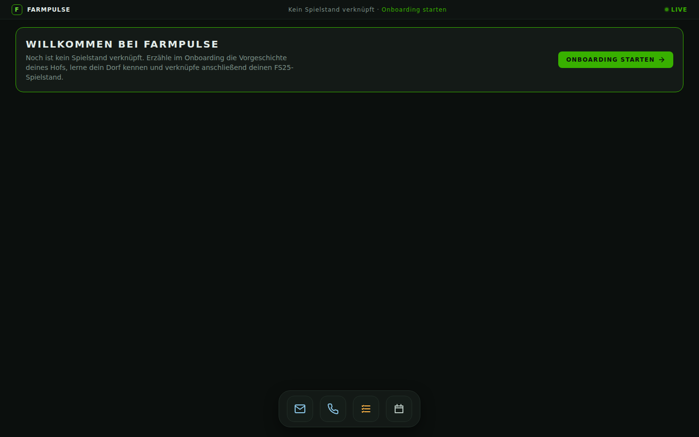

# Installation

FarmPulse besteht aus drei Teilen, die du einmal einrichtest:

| Teil | Was er macht | Wo er läuft |
| --- | --- | --- |
| **Mod `FS25_RPSim`** | liest Kontostand, Maschinen, Felder, Silo und Preise aus dem Spiel und führt Buchungen/Preisänderungen aus | in Farming Simulator 25 |
| **Backend** (`FarmPulse.exe` bzw. `rpsim-backend.jar`) | das „Gehirn“: Bank, Markt, Dorf, Personal, KI-Texte | als kleines Programm auf deinem PC |
| **Oberfläche** | Hof-Tablet mit Post, Telefon, Bank … im Browser | wird vom Backend mitgeliefert: <http://localhost:8080> |

Mod und Backend unterhalten sich nur über Dateien im Ordner `modSettings/FS25_RPSim` – es gibt keine
Netzwerkverbindung ins Spiel und dein API-Schlüssel landet nie im Mod-Ordner.

## Voraussetzungen

- Farming Simulator 25 (PC), Einzelspieler-Spielstand, Windows 10 oder 11 (64 Bit) für das Setup
- **Java 21** – nur für die [ZIP-Variante](#variante-b-zip-für-experten) (z. B. [Eclipse Temurin 21 JRE](https://adoptium.net/),
  prüfen mit `java -version`); das Setup bringt sein eigenes Java mit
- ein aktueller Browser (Chrome, Edge, Firefox)
- optional ein KI-Zugang (OpenAI, Anthropic, Google Gemini) oder ein lokales [Ollama](https://ollama.com/) –
  ohne KI funktioniert alles mit vorformulierten Texten

## Variante A: Setup für Windows (empfohlen)

1. `FarmPulse-<version>-Setup.exe` von der [Releases-Seite](https://github.com/DerGiftzwerg156/FarmPulse_v3/releases)
   laden und starten.
2. **Windows-SmartScreen** meldet „Der Computer wurde durch Windows geschützt“, weil das Setup (noch) nicht signiert
   ist: auf **Weitere Informationen → Trotzdem ausführen** klicken.
3. **Nur für mich** (empfohlen, ohne Administratorrechte) oder **für alle Benutzer** installieren.
4. Die Einstellungsseiten ausfüllen. Alles lässt sich später ändern:

   | Seite | Was du einstellst |
   | --- | --- |
   | KI-Anbieter | OpenAI, Anthropic, Google Gemini, Ollama, ohne KI – oder „später im Tablet einrichten“. Dazu API-Schlüssel, optional ein Modell, bei Ollama die Adresse. Mehr dazu unter [KI-Anbieter einrichten](#5-ki-anbieter-einrichten-optional). |
   | Ordner | **Austauschordner** `…\My Games\FarmingSimulator2025\modSettings\FS25_RPSim` und der **mods-Ordner**. Vorbelegt ist dein echter Dokumente-Ordner, auch wenn OneDrive ihn verschoben hat. |
   | Start | **Port** (Standard 8080) und **Browser beim Start öffnen** |
   | Zusätzliche Aufgaben | **Mod kopieren** (legt `FS25_RPSim.zip` in den mods-Ordner), **mit Windows starten**, **Desktop-Verknüpfung** |

5. Am Ende **FarmPulse jetzt starten** angehakt lassen.
6. Weiter mit [2. Mod installieren](#2-mod-installieren) – das Kopieren entfällt, wenn „Mod kopieren“ angehakt war –
   und [4. Oberfläche öffnen](#4-oberfläche-öffnen). Die Schritte 1 und 3 sind nur für die ZIP-Variante.

**So läuft FarmPulse:** Es gibt kein Konsolenfenster mehr. FarmPulse läuft im Hintergrund und zeigt ein Symbol im
Infobereich neben der Uhr (eventuell unter dem Pfeil **^**). Sobald es bereit ist, öffnet sich der Browser mit dem
Hof-Tablet.

| Symbol im Infobereich | Wirkung |
| --- | --- |
| Doppelklick oder **FarmPulse öffnen** | öffnet das Hof-Tablet im Browser |
| **Protokoll öffnen** | zeigt die Protokolldatei (bei Problemen) |
| **Beenden** | beendet FarmPulse sauber |

- Startest du FarmPulse ein zweites Mal (Startmenü, Desktop), startet es nicht doppelt, sondern öffnet nur den Browser.
- Ist der eingestellte Port belegt, nimmt FarmPulse automatisch den nächsten freien (z. B. 8081) und meldet das am
  Symbol. Die Adresse für das Tablet ändert sich dann.
- Kann FarmPulse nicht starten, erscheint ein Fenster mit dem Grund und dem Pfad der Protokolldatei.

**Update:** Das neue Setup einfach über die alte Version installieren; ein laufendes FarmPulse wird vorher beendet. Das
Setup fragt, ob die **bisherigen Einstellungen bleiben** oder **neu festgelegt** werden. Beim Neu-Festlegen sind alle
Felder mit den alten Werten vorausgefüllt; ein leeres Schlüsselfeld behält den gespeicherten Schlüssel.

**Deinstallieren:** *Windows-Einstellungen → Apps → FarmPulse → Deinstallieren*. Danach fragt das Setup, ob auch
Spielstände und Einstellungen (`<Benutzerordner>\.rpsim\`) gelöscht werden sollen (Standard: Nein). Der Mod im
mods-Ordner bleibt liegen.

**Wo liegt was?** Programm: `%LOCALAPPDATA%\Programs\FarmPulse` (bzw. `C:\Programme\FarmPulse` für alle Benutzer).
Deine Daten im Ordner `<Benutzerordner>\.rpsim\`:

| Datei | Inhalt |
| --- | --- |
| `farmpulse-setup.yml` | Port, Austauschordner, Browser öffnen – vom Setup geschrieben |
| `application-local.yml` | optional, eigene Einstellungen für Experten; gewinnen gegen `farmpulse-setup.yml` |
| `local-config\ai-provider.properties` | KI-Anbieter und Schlüssel (Setup und Einstellungsseite im Tablet) |
| `logs\farmpulse.log` | Protokoll |
| `rpsim.mv.db`, `db.properties` | deine Spieldaten |

## Variante B: ZIP für Experten

Die ZIP-Variante läuft auch unter Linux und macOS und startet das Backend mit sichtbarem Konsolenfenster.

## 1. Release entpacken

Lade `FarmPulse-<version>.zip` von der [Releases-Seite](https://github.com/DerGiftzwerg156/FarmPulse_v3/releases) und entpacke es z. B. nach `C:\FarmPulse`. Inhalt:

```
FarmPulse-<version>/
  rpsim-backend.jar               Backend
  web/                            Oberfläche (wird vom Backend ausgeliefert)
  FS25_RPSim.zip                  der Mod
  start.bat / start.sh            Startskripte
  Desktop-Verknuepfung.bat        legt die Desktop-Verknüpfung „FarmPulse“ mit Icon an (Windows, optional)
  application-local.yml.example   Vorlage für eigene Einstellungen
```

## 2. Mod installieren

1. `FS25_RPSim.zip` **ungeöffnet** nach `Dokumente\My Games\FarmingSimulator2025\mods\` kopieren.
2. Farming Simulator 25 starten, beim Anlegen bzw. Laden des Spielstands **FS25_RPSim** in der Mod-Auswahl
   aktivieren.

Der Mod legt beim ersten Laden `Dokumente\My Games\FarmingSimulator2025\modSettings\FS25_RPSim\` an und schreibt
dort etwa jede Minute die Hofdaten.

## 3. Backend starten

Doppelklick auf **`start.bat`** (Windows) bzw. `./start.sh` (Linux/macOS). Ein Konsolenfenster zeigt nach einigen
Sekunden `Started RpsimApplication`. Das Fenster offen lassen, solange du spielst – Schließen beendet das Backend.

Tipp (Windows): Ein Doppelklick auf **`Desktop-Verknuepfung.bat`** legt einmalig die Verknüpfung „FarmPulse“ mit dem
FarmPulse-Icon auf dem Desktop an – darüber startest du künftig `start.bat`. Den FarmPulse-Ordner danach nicht mehr
verschieben (sonst die Verknüpfung neu anlegen).

Das Backend sucht die Mod-Dateien unter `<Benutzerordner>\Documents\My Games\FarmingSimulator2025\modSettings\FS25_RPSim`.
Liegt dein Dokumente-Ordner woanders (z. B. in OneDrive), trage den Pfad ein – siehe
[Eigene Einstellungen](#eigene-einstellungen-optional).

Deine Spieldaten (Charaktere, Mails, Kredite …) speichert das Backend in `<Benutzerordner>\.rpsim\`.

## 4. Oberfläche öffnen

Im Browser <http://localhost:8080> öffnen. Ohne verknüpften Spielstand begrüßt dich FarmPulse mit dem Einstieg
ins Onboarding:



Weiter geht es mit [Dein erster Spielstand](erster-spielstand.md).

## Auf dem Tablet oder Handy öffnen

FarmPulse läuft auch auf einem Tablet oder Handy im **selben WLAN** wie der Spiele-PC, z. B. neben dem Spiel. Aus dem
Internet ist das Tool nie erreichbar, auch nicht über eine Portfreigabe am Router.

1. Am Spiele-PC **Einstellungen → Tablet & Netzwerk** öffnen und **Im Heimnetz erreichbar** einschalten (Standard: aus).
2. Optional eine **PIN** aus 4 bis 8 Ziffern setzen. Mit PIN meldet sich jedes Tablet einmal an und bleibt 30 Tage
   angemeldet. Ohne PIN kommt jedes Gerät in deinem Heimnetz direkt hinein. Eine neue PIN meldet alle Tablets ab.
3. Am Tablet die angezeigte Adresse öffnen (z. B. `http://192.168.178.20:8080`) oder den **QR-Code** mit der Kamera
   abscannen. Die Adresse steht auch im Backend-Fenster: „Auf dem Tablet öffnen: …“.
4. Tipp: Über das Browser-Menü **Zum Startbildschirm hinzufügen** bekommt das Tablet ein FarmPulse-Symbol, das die
   App ohne Adressleiste öffnet.

Schalter und PIN lassen sich nur am Spiele-PC ändern; das Tablet zeigt die Karte nur an. Nach fünf falschen PINs ist
das Gerät fünf Minuten gesperrt. Klappt die Verbindung nicht, siehe [Fehlerbehebung](fehlerbehebung.md#das-tablet-erreicht-farmpulse-nicht).

## 5. KI-Anbieter einrichten (optional)

Unter **Einstellungen** wählst du den Anbieter, optional ein Modell und trägst deinen API-Schlüssel ein.


| Anbieter | Was du brauchst |
| --- | --- |
| Keine KI (Textvorlagen) | nichts – Charaktere antworten mit passenden, vorformulierten Texten |
| OpenAI | API-Schlüssel von platform.openai.com |
| Anthropic | API-Schlüssel von console.anthropic.com |
| Google Gemini | API-Schlüssel aus Google AI Studio (das Standardmodell kann sich ändern – bei Fehlern ein aktuelles Modell eintragen) |
| Ollama (lokal) | laufendes Ollama, Adresse z. B. `http://localhost:11434` und ein installiertes Modell |

Der Schlüssel wird **nur lokal** gespeichert – beim Setup in `<Benutzerordner>\.rpsim\local-config\ai-provider.properties`,
bei der ZIP-Variante in `data\local-config\ai-provider.properties` neben dem Backend –
nie im Browser, nie im Mod und nie wieder angezeigt. Die KI schreibt ausschließlich Texte – Geld, Preise und
Entscheidungen berechnet FarmPulse immer selbst.

## Eigene Einstellungen (optional)

**Setup:** Einstellungen änderst du am einfachsten, indem du das Setup erneut startest und *Einstellungen neu festlegen*
wählst. Für alles Weitere eine `application-local.yml` im Ordner `<Benutzerordner>\.rpsim\` anlegen (Inhalt wie
unten) und FarmPulse über das Symbol im Infobereich beenden und neu starten.

**ZIP-Variante:** `application-local.yml.example` nach `application-local.yml` (gleicher Ordner wie die JAR) kopieren und anpassen,
z. B. für einen abweichenden Dokumente-Ordner:

```yaml
rpsim:
  bridge:
    path: C:/Users/<du>/OneDrive/Dokumente/My Games/FarmingSimulator2025/modSettings/FS25_RPSim
```

Die Datei bleibt auf deinem PC. Anschließend das Backend neu starten.

## Aus dem Quellcode starten (für Entwickler)

Siehe [`docs/dev/setup.md`](../dev/setup.md).
